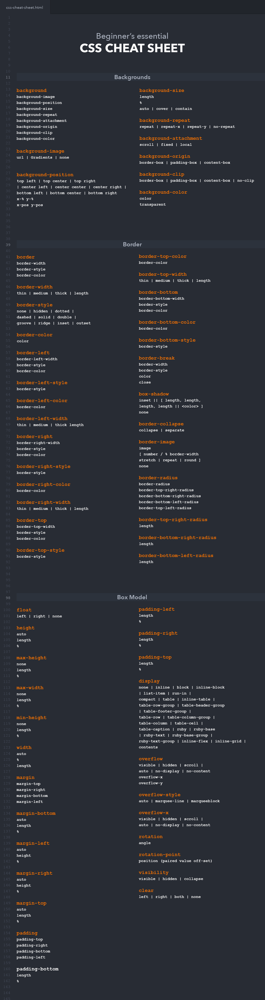

# CSS Cheat Sheet

Using CSS day-to-day? Whether you’re a super savvy web developer or just someone who wants to learn web development, this CSS cheat sheet should help you out.

I originally made it for myself, but eventually wanted to share this on WebsiteSetup.

So here you have it – a total of 29 pages, structured into different paragraphs: backgrounds, borders, fonts, texts, Column, Colours, Grid positioning and a lot more (including UI).

And oh! I’ve also listed out all the new CSS3 tags/divs, too.

Enjoy!

---
© 2022 edX Boot Camps LLC. Confidential and Proprietary. All Rights Reserved.