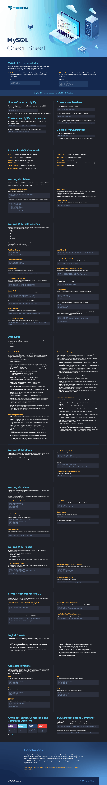

# MySQL Cheat Sheet
Ready to advance your coding skills and master databases?

Great! Then you will find our complete MySQL cheat sheet absolutely handy.

MySQL is a popular, open-source, relational database that you can use to build all sorts of web databases — from simple ones, cataloging some basic information like book recommendations to more complex data warehouses, hosting hundreds of thousands of records.

Learning MySQL is a great next step for those who already know PHP or Perl. In this case, you can create websites that interact with a MySQL database in real-time and display searchable and categorized records to users.

Sounds promising? Let’s jump in then!



## MySQL Getting Started
Similar to other programming languages like PHP, JavaScript, HTML, and jQuery, MySQL relies on commenting to execute any commands.

You can write two types of comments in MySQL:

* **Single-Line Comments**: These start with “–”. Any text that goes after the dash and till the end of the line will not be taken into account by the compiler.

Example:

```sql
– Update all:
SELECT * FROM Movies;
```

* **Multi-Line Comments**: These start with /* and end with */. Again, any text that is beyond the slashes lines will be ignored by the compiler.

Example:

```sql
/*Select all the columns
of all the records
in the Movies table:*/
SELECT * FROM Movies;
```

Keeping this in mind, let’s get started with actual coding.

**How to Connect to MySQL**

To start working with MySQL, you’ll need to establish an active SSH session on your server.

```
mysql -u root -p
```

If you didn’t set a password for your MySQL root user, you omit the -p switch.

**Create a new MySQL User Account**
Next, you can create a new test user for practice.

To do that, run the following command:

```sql
CREATE USER 'username'@'localhost' IDENTIFIED BY 'password';
```

If you need to delete a user later on you, use this command:

```sql
DROP USER 'someuser'@'localhost';
```

**Create a New Database**
To set up a new database use this line:

```sql
CREATE DATABASE yourcoolname
```

You can then view all your databases with this command:

```sql
mysql> show databases;
```

Later on, you can quickly navigate to a particular database using this command:

```
[root@server ~]# mysql -u root -p mydatabase < radius.sql
```

**Delete a MySQL Database**
To get rid of a database just type:

```sql
DROP DATABASE dbName
```

If you are done for the day, just type “exit” in the command line to finish your session.

## Essential MySQL Commands

* SELECT — choose specific data from your database.

* UPDATE — update data in your database.

* DELETE — deletes data from your database.

* INSERT INTO — inserts new data into a database.

* CREATE DATABASE — generate a new database.

* ALTER DATABASE — modify an existing database.

* CREATE TABLE — create a new table in a database.

* ALTER TABLE — change the selected table.

* DROP TABLE — delete a table.

* CREATE INDEX — create an index (search key for all the info stored).

* DROP INDEX — delete an index.

## Working with Tables
Tables are the key element of MySQL databases as they let you store all the information together in organized rows. Each row consists of columns that feature a specified data type.

You have plenty of options for customization using the commands below.

**Create a New Simple Table**
Use this command to create a new table:

```sql
CREATE TABLE [IF NOT EXISTS] table_name(
  column_list
);
```

The code snippet below features a table for a list of movies that we want to organize by different attributes:

```sql
CREATE TABLE movies(
   title VARCHAR(100),
   year VARCHAR(100),
   director VARCHAR(50),
   genre VARCHAR(20),
   rating VARCHAR(100),
);
```

**View Tables**
Use the next commands to get more information about the tables stored in your database.

* SHOW TABLES — call a list of all tables associated with a database.

* DESCRIBE table_name; — see the columns of your table.

* DESCRIBE table_name column_name; — review the information of the column in your table.

## Delete a Table
To get rid of the table specify the table name in the following command:

```sql
DROP TABLE tablename;
```

## Working With Table Columns
Use columns to store alike information that shares the same attribute (e.g. movie director names).

Columns are defined by different storage types:

```
* CHAR
* VARCHAR
* TEXT
* BLOB
* EUT
* And others.
```

An in-depth overview comes in the next section!

When designing columns for your database, your goal is to select the optimal length to avoid wasted space and maximize performance.

Below are the key commands for working with tables.

**Add New Column**

```sql
ALTER TABLE table
ADD [COLUMN] column_name;
```

**Delete/Drop a Column**

```sql
ALTER TABLE table_name
DROP [COLUMN] column_name;
```

**Insert New Row**

```sql
INSERT INTO table_name (field1, field2, ...) VALUES (value1, value2, ...)
```

**Select Data from The Row**

Specify what kind of information you want to retrieve from a certain row.

```sql
SELECT value1, value2 FROM field1
```

**Add an Additional Selection Clause**

Include an additional pointer that indicates what type of data do you need.

```sql
SELECT * FROM movies WHERE budget='1';
SELECT * FROM movies WHERE year='2020' AND rating='9';
```

**Delete a Row**

Use SELECT FROM syntax and WHERE clause to specify what rows to delete.

```sql
DELETE FROM movies WHERE budget='1';
```

**Update Rows**

Similarly, you can use different clauses to update all or specified rows in your table.

To update all rows:

```sql
UPDATE table_name
SET column1 = value1,
    ...;
```

To update data only in a specified set of rows you can use WHERE clause:

```sql
UPDATE table_name
SET column_1 = value_1,
WHERE budget='5'
```

You can also update, select or delete rows using JOIN clause. It comes particularly handy when you need to manipulate data from multiple tables in a single query.

Here’s how to update rows with JOIN:

```sql
UPDATE table_name
INNER JOIN table1 ON table1.column1 = table2.column2
SET column1 = value1,
WHERE budget='5'
```

**Edit a Column**
You can alter any existing column with the following snippet:

```sql
ALTER TABLE movies MODIFY COLUMN  number INT(3)
```

**Sort Entries in a Column**

You can sort the data in all columns and rows the same way you do in Excel e.g. alphabetically or from ascending to descending value.

```sql
SELECT * FROM users ORDER BY last_name ASC;
SELECT * FROM users ORDER BY last_name DESC;
```

**Search Columns**

Here’s how you can quickly find the information you need using WHERE and LIKE syntax:

```sql
SELECT * FROM movies WHERE genre LIKE 'com%';
SELECT * FROM movies WHERE title LIKE '%a';
```

You can also exclude certain items from search with NOT LIKE:

```sql
SELECT * FROM movies WHERE genre NOT LIKE 'hor%';
```

**Select a Range**

Or you can bring up a certain data range using the next command:

```sql
SELECT * FROM movies WHERE rating BETWEEN 8 AND 10;
```

**Concentrate Columns**

You can mash-up two or more columns together with CONCAT function:

```sql
SELECT CONCAT(first_name, ' ', last_name) AS 'Name', dept FROM users;
```

## Working With Indexes
Indexes are the core element of your database navigation. Use them to map the different types of data in your database, so that you don’t need to parse all the records to find a match.

**Note:** 
> You have to update an index every time you are creating, changing or deleting a record in the table. Thus, it’s best to create indexes only when you need to and for frequently searched columns.

**How to Create an Index**

The basic syntax is as follows:

```sql
CREATE INDEX index_name
ON table_name (column1, column2, ...);
```

You can also create a unique index — one that enforces the uniqueness of values in one or more columns.

```sql
CREATE UNIQUE INDEX index_name
ON table_name(index_column_1,index_column_2,...);
```

**How to Delete an Index in MySQL**

Use the DROP command for that:

```sql
DROP INDEX index_name;
```

## Working with Views
A **view** is a virtual representation of an actual table that you can assemble up to your liking (before adding the actual one to your database).

It features rows and columns, just like the real deal and can contain fields from one or more of the real tables from your database. In short, it’s a good way to visualize and review data coming from different tables within a single screen.

**How to Create a New View**

```sql
CREATE VIEW view_name AS
SELECT column1, column2, ...
FROM table_name
WHERE condition;
```

**Update a View**

A view always displays fresh data since the database engine recreates it each time, using the view’s SQL statement. To refresh your view use the next code:

```sql
CREATE OR REPLACE VIEW view_name AS
SELECT column1, column2, ...
FROM table_name
WHERE condition;
```

**Rename a View**

If you are dealing with multiple views at a time, it’s best to give them distinctive names. Here’s how that done:

```sql
RENAME TABLE view_name TO new_view_name;
```

**Show All Views**

To call up all current views for all tables from the database, use this snippet:

```sql
SHOW FULL TABLES
WHERE table_type = 'VIEW';
```

**Delete a View**

To delete a single view use the DROP command:

```sql
DROP VIEW [IF EXISTS] view_name;
```

You can also delete multiple views at a time:

```sql
DROP VIEW [IF EXISTS] view1, view2, ...;
```

---
© 2022 edX Boot Camps LLC. Confidential and Proprietary. All Rights Reserved.