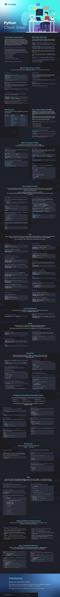

# Python Cheat Sheet
Python 3 is a truly versatile programming language, loved both by [web developers](https://websitesetup.org/become-web-developer/), data scientists, and software engineers. And there are several good reasons for that!

* Python is open-source and has a great support community,
* Plus, extensive support libraries.
* Its data structures are user-friendly.

Best of all:

Once you get a hang of it, your development speed and productivity will soar!

If you want to master two lucrative codings skills at once — server-side website development and machine learning — Python is your best bet.

In case you’re interested, we also have complete cheat sheets for Bootstrap, HTML, CSS, MySQL, and JavaScript.

So download a copy of our Python cheat sheet and get that first `.py` program up and running!



## Python Basics: Getting Started

Most Windows and Mac computers come with Python pre-installed. You can check that via a Command-Line search. If you don’t have a copy, [download](https://www.python.org/) one.

The particular appeal of Python is that you can write a program in any text editor, save it in .py format and then run via a Command-Line.

But as you learn to write more complex code or venture into data science, you might want to switch to an [IDE](https://websitesetup.org/best-ide-software/) or IDLE.

## What is IDLE (Integrated Development and Learning)?

IDLE (Integrated Development and Learning Environment) comes with every Python installation. Its advantage over other text editors is that it highlights important keywords (e.g. string functions), making it easier for you to interpret code.

Shell is the default mode of operation for Python IDLE. In essence, it’s a simple loop that performs that following four steps:

* Reads the Python statement
* Evaluates the results of it
* Prints the result on the screen
* And then loops back to read the next statement.

Python shell is a great place to test various small code snippets.

## Main Python Data Types

Every value in Python is called an “object”. And every object has a specific data type. The three most-used data types are as follows:

* **Integers (int)** — an integer number to represent an object such as “number 3”.

```python
Integers            -2, -1, 0, 1, 2, 3, 4, 5
```

* **Floating-point numbers (float)** — use them to represent floating-point numbers.

```python
Floating-point numbers            -1.25, -1.0, – 0.5, 0.0, 0.5, 1.0, 1.25
```

* **Strings** — codify a sequence of characters using a string. For example, the word “hello”. In Python 3, strings are immutable. If you already defined one, you cannot change it later on.

While you can modify a string with commands such as replace() or join(), they will create a copy of a string and apply the modification to it, rather than rewrite the original one.

```python
Strings            'yo', 'hey', ‘Hello!', 'what’s up!'
```

Plus, another three types worth mentioning are **lists**, **dictionaries**, and **tuples**. All of them are discussed in the next sections.

For now, let’s focus on the strings.

## How to Create a String in Python

You can create a string in three ways using single, double, or triple quotes.

Here’s an example of every option:

### Basic Python String

```python
my_string = "Let’s Learn Python!"
another_string = 'It may seem difficult first, but you can do it!'
a_long_string = '''Yes, you can even master multi-line strings
 that cover more than one line
 with some practice'''
```

Whichever option you choose, you should stick to it and use it consistently within your program.

As the next step, you can use the **print()** function to output your string in the console window. This lets you review your code and ensure that all functions well.

Here’s a snippet for that:

```python
print("Let's print out a string!")
```

### String Concatenation

The next thing you can master is **concatenation** — a way to add two strings together using the “+” operator.

Here’s how it’s done:

```python
string_one = "I’m reading "
string_two = "a new great book!"
string_three = string_one + string_two
```

**Note**: You can’t apply + operator to two different data types e.g. string + integer. If you try to do that, you’ll get the following Python error:

```python
TypeError: Can't convert 'int' object to str implicitly
```

**String Replication**

As the name implies, this command lets you repeat the same string several times. This is done using * operator.

Mind that this operator acts as a replicator only with string data types. When applied to numbers, it acts as a multiplier.

String replication example:

```python
'Alice' * 5 'AliceAliceAliceAliceAlice'
```

And with `print ()`

```python
print("Alice" * 5)
```

And your output will be Alice written five times in a row.

## Math Operators

For reference, here’s a list of other math operations you can apply towards numbers:

| Operators | Operation | Example |
|:--| :--  | :--  |
** | Exponent | 2 ** 3 = 8 |
% | Modulus/Remainder | 22 % 8 = 6 |
// | Integer division | 22 // 8 = 2 |
/ | Division | 22 / 8 = 2.75 |
(*) | Multiplication | 3 * 3 = 9 |
(-) | Subtration | 5 - 2 = 3 |
(+) | Addition | 2 + 2 = 4 |

## How to Store Strings in Variables

**Variables** in Python 3 are special symbols that assign a specific storage location to a value that’s tied to it. In essence, variables are like special labels that you place on some value to know where it’s stored.

Strings incorporate data. So you can “pack” them inside a variable. Doing so makes it easier to work with complex Python programs.

Here’s how you can store a string inside a variable.

```python
my_str = "Hello World"
```

Let’s break it down a bit further:

* my_str is the variable name.
* = is the assignment operator.
* “Just a random string” is a value you tie to the variable name.

Now when you print this out, you receive the string output.

print(my_str)

```python
print(my_str)
```

= Hello World

See? By using variables, you save yourself heaps of effort as you don’t need to retype the complete string every time you want to use it.

## Built-in Functions in Python

You already know the most popular function in Python — `print()`.

Now let’s take a look at its equally popular cousins that are in-built in the platform.

**Input() Function**
`input()` function is a simple way to prompt the user for some input (e.g. provide their name). All user input is stored as a string.

Here’s a quick snippet to illustrate this:

```python
name = input("Hi! What's your name? ")
print("Nice to meet you " + name + "!")

age = input("How old are you ")
print("So, you are already " + str(age) + " years old, " + name + "!")
```

When you run this short program, the results will look like this:

Hi! What’s your name? “Jim”

Nice to meet you, Jim!

How old are you? 25

So, you are already 25 years old, Jim!

**len() Function**

`len()` function helps you find the length of any string, list, tuple, dictionary, or another data type.

It’s a handy command to determine excessive values and trim them to optimize the performance of your program.

Here’s an input function example for a string:

```python
# testing len() 
str1 = "Hope you are enjoying our tutorial!"
print("The length of the string is :", len(str1))
```

Output:

The length of the string is: 35

**filter()**

Use the `filter()` function to exclude items in an iterable object (lists, tuples, dictionaries, etc.).

```python
ages = [5, 12, 17, 18, 24, 32]

def myFunc(x):
  if x < 18:
    return False
  else:
    return True

adults = filter(myFunc, ages)

for x in adults:
  print(x)
```

*Optional: The PDF version of the checklist can also include a [full table](https://www.w3schools.com/python/python_ref_functions.asp) of all the in-built functions.*

## How to Define a Function

Apart from using in-built functions, Python 3 also allows you to define your own functions for your program.

To recap, a **function** is a block of coded instructions that perform a certain action. Once properly defined, a function can be reused throughout your program i.e. re-use the same code.

Here’s a quick walkthrough explaining how to define a function in Python:

First, use **def** keyword followed by the function `name():`. The parentheses can contain any parameters that your function should take (or stay empty).

`def name():`

Next, you’ll need to add a second code line with a 4-space indent to specify what this function should do.

```python
def name():
    print("What’s your name?")
```

Now, you have to call this function to run the code.

```python
name.py
def name():
    print("What’s your name?")

name()
```

Now, let’s take a look at a defined function with a parameter — an entity, specifying an argument that a function can accept.

```python
def add_numbers(x, y, z):
    a = x + y
    b = x + z
    c = y + z
    print(a, b, c)

add_numbers(1, 2, 3)
```

In this case, you pass the number 1 in for the x parameter, 2 in for the y parameter, and 3 in for the z parameter. The program will that do the simple math of adding up the numbers:

Output:

a = 1 + 2

b = 1 + 3

c = 2 + 3

**How to Pass Keyword Arguments to a Function**

A function can also accept keyword arguments. In this case, you can use parameters in random order as the Python interpreter will use the provided keywords to match the values to the parameters.

Here’s a simple example of how you pass a keyword argument to a function.

```python
# Define function with parameters
def product_info(product name, price):
    print("productname: " + product name)
    print("Price " + str(dollars))

# Call function with parameters assigned as above
product_info("White T-shirt", 15 dollars)

# Call function with keyword arguments
product_info(productname="jeans", price=45)
```

Output:

Productname: White T-shirt

Price: 15

Productname: Jeans

Price: 45

## Lists

Lists are another cornerstone data type in Python used to specify an ordered sequence of elements. In short, they help you keep related data together and perform the same operations on several values at once. Unlike strings, lists are mutable (=changeable).

Each value inside a list is called an **item** and these are placed between square brackets.

### Example Lists

```python
my_list = [1, 2, 3]
my_list2 = ["a", "b", "c"]
my_list3 = ["4", d, "book", 5]
```

Alternatively, you can use `list()` function to do the same:

```python
alpha_list = list(("1", "2", "3”)) 
print(alpha_list)
```

### How to Add Items to a List

You have two ways to add new items to existing lists.

The first one is using `append()` function:

```python
beta_list = ["apple", "banana", "orange"]
beta_list.append("grape")
print(beta_list)
```

The second option is to `insert()` function to add an item at the specified index:

```python
beta_list = ["apple", "banana", "orange"]
beta_list.insert("2 grape")
print(beta_list)
```

### How to Remove an Item from a List

Again, you have several ways to do so. First, you can use `remove()` function:

```python
beta_list = ["apple", "banana", "orange"]
beta_list.remove("apple")
print(beta_list)
```

Secondly, you can use the `pop()` function. If no index is specified, it will remove the last item.

```python
beta_list = ["apple", "banana", "orange"]
beta_list.pop()
print(beta_list)
```

The last option is to use **del keyword** to remove a specific item:

```python
beta_list = ["apple", "banana", "orange"]
del beta_list [1]
print(beta_list)
```

P.S. You can also apply del towards the entire list to scrap it.

### Combine Two Lists

To mash up two lists use the + operator.

```python
my_list = [1, 2, 3]
my_list2 = ["a", "b", "c"]
combo_list = my_list + my_list2
combo_list
[1, 2, 3, 'a', 'b', 'c']
```

### Create a Nested List

You can also create a list of your lists when you have plenty of them.

```python
my_nested_list = [my_list, my_list2]
my_nested_list
[[1, 2, 3], ['a', 'b', 'c']]
```

### Sort a List

Use the **sort()** function to organize all items on your list.

```python
alpha_list = [34, 23, 67, 100, 88, 2]
alpha_list.sort()
alpha_list
[2, 23, 34, 67, 88, 100]
```

### Slice a List

Now, if you want to call just a few elements from your list (e.g. the first 4 items), you need to specify a range of index numbers separated by a colon [x:y].

Here’s an example:

```python
alpha_list[0:4]
[2, 23, 34, 67]
```

### Change Item Value on Your List

You can easily overwrite the value of one list items:

```python
beta_list = ["apple", "banana", "orange"]
beta_list[1] = "pear"
print(beta_list)
```

Output:

```python
['apple', 'pear', 'cherry']
```

### Loop Through The List

Using **for loop** you can multiply the usage of certain items, similarly to what * operator does.

Here’s an example:

```python
for x in range(1,4):
    beta_list += ['fruit']
    print(beta_list)
```

### Copy a List

Use the built-in `copy()` function to replicate your data:

```python
beta_list = ["apple", "banana", "orange"]
beta_list = beta_list.copy()
print(beta_list)
```

Alternatively, you can copy a list with the `list()` method:

```python
beta_list = ["apple", "banana", "orange"]
beta_list = list (beta_list) 
print(beta_list)
```

## List Comprehensions

List comprehensions are a handy option for creating lists based on existing lists. When using them you can build by using strings and tuples as well.

### List Comprehensions Examples

```python
list_variable = [x for x in iterable]
```

Here’s a more complex example that features  math operators, integers, and the range() function:

```python
number_list = [x ** 2 for x in range(10) if x % 2 == 0]
print(number_list)
```

## Tuples

Tuples are similar to lists — they allow you to display an ordered sequence of elements. However, they are immutable and you can’t change the values stored in a tuple.

The advantage of using tuples over lists is that the former is slightly faster. So it’s a nice way to optimize your code.

### How to Create a Tuple

```python
my_tuple = (1, 2, 3, 4, 5)
my_tuple[0:3]
(1, 2, 3)
```

**Note**: Once you create a tuple, you can’t add new items to it or change it in any other way!

### How to Slide a Tuple

The process is similar to slicing lists.

```python
numbers = (0, 1, 2, 3, 4, 5, 6, 7, 8, 9, 10, 11, 12)
print(numbers[1:11:2])
```

Output:

```python
(1, 3, 5, 7, 9)
```

### Convert Tuple to a List

Since Tuples are immutable, you can’t change them. What you can do though is convert a tuple into a list, make an edit and then convert it back to a tuple.

Here’s how to accomplish this:

```python
x = ("apple", "orange", "pear")
y = list(x)
y[1] = "grape"
x = tuple(y)
print(x)
```

### Dictionaries

A dictionary holds indexes with keys that are mapped to certain values. These key-value pairs offer a great way of organizing and storing data in Python. They are mutable, meaning you can change the stored information.

A key value can be either a **string**, **Boolean**, or **integer**. Here’s an example dictionary illustrating this:

```python
Customer 1= {'username': 'john-sea', 'online': false, 'friends':100}
```

### How to Сreate a Python Dictionary

Here’s a quick example showcasing how to make an empty dictionary.

**Option 1**: new_dict = {}

**Option 2**: other_dict= dict()

And you can use the same two approaches to add values to your dictionary:

```python
new_dict = {
  "brand": "Honda",
  "model": "Civic",
  "year": 1995
}
print(new_dict)
```

### How to Access a Value in a Dictionary

You can access any of the values in your dictionary the following way:

```python
x = new_dict["brand"]
```

You can also use the following methods to accomplish the same.

* dict.keys() isolates keys

* dict.values() isolates values

* dict.items() returns items in a list format of (key, value) tuple pairs
 
### Change Item Value

To change one of the items, you need to refer to it by its key name:

```python
#Change the "year" to 2020:

new_dict= {
  "brand": "Honda",
  "model": "Civic",
  "year": 1995
}
new_dict["year"] = 2020
```

### Loop Through the Dictionary

Again to implement looping, use **for loop** command.

**Note**: In this case, the return values are the **keys** of the dictionary. But, you can also return values using another method.

```python
#print all key names in the dictionary 

for x in new_dict:
  print(x)

#print all values in the dictionary 

for x in new_dict:
  print(new_dict[x])

#loop through both keys and values

for x, y in my_dict.items():
  print(x, y)
```

### If Statements (Conditional Statements) in Python

Just like other programming languages, Python supports the basic logical conditions from math:

* Equals: a == b

* Not Equals: a != b

* Less than: a < b

* Less than or equal to a <= b

* Greater than: a > b

* Greater than or equal to: a >= b

You can leverage these conditions in various ways. But most likely, you’ll use them in “if statements” and loops.

### If Statement Example

The goal of a conditional statement is to check if it’s True or False.

```python
if 5 > 1:
        print("That’s True!")
```

Output:

That’s True!

### Nested If Statements

For more complex operations, you can create nested if statements. Here’s how it looks:

```python
x = 35

if x > 20:
  print("Above twenty,")
  if x > 30:
    print("and also above 30!")
```

### Elif Statements

`elif` keyword prompts your program to try another condition if the previous one(s) was not true.

Here’s an example:

```python
a = 45
b = 45
if b > a:
  print("b is greater than a")
elif a == b:
  print("a and b are equal")
```

### If Else Statements

`else` keyword helps you add some additional filters to your condition clause. Here’s how an if-elif-else combo looks:

```python
if age < 4: 
ticket_price = 0 
elif age < 18: 
ticket_price = 10 
else: ticket_price = 15
```

### If-Not-Statements

**Not** keyword lets you check for the opposite meaning to verify whether the value is NOT True:

```python
new_list = [1, 2, 3, 4]
x = 10
if x not in new_list:
    print("'x' isn’t on the list, so this is True!")
```

### Pass Statements

If statements can’t be empty. But if that’s your case, add the **pass** statement to avoid having an error:

```python
a = 33
b = 200

if b > a:
  pass
```

## Python Loops

Python has two simple loop commands that are good to know:

* for loops

* while loops

Let’s take a look at each of these.

### For Loop
As already illustrated in the other sections of this Python checklist, **for loop** is a handy way for iterating over a sequence such as a list, tuple, dictionary, string, etc.

Here’s an example showing how to loop through a string:

```python
for x in "apple":
  print(x)
```

### While Loops

While loop enables you to execute a set of statements as long as the condition for them is true.

```python
#print as long as x is less than 8 

i = 1
while i< 8:
  print(x)
  i += 1
```

### How to Break a Loop

You can also stop the loop from running even if the condition is met. For that, use the **break** statement both in while and for loops:

```python
i = 1
while i < 8:
  print(i)
  if i == 4:
    break
  i += 1
```

## Class

Since Python is an object-oriented programming language almost every element of it is an **object** — with its methods and properties.

**Class** acts as a blueprint for creating different **objects**. Objects are an instance of a class, where the class is manifested in some program.

### How to Create a Class

Let’s create a class named TestClass, with one property named z:

```python
class TestClass:
  z = 5
```

### How To Create an Object

As a next step, you can create an object using your class. Here’s how it’s done:

```python
p1 = TestClass()
print(p1.x)
```

Further, you can assign different attributes and methods to your object. The example is below:

```python
class car(object):
    """docstring"""

    def __init__(self, color, doors, tires):
        """Constructor"""
        self.color = color
        self.doors = doors
        self.tires = tires

    def brake(self):
        """
        Stop the car
        """
        return "Braking"

    def drive(self):
        """
        Drive the car
        """
        return "I'm driving!"
```

### How to Create a Subclass

Every object can be further sub-classified. Here’s an example:

```python
class Car(Vehicle):
    """
    The Car class
    """

    def brake(self):
        """
        Override brake method
        """
        return "The car class is breaking slowly!"

if __name__ == "__main__":
    car = Car("yellow", 2, 4, "car")
    car.brake()
    'The car class is breaking slowly!'
    car.drive()
    "I'm driving a yellow car!"
```

## Dealing with Python Exceptions (Errors)

Python has a list of in-built exceptions (errors) that will pop up whenever you make a mistake in your code. As a newbie, it’s good to know how to fix these.

The Most Common Python Exceptions

* AttributeError — pops up when an attribute reference or assignment fails.

* IOError — emerges when some I/O operation (e.g. an open() function) fails for an I/

* O-related reason, e.g., “file not found” or “disk full”.

* ImportError — comes up when an import statement cannot locate the module definition. Also, when a from… import can’t find a name that must be imported.

* IndexError — emerges when a sequence subscript is out of range.

* KeyError — raised when a dictionary key isn’t found in the set of existing keys.

* KeyboardInterrupt — lights up when the user hits the interrupt key (such as Control-C or Delete).

* NameError — shows up when a local or global name can’t be found.

* OSError — indicated a system-related error.

* SyntaxError — pops up when a parser encounters a syntax error.

* TypeError — comes up when an operation or function is applied to an object of inappropriate type.

* ValueError — raised when a built-in operation/function gets an argument that has the right type but not an appropriate value, and the situation is not described by a more precise exception such as IndexError.

* ZeroDivisionError — emerges when the second argument of a division or modulo operation is zero.

## How to Troubleshoot The Errors

Python has a useful statement, design just for the purpose of handling exceptions – **try/except statement**.

Here’s a code snippet showing how you can catch KeyErrors in a dictionary using this statement:

```python
my_dict = {"a":1, "b":2, "c":3}
try:
        value = my_dict["d"]
    except KeyError:
        print("That key does not exist!")
```

You can also detect several exceptions at once with a single statement. Here’s an example of that:

```python
my_dict = {"a":1, "b":2, "c":3}
try:
    value = my_dict["d"]
except IndexError:
    print("This index does not exist!")
except KeyError:
    print("This key is not in the dictionary!")
except:
    print("Some other problem happened!")
```

### Try/Except With Else Clause

Adding an else clause will help you confirm that no errors were found:

```python
my_dict = {"a":1, "b":2, "c":3}

try:
    value = my_dict["a"]
except KeyError:
    print("A KeyError occurred!")
else:
    print("No error occurred!")
```

## Conclusion
Now you know the core Python concepts!

By no means is this Python checklist comprehensive. But it includes all the key data types, functions, and commands you should learn as a beginner.

---
© 2022 edX Boot Camps LLC. Confidential and Proprietary. All Rights Reserved.