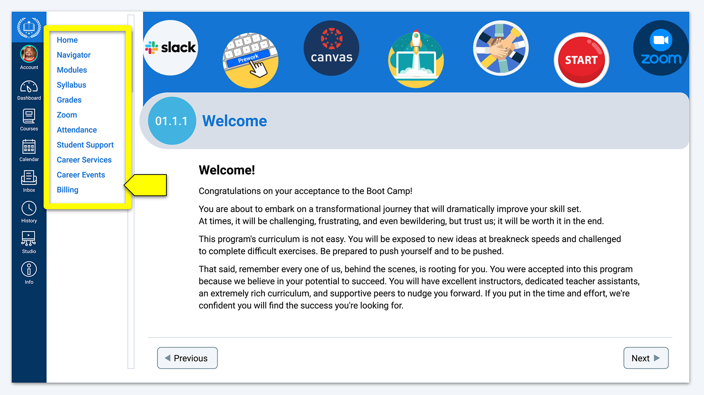

# 0.4.2 Bootcamp Spot Overview
To participate in this course, you need to know a few basic things about Bootcamp Spot, the learning platform you'll be using. You'll learn more about this system as you progress through the course, and you can always consult the official documentation for more information.

## Navigate Bootcamp Spot
Bootcamp Spot navigation consists of global navigation, course navigation, and module navigation.

* You can use **global navigation** to access your Account/Profile, Dashboard, Courses, and Calendar. Global navigation is located on the left-hand side of the screen, listed from top to bottom, as shown in the following image:

* You can use **course navigation** to move between the different areas of your course, like Syllabus, Modules, Grades, and People. Course navigation is located just to the right of the global navigation and can be collapsed for more screen space, as shown in the following image:

* You can use module navigation to move through your course content. You can access specific items in the modules, refer to a module overview from the Modules page, and navigate among pages in a module, as shown in the following image:

* The Previous and Next buttons appear at the bottom of each page, allowing you to navigate within the module, as shown in the following image:

## Update Your Time Zone
You and your classmates might be in different time zones. Follow these steps to check that your time zone on Bootcamp Spot is correct so that you don't miss an important deadline or live session:

* In the global navigation menu on the left side of the screen, click Account, as shown in the following image:

* Click Settings to access your settings page, as shown in the following image:

* On this page, you'll find the language and time zone that your account is currently set to. If these settings are correct, you can stop here. If not, continue to Step 4. The screen will resemble the following image:

* On the right side of the page, click Edit Settings, as shown in the following image:

* Click the Time Zone dropdown menu and select the one that matches your location, as shown in the following image:

* Click Update Settings to save your settings, as shown in the following image:

* Verify that the correct time zone is showing for your account.

## Submit Assignments in Bootcamp Spot
You'll submit your Challenges and projects directly in Bootcamp Spot. To submit these assignments, follow these steps:

* Access the Assignment page in Bootcamp Spot to view the assignment instructions.

* When you're ready to submit the assignment, click Submit Assignment, as shown in the following image:

You'll be shown the submission page, where you'll find one of the following things:
* A Text Entry box for assignments that must be entered as text, as shown in the following image:

* A Website URL box for submitting a link (whether a link to your Challenge stored on GitHub or another link as required in the assignment instructions), as shown in the following image:

* A Choose File button, where you can upload a file directly into Bootcamp Spot, as shown in the following image:

* When you've entered your text, URL, or file upload, you're ready to submit! Just click the Submit Assignment button, as shown in the following image:

---
© 2022 edX Boot Camps LLC. Confidential and Proprietary. All Rights Reserved.
