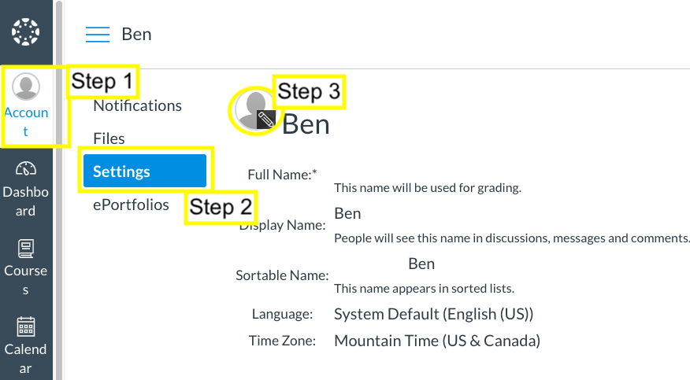
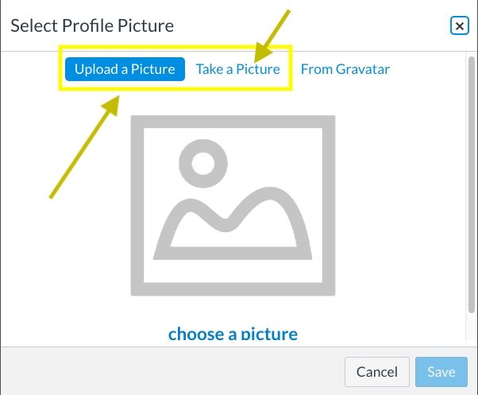
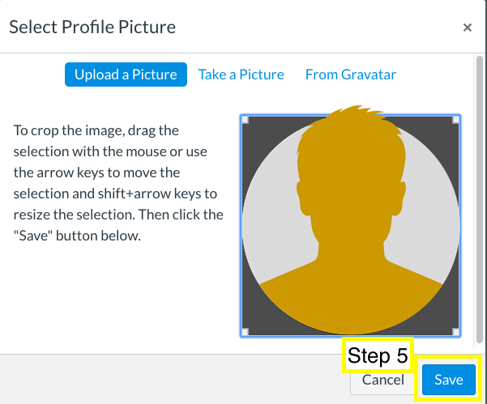

# 0.4.3: Set Up Your Profile
## Instructions

Upload a profile picture for your classmates and instructor to see. When you're finished, click the Take Quiz button and answer the quiz question to verify you have completed the steps.

* Click Account in the upper left-hand side of the page.

* Click Settings. 

* Place your cursor over the gray profile image and click on it when you see the pencil icon.

* Click Upload Picture if you want to choose a file from your computer. Click Take Picture to take a new photo with your webcam.

* Crop the picture if needed, and then click Save.

Now click the Take Quiz button and answer a question to continue.

---
© 2022 edX Boot Camps LLC. Confidential and Proprietary. All Rights Reserved.
