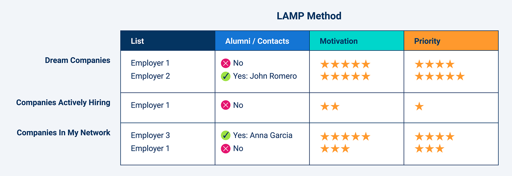
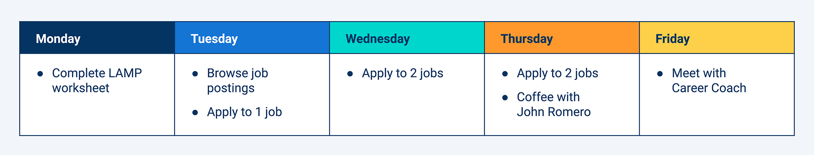

# Weekly Wrap-Up
Congratulations on your progress so far! By completing another week of the boot camp, you've taken more crucial steps in your journey to become a web developer.

Now is a great time to reflect on what you learned, connect that knowledge to your future job search and career, and practice using your skills in real-world applications.

Here we've provided extra resources, assessments, and technical interview prep to help you do that.

## What You Learned
You're making fantastic progress! This week in particular, you learned how to do the following:

* Identify the DOM and its relationship to HTML.

* Select and dynamically generate HTML elements and content using Web API methods.

* Implement DOM API methods to handle events like key presses and mouse clicks.

* Explain event propagation and implement handling functions.

* Store and retrieve data using the browser's local and session storage.

## Career Connection
What a week! You learned how to work with web APIs! The DOM is one of many APIs built directly into the browser, and it is also one of the most popular. You can now use JavaScript to manipulate data on the page. No longer do prospective employers stare at static blocks of text on your portfolio website—instead, they scroll past dynamically appearing graphics and cards or contact you with the click of a button.

### Today’s Career Connection Agenda
* DOM in the Workplace

* Finding Your Career Fit: Strategizing Your Job Search

* Interview Prep

* Next Steps

### DOM in the Workplace
Your knowledge of the DOM completes your basic front-end toolkit. You can now use HTML, CSS, JavaScript, and the DOM to create interactive web pages. It probably goes without saying that any front-end developer will be expected to know how to use the DOM since most web pages these days have interactive components.

Something that we find exciting about this phase in your journey are the opportunities that open up because you can now work with the DOM. In your programming career, you will solve problems, and you will want to build beautiful solutions to these problems. The DOM opens up a world of infinite possibilities for your front-end solutions. You can create applications that update the data of a page without a refresh, drag elements, resize elements, delete elements, and so on. Seriously, you have a lot of options. Whether you are designing for a client as a freelancer or for a set of users as a full-time employee, you can use the DOM to bring the best solution to life.

One more note about the DOM for those applying to new roles after this course. Utilizing the DOM is a skill that employers will likely assume you have. The skill usually won’t appear on a job description, but you should be prepared to answer questions about the DOM in a technical interview.

### Finding Your Career Fit: Strategizing Your Job Search

Job searching can be such an emotional rollercoaster. We find that job-seekers with a solid strategy are more effective, more efficient, and less stressed. Below are five practices that you can add to your job search strategy.

### Network
Networking is CRUCIAL to the job search, and an essential piece in your job search strategy. For this reason, we are big fans of a job search strategy called LAMP. The LAMP method, which stands for List, Alumni, Motivation, Priority, walks you through creating a list of companies and contacts that match your interests, goals, and network. Check out this [LAMP method article](https://careernetwork.2u.com/articles/blog-the-lamp-method/) to learn more.

If you are intimidated by the word "networking," don’t worry! We will discuss networking strategies and tools in upcoming Career Connections.

### Let the jobs come to you
Today you can utilize technology to let the jobs come to you. Here are just a few ways to do so:

* Create job alerts on your favorite online job boards, such as Indeed.com or ZipRecruiter.com.

* Follow companies and professionals on social media and LinkedIn. They will often post about job openings.

* Join professional groups. For example, one such group is Women in Web Dev. These groups will often have newsletters or forums that include job postings.

Note that this is an add-on to your other job search strategies, which should also include online and offline searches, and networking.

### Take care of your mental health
Like we said, job searching can be an emotional rollercoaster. It is wise to incorporate mental health considerations into your job search strategy. Take a day off once a week, and celebrate your wins!

### Meet with your Career Coach
Your Career Coach can help you develop a job search strategy, research job postings, and more. In order to connect with your Career Coach, you must submit your resume to the Develop Your Resume Milestone, which you can find on the Career Services tab of your course portal.

### Create a schedule
Finally, schedule all of these practices into a job search plan. Our Career Coaches recommend that you apply to 5-10 jobs per week in order to get hired within 6 months of completing your bootcamp. The table below shows a one-week snapshot of a job search plan.

We hope that these tips help! If you want to learn more, consider attending our "Launch Your Job Search Today" workshop. You can sign up on the [Events page of the Career Engagement Network](https://careernetwork.2u.com/all-events/).

# INTERVIEW PREP
#### It is common in the tech industry to have a technical interview as part of the hiring process. In this section of each Career Connection, we will review sample interview questions, and provide example responses. We’ve included this section as a pulldown feature so that you can practice as you go through the course, or skip these sections now and come back later when you are preparing for interviews.

**Practice Interview Questions**

Sometimes employers will ask you to complete an online assessment. Try out the multiple-choice [Module 4 Technical Interview Assessment](https://forms.gle/jYRX4XMiVDo2UpxS9) for practice.

**Algorithm-based Interview Questions**

Many companies use algorithm questions during the technical interview. Starting this week, we will provide weekly algorithm problems for you to work on.

Each algorithm has instructions, an **Unsolved** folder, and a **Solved** folder. Spend up to a few hours trying to solve each problem without looking at the solution. If you're unable to solve a problem, study the solution to understand why it works and then come back and try again later:

* [01: Log Even Nums](https://static.fullstack-bootcamp.com/algorithms/04-Web-APIs/01-log-even-nums.zip)

* [02: Countdown](https://static.fullstack-bootcamp.com/algorithms/04-Web-APIs/02-countdown.zip)

* [03: Sum of Array](https://static.fullstack-bootcamp.com/algorithms/04-Web-APIs/03-sum-array.zip)

The following video will help you work out the solution to the Sum of Array problem:

[Sum all array elements in JavaScript](https://www.youtube.com/watch?v=5HYww3eTxzI)

Another great resource for practicing algorithms is CodeSignal. Some companies even use CodeSignal to deliver their online technical assessment. Here’s a problem for you to try: [Count Vowel Consonant](https://app.codesignal.com/public-test/YvSg9mctHApfLBuMH/qBHxbHRS4Yghf8)

### Next Steps
* Consider adding DOM to the technical skills section of your application materials.

* Consider adding APIs to the technical skills sections of your application materials. (Only add APIs that you have experience with and that relate to the positions you are applying for.)

* Create and fill out your own LAMP table.

* Create a job search strategy and schedule.

## Prepare for Next Week
If you haven't yet, be sure to complete and turn in all Challenge assignments for this week. Once you've done that, you can turn your attention to the upcoming module.

When you are researching DOM and event resources, you might encounter jQuery solutions. jQuery is a lightweight JavaScript library that allows you execute JavaScript functionality with just a few lines of code. We'll cover jQuery next, but for now use resources that don't rely on jQuery or the **$** variable.

---
© 2022 edX Boot Camps LLC. Confidential and Proprietary. All Rights Reserved.
