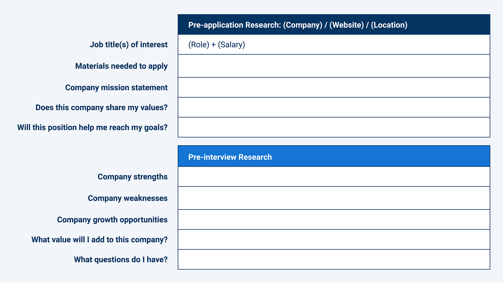

# Weekly Wrap-Up
Congratulations on your progress so far! By completing another week of the boot camp, you've taken more crucial steps in your journey to become a web developer.

Now is a great time to reflect on what you learned, connect that knowledge to your future job search and career, and practice using your skills in real-world applications.

Here we've provided extra resources, assessments, and technical interview prep to help you do that.

## What You Learned
You're making fantastic progress! This week in particular, you learned how to do the following:

* Explain and implement CDNs to leverage third-party APIs like CSS frameworks, JavaScript libraries, and custom fonts.

* Use jQuery to perform DOM manipulation and traversals and implement interactivity using event handlers.

* Explain how to resolve issues related to dynamically generated HTML using jQuery.

* Explain and implement the Bootstrap grid layout in HTML.

* Integrate Bootstrap components in HTML files to quickly build user interfaces.

* Add custom styling to a CSS framework.

* Implement jQuery UI to make a webpage more user-friendly.

* Use Moment.js to format dates and calculate time differences.

## Career Connection
Congratulations on completing another intense week! This week, you learned how to work with third-party libraries. In the process, you also learned how to work with jQuery. Today, we will talk about jQuery’s relevance to today’s workforce, legacy code, and how to research a potential employer.

### Today’s Career Connection Agenda
* jQuery in the Workplace

* Finding Your Career Fit: Researching a Potential Employer

* Interview Prep

* Next Steps

### jQuery and Legacy Code in the Workplace
You may come across articles that question if developers should still learn jQuery in this day and age. Over the years, JavaScript has developed many of the features that popularized jQuery. Additionally, web frameworks like React and Angular have emerged. These new technologies have led to a decline in the use of jQuery, which leads some to question if jQuery is still relevant to new programmers.

Well, as of today, jQuery is still worth a mention! Despite other innovations, jQuery is still widely used. W3techs estimates that [78% of all websites use jQuery](https://w3techs.com/technologies/details/js-jquery). Visit [Indeed.com](https://www.indeed.com/jobs?q=jQuery&vjk=030fb18cc8754373) to see thousands of job postings that list jQuery as a requirement. It seems likely that you will come across jQuery in your career.

There are two main reasons that jQuery is still around. The first is that some developers prefer it. jQuery is still a great option for websites that will not scale into a more complicated project.

The second reason is legacy code. Legacy code is code inherited from someone else or from an older version of software. Today, many new developers will inherit projects that contain jQuery because, for some companies, the effort to replace jQuery with a better solution is not worth the investment.

In summary, even though newer technology may eliminate the need for jQuery, it is nevertheless worth learning about. At the end of the day, jQuery can still make a website more dynamic and beautiful. So for now, we recommend learning it and embracing it.

### Finding Your Career Fit: Researching a Potential Employer

There are two stages in the job search during which you need to research a potential employer:

* Before you apply.

* Before you interview.

In the first stage, you should research for the purpose of discovering if an application is worth your time. You will be applying to several jobs each week so try to limit this phase of research to 10-20 minutes. Ask yourself: Does this company share my values? Do the open positions fit my skills? Remember, the goal is to get a job that you enjoy, not just any job.

In the second stage, you should research for the purpose of interview preparation. Researching the company before an interview will show the interviewer that you are interested in the position, enable you to predict questions that may be asked, and prepare you to give responses that resonate with the employer.

Below is a template that you can use to research companies at each stage in the process. Feel free to copy it and make your own adjustments!

Not sure where to find this information? Here are just a few resources that you can use:

* Company website

* Company social media

* Company blog

* Online reviews

* Press releases

* Company leader bios

* Company employees that are within your network

# INTERVIEW PREP
#### Let’s do some interview prep!

**Practice Interview Questions**

Sometimes employers will ask you to complete an online assessment. Try out the multiple-choice [Module 5 Technical Interview Assessment](https://forms.gle/c4pv2qUatMXs5rzZA) for practice.

**Algorithm-based Interview Questions**

Many companies use algorithm questions during the technical interview. Starting this week, we will provide weekly algorithm problems for you to work on.

Each algorithm has instructions, an **Unsolved** folder, and a **Solved** folder. Try to solve each problem first, then study the solution.

* [01: Fizz Buzz](https://static.fullstack-bootcamp.com/algorithms/05-Third-Party-APIs/01-fizz-buzz.zip)

* [02: Max Num](https://static.fullstack-bootcamp.com/algorithms/05-Third-Party-APIs/02-max-num.zip)

* [03: Vowel Count](https://static.fullstack-bootcamp.com/algorithms/05-Third-Party-APIs/03-vowel-count.zip)

The following video will help you work out the solution to the Max Num problem:

[Finding the Minimum or Maximum Value in an Array : JavaScript](https://www.youtube.com/watch?v=tPCOYESqQiY)

Also, here is a problem for you to try on CodeSignal: [Reverse Sentence](https://app.codesignal.com/public-test/qL7KK4o6KBSgmdqBw/rDz464zXxdE6dx)

### Next Steps
* Consider adding jQuery to the technical skills section of your application materials.

* Consider adding APIs to the technical skills sections of your application materials. (Only add APIs that you have experience with, and that relate to the positions you are applying for.)

* Use the company research template (provided earlier) to research a few employers that you would consider working with.

## Prepare for Next Week
If you haven't yet, be sure to complete and turn in all Challenge assignments for this week. Once you've done that, you can turn your attention to the upcoming module, in which you'll use the jQuery AJAX method to make requests to server-side APIs.

---
© 2022 edX Boot Camps LLC. Confidential and Proprietary. All Rights Reserved.
