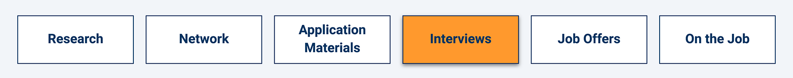

# Weekly Wrap-Up
Congratulations on your progress so far! By completing another week of the boot camp, you've taken more crucial steps in your journey to become a web developer.

Now is a great time to reflect on what you learned, connect that knowledge to your future job search and career, and practice using your skills in real-world applications.

Here we've provided extra resources, assessments, and technical interview prep to help you do that.

## What You Learned
You're making fantastic progress! This week in particular, you learned how to do the following:

* Explain the differences between a global execution context and a function execution context.

* Identify when a function execution context is created and what is stored in it.

* Describe the functions of the call stack and the callback queue.

* Compare and contrast a stack vs. a queue in terms of LIFO and FIFO.

* Summarize asynchronous behavior and the role of the event loop.

* Construct a higher-order function.

* Explain the lexical environment.

* Identify encapsulated variables.

* Create a factory function.

* Distinguish between inheritance and composition design.

* Implement a linear search algorithm.

* Use recursion to solve a Fibonacci sequence algorithm.

* Implement a binary search algorithm and know when to use it over a linear search algorithm.

* Write shell scripts to be executed from the command line.

* Articulate and implement sorting algorithms in a technical interview setting.

## Career Connection
Congratulations on making it through some challenging computer science topics. We know this is complicated stuff, and we don't expect you to have walked into this Career Connection fully confident in the material. Try to focus on the broader concepts of what we talked about, and keep working at solving algorithms and developing applications to practice your new skills.

### Today’s Career Connection Agenda
* Computer Science in the Workplace

* Finding Your Career Fit: Pseudocoding During Interviews

* Interview Prep

* Next Steps

### Computer Science in the Workplace
In this module, we talked about several topics that are likely to come up in a technical interview. Why do employers care about these topics? Well, it’s all about creating the best code possible. Employers want to know that you have a strong foundation of knowledge to build your code upon.

In addition to having a strong knowledge foundation, you should be continually adding to it. The world of tech moves fast. There are always new tools, libraries, and systems that may be of use to you. Good developers are lifelong learners. For this reason, two other common interview questions are, "What do you do to keep up-to-date on the latest technology?" and "What do you do when you get stuck?"

We have asked industry professionals these exact questions, and here are the trends that we see:
* Utilize [Stack Overflow](https://stackoverflow.com/): Stack Overflow is a question and answer website for programmers. It is likely that your questions have already been answered by the community. Note that proper programmer etiquette is to not post questions that have already been answered, and to contribute to the community by answering questions when possible.

* Connect with your team: Your programing peers are a great resource for discussing trends in the industry, and getting help when you are stuck.

* Use search engines: Employers know that "googling" is an effective problem solving strategy! Learn how to effectively use search engines for problem-solving and research.

### Finding Your Career Fit: Pseudocoding During Interviews

Here is our number one tip for anyone that is asked to code during the hiring process: pseudocode! (Don’t remember what pseudocode is? Review this [Geeks for Geeks article on how to write pseudocode](https://www.geeksforgeeks.org/how-to-write-a-pseudo-code/). In fact, we recommend pseudocoding as the first step during a whiteboard interview or online technical assessment.

Below is a list of what you will gain by pseudocoding at the start of your interview task:

* It gives you time to collect your thoughts before writing the code.

* It demonstrates how you structure and solve problems.

* It demonstrates your organizational skills, and how you achieve "clean code."

* It can be evidence that you solved the problem correctly, even if you make a syntax error.

* It can demonstrate all that you do know, even when you don’t know the entire solution.

Still thinking about skipping pseudocoding during an interview? Please don’t. We know that applicants are often eager to solve the interview task as quickly as possible, but that’s only a small part of what the interviewer is looking for. The interviewer actually expects you to pseudocode! In addition to the correct answer, they are trying to see how you problem-solve and organize your work.

# INTERVIEW PREP
#### Let’s do some interview prep!

**Practice Interview Questions**

Sometimes employers will ask you to complete an online assessment. Try out the multiple-choice [Module 17 Technical Interview Assessment](https://forms.gle/hqrZiocUkRsskb616) for practice.

**Algorithm-based Interview Questions**

Each algorithm has instructions, an **Unsolved** folder, and a **Solved** folder. Try to solve each problem first, then study the solution.

* [01: Reverse No Built In](https://static.fullstack-bootcamp.com/algorithms/17-CS/01-reverse-no-built-in.zip)

* [02: Left Rotation](https://static.fullstack-bootcamp.com/algorithms/17-CS/02-left-rotation.zip)

* [03: Reverse in Place](https://static.fullstack-bootcamp.com/algorithms/17-CS/03-reverse-in-place.zip)

The following video will help you work out the solution to the Left Rotation problem:

[Left rotate array HackerRank problem JavaScript solution](https://www.youtube.com/watch?v=1Cn4K0rVd9I)

Also, here is a problem for you to try on CodeSignal:

[Word Tumble](https://app.codesignal.com/public-test/W38trZ3bQdqpabN2X/SvJ3vebQ5oLSJu)

### Next Steps
Practice pseudocoding and prepare for technical assessments on:

* [HackerRank](https://www.hackerrank.com/dashboard)

* [CodeSignal](https://codesignal.com/developers/)

* [CodeWars](https://www.codewars.com/)

## Prepare for Next Week
If you haven't yet, be sure to complete and turn in all Challenge assignments for this week. Once you've done that, you can turn your attention to the upcoming module.

In the next module, you'll return to the back end and learn about NoSQL databases using MongoDB, a popular document-based database that integrates easily with JavaScript.

Be sure to have MongoDB and Compass installed on your computer BEFORE class. Follow the [MongoDB installation guide on The Full-Stack Blog](https://coding-boot-camp.github.io/full-stack/mongodb/how-to-install-mongodb) to install MongoDB and Compass locally.

Mongo Atlas, a fully managed cloud database, will be used to deploy the mini-project to Heroku. For instructions on how to sign up for a account and deploy a free cluster, refer to the [MongoDB Atlas setup guide on The Full-Stack Blog](https://coding-boot-camp.github.io/full-stack/mongodb/how-to-set-up-mongodb-atlas)

Finally, this is an early heads-up that the Module 22 Challenge will be an optional assignment. It is not required for submission, nor will it count towards one of the two assignments that you can skip. If you choose to submit the Module 22 Challenge, you will receive extra credit points on your final grade. However, if you choose not to submit it, your final grade will not be affected in any way. The Module 22 Challenge is an opportunity for you to further practice your skills and get feedback on it, with the added incentive of receiving extra credit for the work.

---
© 2022 edX Boot Camps LLC. Confidential and Proprietary. All Rights Reserved.