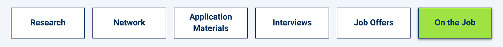

# Weekly Wrap-Up
Congratulations on your progress so far! By completing another week of the boot camp, you've taken more crucial steps in your journey to become a web developer.

Now is a great time to reflect on what you learned, connect that knowledge to your future job search and career, and practice using your skills in real-world applications.

Here we've provided extra resources, assessments, and technical interview prep to help you do that.

## What You Learned
You're making fantastic progress! This week in particular, you learned how to do the following:

* Define a GraphQL schema and implement resolvers to handle data population.

* Write a GraphQL query to read data with and without parameters.

* Use a GraphQL mutation to create and update data.

* Execute queries and mutations using **useQuery()** and **useMutation()** Hooks.

* Update GraphQL's in-memory cache.

* Implement client-side routing by using React Router.

* Securely transmit data as a JSON object using JWT.

* Implement server-side authentication in GraphQL API.

## Career Connection
This week, you really brought everything together—the entire MERN stack. Congratulations!

### Today’s Career Connection Agenda
* MERN in the Workplace

* Finding Your Career Fit: Asking for a Raise or Promotion

* Interview Prep

* Next Steps

### MERN in the Workplace
When we talk about a "full stack," it generally includes the tools for building a cohesive front end, back end, database, and DevOps. There are many tools available for this, which means that there are seemingly infinite combinations for full-stack development. Let’s discuss the three most popular combinations.

### MEAN (MongoDB, ExpressJS, Angular, Node.js)
MEAN was introduced as a way to keep the whole code in JavaScript. (You can imagine how nice this is as a full-stack developer.) Although you haven’t used Angular, it is very similar to React, so you should feel comfortable working with the MEAN stack.

### MERN (MongoDB, ExpressJS, React, Node.js)
You know this one! MERN has gained popularity over MEAN as React has become favored over Angular. React is quicker to learn, which makes the MERN stack easy to adopt.

### LAMP (Linux, Apache, MySQL, PHP/Python)
LAMP is extremely popular on a worldwide scale. It is an open source stack, and known for its ability to handle dynamic pages. If you are interested in LAMP, you are in luck because it has a huge community and a large library of tools.

Of course, there is also MEVN, WISA, XAMPP, and the list goes on. Remember when we mentioned choosing the right tool for the right job? Developers must rely on this philosophy when choosing a stack. In general, MERN is a great stack for most jobs, which is why we learn it in this course.

### Finding Your Career Fit: Asking for a Raise or Promotion

At some point in your career, you may need to ask for a raise or a promotion. We’ve decided to bring this up now because preparing for this moment ahead of time will set you up for success. Consider implementing the recommendations below, and thank yourself later.

### Keep receipts
Keep track of your major successes at the company in a personal document. Include quantitative figures such as the number of people managed or the amount of cost reduced. These "receipts" can be used to demonstrate your value as an employee.

### Periodically check salary trends
Stay up-to-date on the salary range for positions similar to yours. Understand how people in similar positions are being compensated in your location and at your company.

### Learn the company fiscal calendar
At most companies, there are specific times when it is most convenient to raise salaries. This is commonly at the end of the fiscal year when the company is planning the next year’s budget. Other times to consider are during an annual or quarterly employee review. Learn these dates and plan accordingly.

When the time is right, this small bit of work will create a strong foundation for your raise or promotion conversation.

# INTERVIEW PREP
#### Let’s do some interview prep!

**Practice Interview Questions**

Sometimes employers will ask you to complete an online assessment. Try out the multiple-choice [Module 21 Technical Interview Assessment](https://forms.gle/MgELRy6rvTXQz6M16) for practice.

**Algorithm-based Interview Questions**

Each algorithm has instructions, an **Unsolved** folder, and a **Solved** folder. Try to solve each problem first, then study the solution.

* [01: Plus One](https://static.fullstack-bootcamp.com/algorithms/21-MERN/01-plus-one.zip)

* [02: One Edit Away](https://static.fullstack-bootcamp.com/algorithms/21-MERN/02-one-edit-away.zip)

* [03: Caesar Cipher](https://static.fullstack-bootcamp.com/algorithms/21-MERN/03-caesar-cipher.zip)

The following video will help you work out the solution to the Caesar Cipher problem:

[Javascript Coding Challenge #16: Caesars Cipher (Freecodecamp)](https://www.youtube.com/watch?v=4mp-6a3vARU)

Also, here is a problem for you to try on CodeSignal:

[Disemvowel](https://app.codesignal.com/public-test/muLKxQ9LXTWtufeXX/jZiFpbXwCTErvS)

### Next Steps
* Consider adding MERN to your application materials.

* Remember that you have access to your Career Coach for up to three months post-graduation. Schedule a meeting to discuss how you would like to work with them post-graduation.

## Prepare for Next Week
If you haven't yet, be sure to complete and turn in all Challenge assignments for this week. Once you've done that, you can turn your attention to the upcoming module.

During the next module, you'll build on your full-stack app development skills as you learn about state management and the Context API. You'll also review the key concepts covered in this module to help you prepare for your final project.

---
© 2022 edX Boot Camps LLC. Confidential and Proprietary. All Rights Reserved.