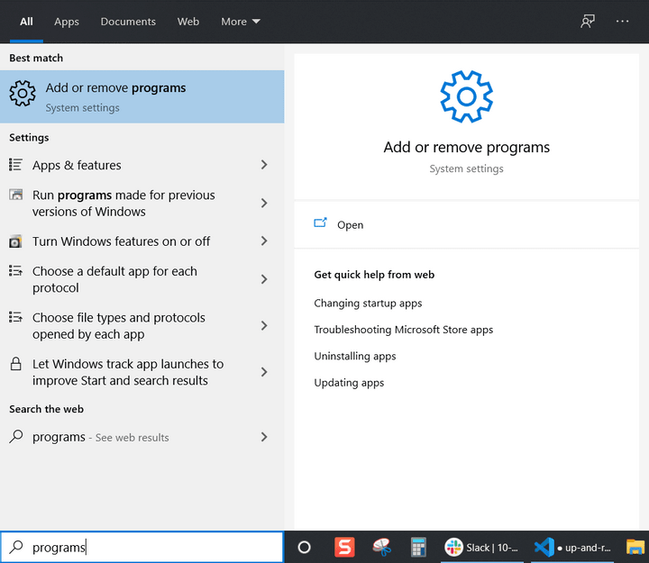
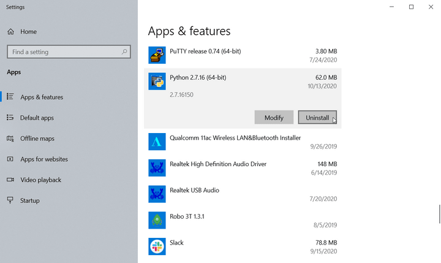
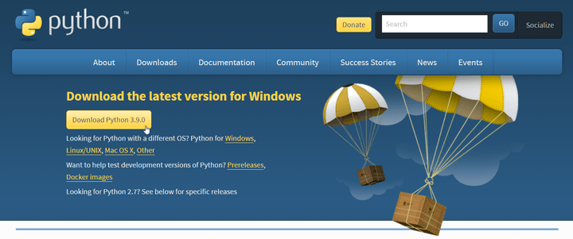
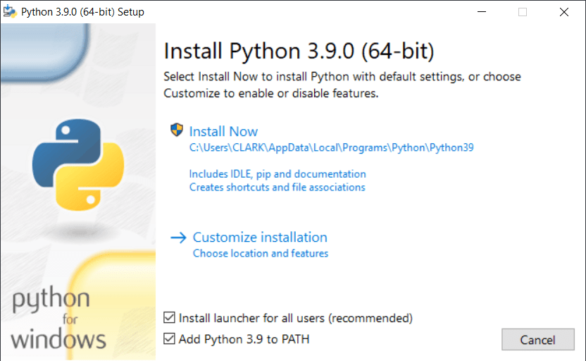
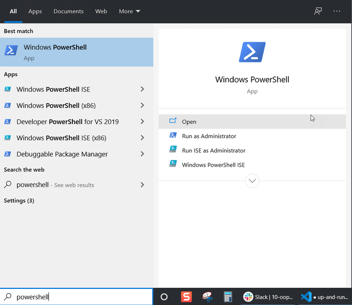
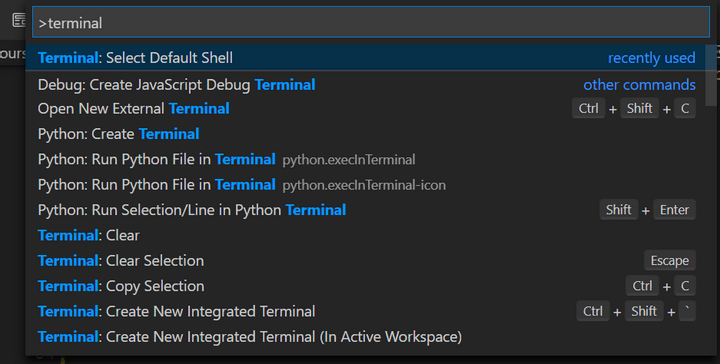
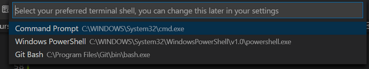

# Getting Ready

This section contains a list of the tools you'll use in this module. For Python, install it on your computer using the Windows or macOS instructions after the list of tools. For any other new tools, you don't need to install them before you begin—you'll do that during the lessons.

You'll use the following tools in this module:

* [Python](https://www.python.org/) is an interpreted, high-level, open-source, general-purpose programming language that supports procedural, object-oriented, and some functional programming constructs.

* pip is the default package manager for Python. It is distributed with Python, which means that when you install Python, pip is automatically installed on your computer! You will use pip from the command line to add packages from the [Python Package Index (PyPI)](https://pypi.org/), a repository of software for the Python programming language, to your Python applications.

* [Flask](https://palletsprojects.com/p/flask/) is a lightweight web application framework written in Python. It's designed to make getting started quick and easy, with the ability to scale up to complex applications. It has become one of the most popular Python web application frameworks. For the purposes of this course, you will use the [Flask PyPI package](https://pypi.org/project/Flask/).

* [SQLAlchemy](https://www.sqlalchemy.org/) is the Python SQL toolkit and object-relational mapper that gives Python developers the full power and flexibility of SQL. It provides a full suite of well known enterprise-level persistence patterns, designed for efficient and high-performing database access, adapted into a simple and Pythonic domain language. For the purposes of this course, you'll use the [SQLAlchemy PyPI package](https://pypi.org/project/SQLAlchemy/).

* [PyMySQL](https://pymysql.readthedocs.io/en/latest/) is a pure Python MySQL driver that connects a Python application to a MySQL database. For the purposes of this course, you'll use the [PyMySQL PyPI package](https://pypi.org/project/PyMySQL/).

* [bcrypt](https://pypi.org/project/bcrypt/) is a PyPI library for Python that allows you to hash passwords. Hashing is the process of taking input and using a mathematical formula to chop and mix it up to produce an output of a specific length. Hashing is a one-way function, meaning that it can easily convert input to a fixed-size output, but it is difficult to invert, or convert in the opposite direction. This attribute allows developers to secure passwords when authenticating users for their applications. The [cryptography PyPI package](https://pypi.org/project/cryptography/) is a dependency of `bcrypt` that you'll need to install in order to use it in your application.

* [python-dotenv](https://pypi.org/project/python-dotenv/) is a PyPI dotenv package used to manage environment variables inside Python's native virtual environment, or `venv`. This virtual environment is a self-contained directory that can maintain its own version of Python as well as its own library dependencies so that multiple Python projects can reside on the same machine without interfering with each other.

* [Gunicorn](https://docs.gunicorn.org/en/stable/), or Green Unicorn, is a Python HTTP Server for UNIX that is broadly compatible with various web frameworks (including Python and Flask), simply implemented, light on server resources, and fast. For the purposes of this course, you'll use the [Gunicorn PyPI package](https://pypi.org/project/gunicorn/).

## Install Python on Windows

There's a chance your operating system might already have an older version of Python installed. For this module, you'll need Python version 3.8 or greater, so you'll need to uninstall the old one first.

In the bottom-left corner of the screen, use the search box to search for "programs" and select "Add or remove programs" from the list. The following image demonstrates what you should see:



`The Windows search box displays "Add or remove programs" as an option.`

In the "Apps & features" window that appears, scroll down until you see your version of Python (for example, Python 2.7.16). Select Python, then select Uninstall. The following image demonstrates this process:



`Python 2.7.16 is listed in the apps & features list.`

If Python isn't on the list, then you're already good to go.

Next, navigate to the [Python download page](https://www.python.org/downloads/) in your browser and select the download button for the latest version, as the following image shows:



`The Python website displays a download button.`

Run the installer after the download finishes. You should see the following image:



`The Python installer includes a checkbox to add Python to PATH.`

Make sure to check "Add Python 3.x to PATH" before selecting "Install Now". Then let the installer run through its steps and close it out.

In the past, you have probably used Git Bash to perform your command line operations. Python, however, doesn't always work with Git Bash. For better results, use the Windows PowerShell command line instead.

To open PowerShell, use the search box in the bottom-left corner of the screen to search for "powershell". The following image demonstrates what you should see:



`The Windows search box displays "Windows PowerShell" as an option.`

Select "Windows PowerShell" and a new command line window will open. Run the following command in this new window:

```python
python --version
```

If the command line prints something like `Python 3.9.0`, then you're all set!

**TIP** Similar to Git Bash's right-click and "Git Bash here" option, you can hold the Shift key when you right-click on a folder to select "Open PowerShell window here".

If you prefer to use the integrated terminal in VS Code, you'll need to change the default settings. In VS Code, press Ctrl+Shift+P to open the command prompt. Search for "terminal" in the prompt. The following image demonstrates what you should see:



`The command prompt in VS Code displays options related to "terminal".`

In the dropdown that appears, select "Terminal: Select Default Shell". This will give you a list of available terminals to choose from, including Windows PowerShell and Git Bash. The following image demonstrates what you should see:



Select "Windows PowerShell". VS Code will now use PowerShell instead of Git Bash whenever you open the integrated terminal.

> **IMPORTANT** 
> 
> PowerShell and Git Bash are not entirely the same. Some commands, like touch, are not recognized by PowerShell.

## Install Python on macOS

If you are working on a macOS, it is likely that you already have Python on your computer. For this course, you will need Python3 or later. To find out if you have the correct version installed on your computer, type the command `python3 --version` in your terminal. You should see something like the following:

```python
Python 3.7.3
```

If you have Python 3.4 or later, you're all set! If not, follow the instructions below.

## Install Homebrew

If you know that you have Homebrew installed on your computer, you can skip ahead to the next section. If you're not sure, type the following command:

```python
brew help
```

If you see a list of options, Homebrew is installed and you can move on to the next section. If you receive an error, like `command not found`, continue in this section.

First, install Apple's Xcode tools by entering the following:

```python
xcode-select --install
```

Next, install Homebrew by typing the following command:

```python
/bin/bash -c "$(curl -fsSL https://raw.githubusercontent.com/Homebrew/install/master/install.sh)"
```

Finally, run `brew doctor` to confirm that Homebrew has been successfully installed. If you see the following, you are ready to move on to the next section to install the latest version of Python3.

```python
Your system is ready to brew.
```

## Install Python3

Once you have Homebrew installed on your operating system, type the following command in your terminal:

```python
$ brew install python3
```

Confirm that Python3 was successfully installed by typing the command `python3 --version` in your terminal. You should see something like the following:

```python
Python 3.5.0
```

---
© 2022 edX Boot Camps LLC. Confidential and Proprietary. All Rights Reserved.
