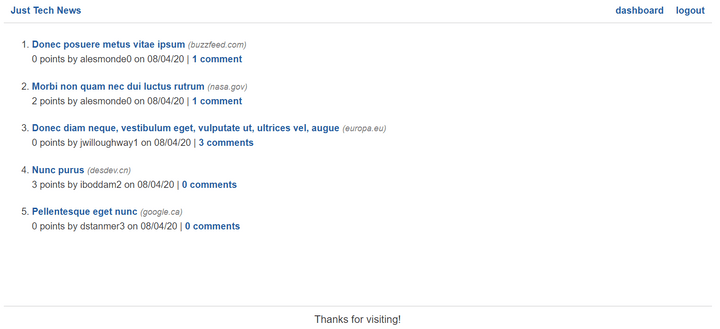

# Introduction

At this point in your web development journey, you've learned several back-end technologies, including the following:

* Node.js—a JavaScript runtime environment

* Express.js—a library that facilitates web server features in Node.js

* Sequelize—an object-relational mapper (ORM) that abstracts database tables as models

* Handlebars.js—a template engine for delivering HTML and data together

These technologies all belong to the JavaScript ecosystem, but not every company uses JavaScript for their back-end needs. The Python programming language, for instance, is a popular alternative to Node.js.

Python's many benefits include the following:

* An intentionally simple syntax

* An active community that boasts many libraries

* A wide range of uses, from machine learning to standalone software

In this module, we'll use Python as the basis for a web server. Instead of building it from scratch, we'll refactor the back end of an app that was originally built using Node.js. The app, called Just Tech News, lets users submit links to tech-related articles, comment on other users' articles, and upvote articles for points.

The homepage of Just Tech News resembles the following image:

`The browser displays a list of news articles, each with the poster's name, date, and comment count.`

In this lesson, you'll focus on learning the basics of Python as you set up some of the initial routes.

Along the way, you'll learn how to do the following:

* Set up a virtual environment for Python.

* Define functions using Python syntax.

* Create and import Python modules.

* Use the Flask library to create GET routes.

When you're working as a professional web developer, you'll often be required to learn new programming languages and frameworks as you move from project to project and as new technologies develop. As you do, you'll probably notice that different languages have conceptual similarities even when the coding syntax differs. By completing this module, you'll develop this dexterity and increase your confidence in your ability to learn new programming languages.

---
© 2022 edX Boot Camps LLC. Confidential and Proprietary. All Rights Reserved.
