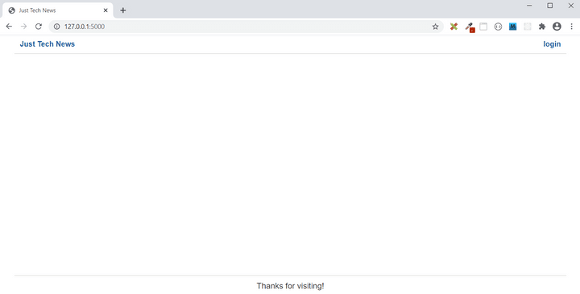

# Preview

The goal for this first lesson is to set up a Python web server that will render the homepage and dashboard templates. Fortunately, the templates and all the static front-end files are already complete, so you only need to focus on setting up the Python back end!

The following image shows the Just Tech News homepage without any content:

`The homepage displays a header and footer but no content in between.`

The following image shows the dashboard page with a form for creating a new post:

`The dashboard displays a form for creating a new post.`

The following steps detail how we will approach this lesson:

* Set up the Git workflow.

* Set up the Python environment.

* Create a "Hello, World" route.

* Create the home view routes.

* Create the dashboard view routes.

Let's get started!

---
© 2022 edX Boot Camps LLC. Confidential and Proprietary. All Rights Reserved.
