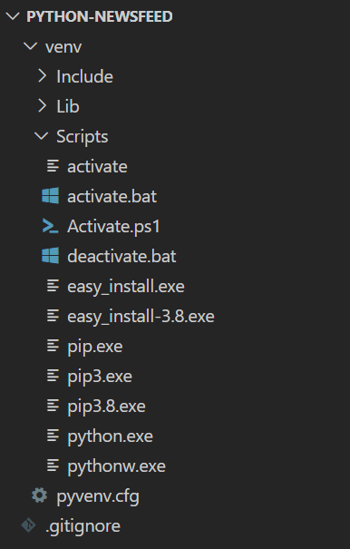

# Set Up the Python Environment

Before we can start coding in Python, we need to set up our environment.

## Verify the Version

You should already have the latest version of Python installed on your computer. To verify that, run the following command from the command line:

```console
python --version
```

That command should print something like `Python 3.8.5` to the console.

> **Note**
> 
> In the context of Python, print usually refers to displaying a response in the console window.

Remember, however, that your operating system probably has multiple versions of Python installed. If you're using macOS, you can run the command as `python3 --version` to force version 3. For Windows, you'll need to use Windows PowerShell instead of Git Bash.

## Install Python Libraries

You'll use several add-on libraries alongside Python. These libraries are comparable to Express.js and Sequelize. But you won't install them globally on your machine, because dependency versions can change from project to project.

> Rewind
> 
> Remember that in a Node.js project, you install library dependencies by using the **npm install** command. If you want to use a library globally, you can add the **-g** flag when you install it. In most cases, however, you'll omit the **-g** flag to keep the dependencies local to that project.

## Create a Virtual Environment

By default, installing a Python library installs it globally. However, Python provides a feature called a **virtual environment**—a self-contained directory that maintains its own version of Python and its own library dependencies. This way, multiple Python projects can reside on the same machine without interfering with each other.

In the root directory of your `python-newsfeed` project, run the following command:

```console
python -m venv venv
```

The `python -m venv` command (or `python3 -m venv`, if your computer requires it) uses Python's built-in `venv` module to create a new directory. In this case, the new directory is also called `venv`. The `venv` directory holds all the files that make a virtual environment possible.

In VS Code, you can expand the `venv` directory to see what it contains, as shown in the following image:



`The Explorer in VS Code shows a venv directory that contains Include, Lib, and Scripts directories.`

Note that on macOS, you'll see a directory called `bin` instead of `Scripts`. Either way, `bin` and `Scripts` both contain a file called `activate`. You'll need to run this script to start the virtual environment.

> Important
>
>On Windows, Git Bash can't start the virtual environment. Even if the `python` command works in Git Bash, the virtual environment won't. You'll need to use Windows PowerShell instead.

If you're using Windows, run the following command from the root directory of your project:

```console
.\venv\Scripts\activate
```

If you're using macOS, run the following command:

```console
. venv/bin/activate
```

You'll know that you activated the virtual environment if `(venv)` appears at the command-line prompt, like in the following example:

```console
(venv) PS C:\Users\lernantino\Desktop\projects\python-newsfeed>
```

As long as the virtual environment is active, installing Python dependencies puts them in this local `venv` directory instead of globally installing them for your entire operating system.

To deactivate the virtual environment, run the `deactivate` command from any directory.

Congrats! You're now set up to start developing a Python back end. Next, you'll install your first dependency to get the web server up and running.

---
© 2022 edX Boot Camps LLC. Confidential and Proprietary. All Rights Reserved.
