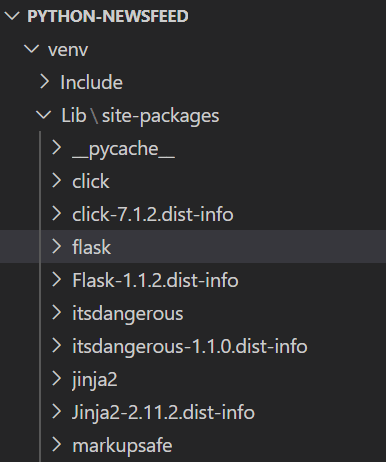

# Create a "Hello, World" Route

As we rebuild the back end of Just Tech News, we'll take advantage of some of the numerous useful libraries that Python has to offer. The first one we'll explore is Flask, which offers functionality similar to Express.js for setting up a web server.

> Pause
> 
> In a Node.js project, how do you install Express.js?
>
> **Answer**: With the command `npm install` express.

## Install Flask

Just like Node.js has npm, Python has its own package manager, called **pip**. The `pip` command installs along with Python, requiring no further setup. However, we need to ensure that the virtual environment is running so that dependencies get put into the right place.

In the root directory of your `python-newsfeed` project, use the following command to start the virtual environment for Windows:

```console
.\venv\Scripts\activate
```

For macOS, use the following command:

```console
. venv/bin/activate
```

Once the virtual environment activates, run the following command to install Flask:

```console
pip install flask
```

You can verify the installation by inspecting the content of the `Lib\site-packages` directory in the `venv` directory, as the following image shows:



`The Explorer in VS Code displays flask in the Lib\site-packages directory.`

## Create the App Package

In the root directory of your project, create a new directory called `app`. In this directory, create a new file called `__init__.py`. That's two underscores on each side.

Next, let's start our Flask server by running the `python -m flask run` command. This works only if the entry point of the app uses the default name of `app`.

You just made your first Python package! In Python, a **package** is a directory that can contain other packages or modules. Just the presence of an `__init__.py` file designates the directory as a package, but the file can also contain logic to consolidate submodules, perform startup tasks, and more.

>Connect the Dots
>
>The `__init__.py` file of a Python package corresponds to the `index.js` file of a Node.js module.

When Flask runs the `app` package, it tries to call a `create_app()` function. Let's define that function now. Open the `app/__init__.py` file, then add the following code:

```python
from flask import Flask

def create_app(test_config=None):
  # set up app config
  app = Flask(__name__, static_url_path='/')
  app.url_map.strict_slashes = False
  app.config.from_mapping(
    SECRET_KEY='super_secret_key'
  )

  return app
```

We use a `from...import` statement to import the `Flask()` function and then use the `def` keyword to define a `create_app()` function.

## About Python Code Formatting

Note that in Python, curly braces don't signify code blocks, nor do semicolons end expressions. So how does Python know what belongs to the function? The indentation is the answer. We indent everything that the `create_app()` function contains, by two spaces.

This can seem strange at first—especially compared to JavaScript, where whitespace characters don't matter as much. But in Python, spacing warrants more consideration because it dictates where code blocks begin and end.

Look at the preceding `create_app()` function again. We declare a new `app` variable (with no need for a `var` or `const` keyword) and set some initial Flask configurations, including the following:

The app should serve any static resources from the root directory and not from the default `/static` directory.

Trailing slashes are optional (meaning that /`dashboard` and `/dashboard/` load the same route).

The app should use the key called `'super_secret_key'` when creating server-side sessions.

## Start the Flask Server

In the root directory of your project, run the following command (switching to `python3` if necessary) to start the Flask server:

```python
python -m flask run
```

The command line prints something like the following example:

```python
* Environment: production
   WARNING: This is a development server. Do not use it in a production deployment.
   Use a production WSGI server instead.
 * Debug mode: off
 * Running on http://127.0.0.1:5000/ (Press CTRL+C to quit)
```

> Important
>
> On Windows, run the command **$env:FLASK_APP = "app"** to set the FLASK_APP variable. On macOS, run the command **export FLASK_APP=app**.

By default, Flask runs your server on port 5000, but if you visit that URL in the browser, nothing loads. That's because you haven't yet defined any routes.

In the `app/__init__.py` file, update the `create_app()` function as follows:

```python
def create_app(test_config=None):
  # set up app config
  app = Flask(__name__, static_url_path='/')
  app.url_map.strict_slashes = False
  app.config.from_mapping(
    SECRET_KEY='super_secret_key'
  )

  @app.route('/hello')
  def hello():
    return 'hello world'

  return app
```

We add an inner function, called `hello()`, that returns a string. However, in the preceding line, the **decorator** `@app.route('/hello')` turns the `hello()` function into a route. The function's `return` becomes the route's response.

## Check Your Work in the Browser

Stop and restart the Flask server, then visit `http://127.0.0.1:5000/hello` in the browser. The browser should resemble the following image:

`The browser displays the "hello world" message.`

Great work! You now have a basic Flask server.

> Rewind
>
> As a comparison, the following example code shows how to create the same route by using Express.js:

```python
app.get('/hello', (req, res) => {
 res.send('hello world');
});
```

In the next section, we'll build routes for the homepage templates.

---
© 2022 edX Boot Camps LLC. Confidential and Proprietary. All Rights Reserved.
