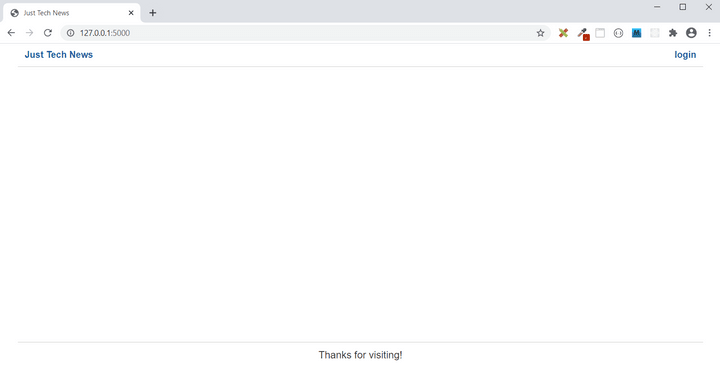
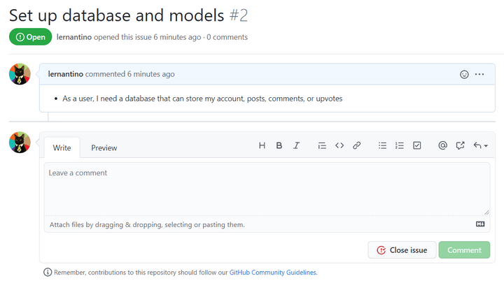

# Introduction

You just learned the basics of Python and built a web server using the Flask library, which is in itself a big accomplishment. With those tasks completed, your app can now render several pages, like a homepage and a dashboard page.

The following image shows the homepage:

`The homepage displays a header and a footer but no content.`

Unfortunately, the page is pretty bare without any data. The next GitHub issue addresses this lack of data, as shown in the following image:

`GitHub issue #2 outlines saving user accounts, posts, comments, and upvotes in the database.`

Based on this GitHub issue, you need to create a MySQL database and define models to help populate it. Along the way, you'll practice creating Python packages, functions, and modules.

You'll also learn how to do the following:

* Create a class in Python.

* Create MySQL tables using the SQLAlchemy ORM.

* Handle errors using the **assert** keyword.

We're back to using MySQL, but like Sequelize in Node.js, the SQLAlchemy ORM will abstract the queries for us.

---
© 2022 edX Boot Camps LLC. Confidential and Proprietary. All Rights Reserved.
