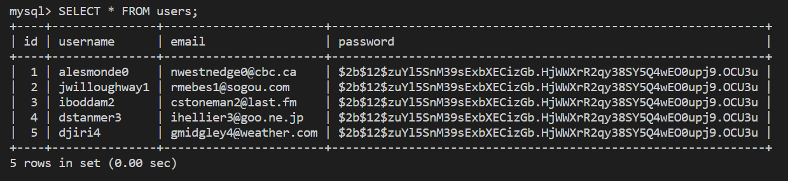

# Preview

The goal for this lesson is to create four new tables and populate them with test data. The following image shows one of these tables:

`The command line displays a user table with id, username, email, and password fields.`

We'll do this by using a Python-based ORM to define models instead of directly creating Structured Query Language (SQL) commands.

Here are the steps we'll take to do this:

* Establish a database connection.

* Create a **User** model.

* Add validations to the user.

* Create a **Post** model.

* Create a **Comment** model.

* Create a **Vote** model.

In these steps, we implement the **User** model first, because it doesn't depend on other models. The **Vote** model, contrastingly, needs to reference users and posts.
---
© 2022 edX Boot Camps LLC. Confidential and Proprietary. All Rights Reserved.
