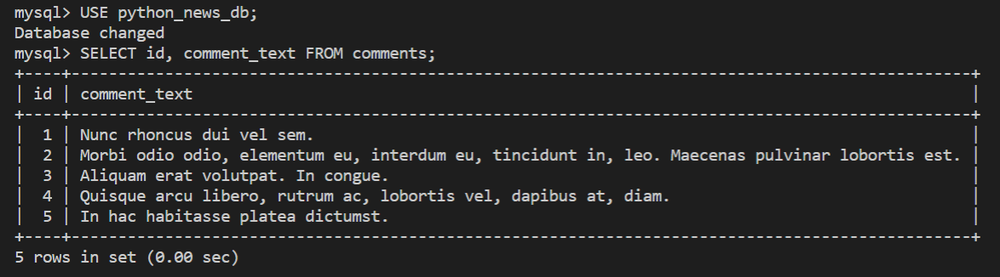

# Create a Comment Model

The Just Tech News app has a one-to-many relationship between posts and comments. That is, one post can have many comments. A one-to-many relationship also exists between users and comments, because one user can leave many comments. Let's keep those relationships in mind as we build the `Comment` model.

Create the Comment Module
In the `app/models` directory, create a new `Comment.py` file.

Create the Comment Class
In the `Comment.py` file, add the following code:

```python
from datetime import datetime
from app.db import Base
from sqlalchemy import Column, Integer, String, ForeignKey, DateTime
from sqlalchemy.orm import relationship

class Comment(Base):
  __tablename__ = 'comments'
  id = Column(Integer, primary_key=True)
  comment_text = Column(String(255), nullable=False)
  user_id = Column(Integer, ForeignKey('users.id'))
  post_id = Column(Integer, ForeignKey('posts.id'))
  created_at = Column(DateTime, default=datetime.now)
  updated_at = Column(DateTime, default=datetime.now, onupdate=datetime.now)

  user = relationship('User')
```

The `Comment` model includes a dynamic property for `user`, meaning that a query for a comment should also return information about its author. Similarly, we want to associate posts and comments so that a query for a post also returns information about any comments on it.

Open the `Post.py` file again, then add the following line to the `Post` class:

```python
comments = relationship('Comment', cascade='all,delete')
```

> Rewind
>
> In MySQL, an `ON DELETE CASCADE` statement deletes the corresponding foreign key records when a record from the specified table is deleted. In this case, deleting a post from the database also deletes all its associated comments.

The `Post` model now has two defined relationships: one for users and one for comments. Querying for a post returns both data subsets. Because the model for comments also defines a relationship, querying for a post returns the comment-to-user subset as well.

You can conceptualize this data consolidation as shown in the following JSON code:

```json
{
  "id": 1,
  "title": "How to Learn Python",
  "user_id": 2,
  "user": {
    "id": 2,
    "username": "lernantino" // post author
  },
  "comments": [
    {
      "id": 1,
      "comment_text": "Great article!",
      "post_id": 1,
      "user_id": 3,
      "user": {
        "id": 3,
        "username": "someone_else" // comment author
      }
    }
  ]
}
```

Again, we won't be able to see this data grouped together until we start creating queries. For now, let's just populate the `comments` table with some seeded data.

Populate the Comments Table
In the `models/__init__.py` file, add the following `import` statement:

```python
from .Comment import Comment
```

Then in the `seeds.py` file, update the `import` statement to include `Comment`, as follows:

```python
from app.models import User, Post, Comment
```

After the last `db.commit()` statement and before the `db.close()` statement, add the following code:

```python
# insert comments
db.add_all([
  Comment(comment_text='Nunc rhoncus dui vel sem.', user_id=1, post_id=2),
  Comment(comment_text='Morbi odio odio, elementum eu, interdum eu, tincidunt in, leo. Maecenas pulvinar lobortis est.', user_id=1, post_id=3),
  Comment(comment_text='Aliquam erat volutpat. In congue.', user_id=2, post_id=1),
  Comment(comment_text='Quisque arcu libero, rutrum ac, lobortis vel, dapibus at, diam.', user_id=2, post_id=3),
  Comment(comment_text='In hac habitasse platea dictumst.', user_id=3, post_id=3)
])

db.commit()
```

The structure of your `seeds.py file` should now resemble the following example:

```python
db = Session()
db.add_all(Users)
db.commit()
db.add_all(Posts)
db.commit()
db.add_all(Comments)
db.commit()
db.close()
```

From the command line, run `python seeds.py` or `python3 seeds.py` to run the new seed script. Then log in to the MySQL shell to verify the `comments` data. The data should resemble the following image:



`The command line displays a comments table with id and comment_text fields.`

Just one more model left!

---
© 2022 edX Boot Camps LLC. Confidential and Proprietary. All Rights Reserved.
