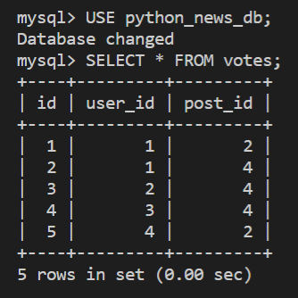

# Create a Vote Model

Interestingly, the `Vote` model doesn't need to store any unique information. It simply needs to reference the post being upvoted and the id of the person who upvoted it. Then the `Post` model can add up the records to get a total point value.

## Create the Vote Module

Let's get started. In the `app/models` directory, create a new `Vote.py` file. In `Vote.py`, add the following code:

```python
from app.db import Base
from sqlalchemy import Column, Integer, ForeignKey

class Vote(Base):
  __tablename__ = 'votes'
  id = Column(Integer, primary_key=True)
  user_id = Column(Integer, ForeignKey('users.id'))
  post_id = Column(Integer, ForeignKey('posts.id'))
```

That's all that an upvote requires. However, this model isn't useful on its own. Remember, the `Post` model will be counting the votes, so we need to update the `Post` model too.

## Update the Post Model

Open the `Post.py` file again and study the `Post` class. How would we attach a vote total to this model?

We can add a dynamic property that performs a count! In `Post.py`, update the `import` statements to the following code:

```python
from datetime import datetime
from app.db import Base
from .Vote import Vote
from sqlalchemy import Column, Integer, String, ForeignKey, DateTime, select, func
from sqlalchemy.orm import relationship, column_property
```

Inside the `Post` class, add the following property:

```python
vote_count = column_property(
  select([func.count(Vote.id)]).where(Vote.post_id == id)
)
```

When we query the model, this dynamic property will perform a `SELECT`, together with the SQLAlchemy `func.count()` method, to add up the votes.

> Rewind
>
> The following raw SQL query would do the same thing:

```sql
SELECT COUNT(votes.id) AS vote_count FROM votes WHERE votes.post_id = 1;
```

The `Post` model includes a dynamic property for `votes`, meaning that a query for a post should also return information about the number of votes the post has. We also want to make sure that when we delete a post from the database, every vote associated is subsequently deleted.

Open the `Post.py` file again, then add the following line to the `Post` class below `comments`, as shown in the following code:

```python
votes = relationship('Vote', cascade='all,delete')
```

## Populate the Vote Table

Let's make some test votes. In `models/__init_.py`, add the following `import` statement:

```python
from .Vote import Vote
```

In the `seeds.py` file, update the `import` statement to include `Vote`, as shown in the following example:

```python
from app.models import User, Post, Comment, Vote
```

After the last `db.commit()` statement and before the `db.close()` statement, add the following code:


```python
# insert votes
db.add_all([
  Vote(user_id=1, post_id=2),
  Vote(user_id=1, post_id=4),
  Vote(user_id=2, post_id=4),
  Vote(user_id=3, post_id=4),
  Vote(user_id=4, post_id=2)
])

db.commit()
```

From the command line, run `python seeds.py` or `python3 seeds.py` to run the new seed script. Then log in to the MySQL shell to verify the `votes` data. The data should resemble the following image:



`The command line displays a votes table with id, user_id, and post_id fields.`

And with that, the last of the data is ready. Close the GitHub issue, then merge the feature branch.

---
© 2022 edX Boot Camps LLC. Confidential and Proprietary. All Rights Reserved.
