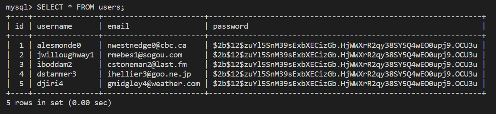
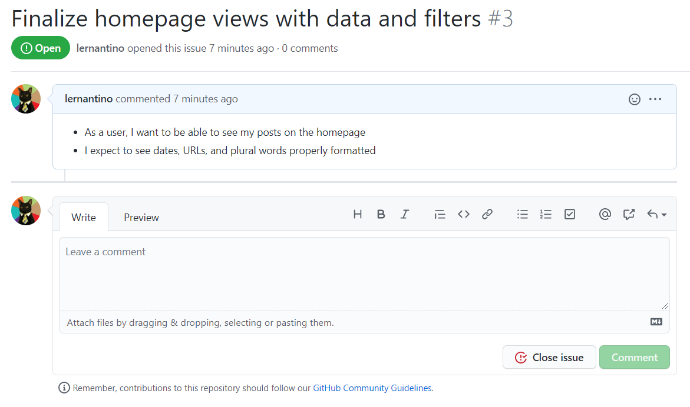

# Introduction

You're making great progress on the Just Tech News app! You've set up the four SQLAlchemy models and populated the tables with data that's waiting to be displayed on the page.

The `users` table should resemble the following image:

`The command line displays a users table with id, username, email, and password fields.`

With the data in place, you can revisit the Flask routes and populate the front-end templates. The GitHub issue shown in the following image outlines these goals:

`GitHub issue #3 outlines the ability to see posts on the homepage with correctly formatted data.`

As you tackle this issue, you'll practice using the following tools:

* SQLAlchemy session connections

* Flask route parameters

You'll also learn how to do the following:

* Query a database using SQLAlchemy models.

* Manage database connections using the Flask app context.

* Import custom filters into Jinja templates.

You might be tempted to skip managing database connections at this point because you're testing locally, but neglecting these improvements can be detrimental in a production environment.

---
© 2022 edX Boot Camps LLC. Confidential and Proprietary. All Rights Reserved.
