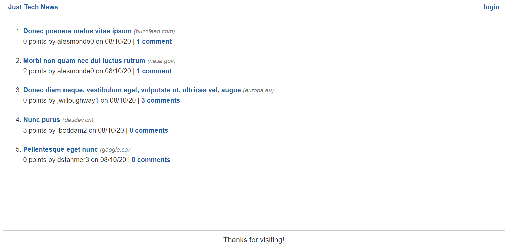
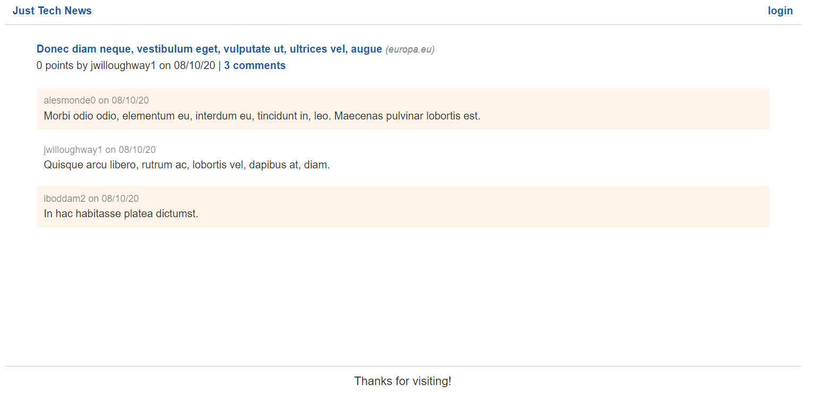

# Preview

The goal for this lesson is to populate both the homepage template and the single-post page template with data.

By the end, the homepage will look like the following image:

`The homepage displays a list of posted news articles.`

The single-post page will look like the following image:

`The single-post page displays an article's details followed by a list of comments.`

Notice that the article URLs are truncated, words like "comment" are properly pluralized, and dates are formatted as month/day/year. You'll need to apply custom filters to achieve this kind of formatting.

With that in mind, take a moment to review the steps you'll take during this lesson:

1. Set up database connection in Flask app.

2. Pass `User` data into homepage templates.

3. Create custom filter functions.

4. Implement filters in template files.

Now let's get started!

---
© 2022 edX Boot Camps LLC. Confidential and Proprietary. All Rights Reserved.
