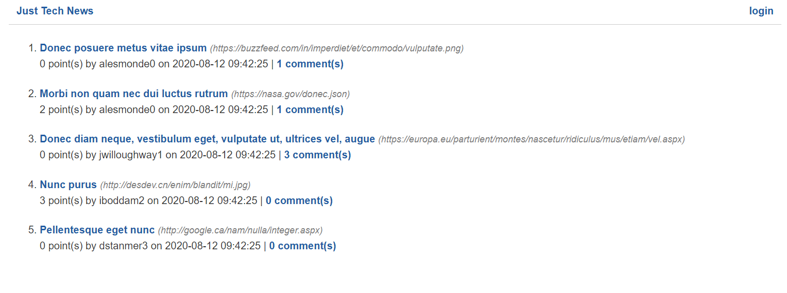
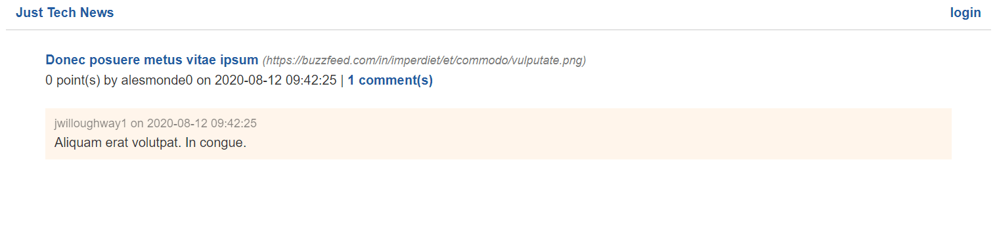

# Pass User Data into Homepage Templates

Now that we've set up the database connection and defined the models, we can implement them in the routes.

Open the `app/routes/home.py` file, then add the following `import` statements:

```python
from app.models import Post
from app.db import get_db
```

Next, update the `index()` function as follows:

```python
@bp.route('/')
def index():
  # get all posts
  db = get_db()
  posts = db.query(Post).order_by(Post.created_at.desc()).all()

  return render_template('homepage.html')
```

The `get_db()` function returns a session connection that's tied to this route's context. We then use the `query()` method on the connection object to query the `Post` model for all posts in descending order, and we save the results in the `posts` variable.

>Important
>
>Coming from JavaScript, you might feel tempted to clean up the spacing of this query by updating it like the following example:

```python
posts = db
  .query(Post)
  .order_by(Post.created_at.desc())
  .all()
```

Remember, though, that indentation in Python is more than just visual. Changing the spacing causes this example to throw an error. However, this doesn't mean that you can never create multiline queries. To do so, wrap the query in a set of parent parentheses, as shown in the following example:

```python
posts = (
  db
    .query(Post)
    .order_by(Post.created_at.desc())
    .all()
)
```

Finally, update the `return` statement of the `index()` function to render the template with `posts` data, as shown in the following example:

```python
return render_template(
  'homepage.html',
  posts=posts
)
```

Save your changes, then use the following command to restart the app:

```console
python -m flask run
```

Visit http://127.0.0.1:5000/ in the browser. At this point, the homepage should look like the following image:



`The homepage displays a list of posted news articles.`

It worked! The homepage renders the articles from the `posts` table, along with the article owner's username, upvote count, and `comments` array length. We defined these extra details as dynamic properties on the `Post` model.

## Close the Database Connection

But wait, did we ever close the connection to the database? We didn't—and although that hasn't caused any local problems, neglecting to close it might cause the app to crash in production. Heroku, for instance, won't let us create an infinite number of open session connections.

To solve this problem, we could add a `db.close()` statement inside every route, but that would be tedious, and we might miss one or two along the way. Instead, let's leverage the app context to close the connection when the request officially terminates.

Revisit the `app/db/__init__.py` file and add the following function after the `get_db` function:

```python
def close_db(e=None):
  db = g.pop('db', None)

  if db is not None:
    db.close()
```

The `pop()` method attempts to find and remove `db` from the `g` object. If `db` exists (that is, `db` doesn't equal None), then `db.close()` will end the connection.

The `close_db()` function won't run automatically, though. We need to tell Flask to run it whenever a context is destroyed.

So in the same `db/__init__.py` file, update the `init_db()` function to look like the following code:

```python
def init_db(app):
  Base.metadata.create_all(engine)

  app.teardown_appcontext(close_db)
```

Now Flask will run `close_db()` together with its built-in `teardown_appcontext()` method. Note that we added `app` as a parameter of the `init_db()` function. We need to make sure that the variable gets passed in correctly.

Open `app/__init__.py`, then update the call to `init_db()` by adding `app` inside the parentheses to look like the following code:

```python
init_db(app)
```

Thanks to these updates, we no longer have to worry about connections remaining open and potentially locking up the server.

Let's switch back to `routes/home.py` and study the next route, which looks like the following example:

```python
@bp.route('/post/<id>')
def single(id):
  return render_template('single-post.html')
```

Note the `<id>` route parameter in the decorator function that becomes a function parameter in the `single()` function. We can use that parameter to query the database for a specific post.

Update the function to look like the following code:

```python
@bp.route('/post/<id>')
def single(id):
  # get single post by id
  db = get_db()
  post = db.query(Post).filter(Post.id == id).one()

  # render single post template
  return render_template(
    'single-post.html',
    post=post
  )
```

This time, we use the `filter()` method on the connection object to specify the SQL `WHERE` clause, and we end by using the `one()` method instead of `all()`. We then pass the single `post` object to the `single-post.html` template. Once the template is rendered and the response sent, the context for this route terminates, and the teardown function closes the database connection.

Restart the Flask app and visit http://127.0.0.1:5000/post/1 in the browser. The page should look like the following image:



`The single-post page displays an article's details followed by a posted comment.`

The data displays as it should, but some of the formatting could be improved. For instance, the date and the URL aren't very readable. We'll fix these issues in the next section.

---
© 2022 edX Boot Camps LLC. Confidential and Proprietary. All Rights Reserved.
