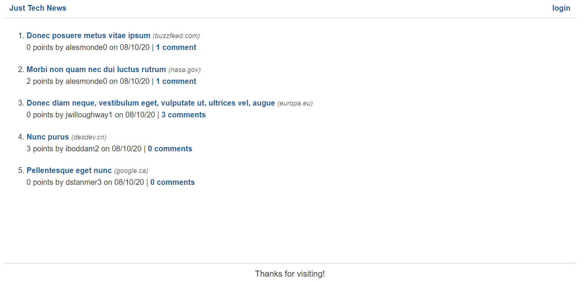

# Implement Filters in Template Files

To use your custom filter functions, you need to register them with the Jinja template environment. To do so, open the `app/__init__.py` file and add the following `import` statement:

```python
from app.utils import filters
```

In the `create_app()` function, add the following code to complete the registration:

```python
app.jinja_env.filters['format_url'] = filters.format_url
app.jinja_env.filters['format_date'] = filters.format_date
app.jinja_env.filters['format_plural'] = filters.format_plural
```

## Add Filters to Template Files

You can now use these functions in the template files. You need to update the following three templates in particular:

* post-info.html

* comments.html

* edit-post.html

Update the Post-Info Template
Open the first template, located at `app/templates/partials/post-info.html`, and update the `<span>` element as follows:

```html
<span>({{post.post_url|format_url}})</span>
```

This code passes `post.post_url` as the argument to the `format_url()` function. Update the date in this file to adhere to the same structure, as shown in the following example:

```python
{{post.created_at|format_date}}
```

The `format_plural()` function differs a bit, because it needs two arguments. Update the first line in the `<div class="meta">` element as follows:

```python
{{post.vote_count}} {{post.vote_count|format_plural('point')}} by {{post.user.username}} on {{post.created_at|format_date}}
```

The first `{{post.vote_count}}` displays the number as is. But the second one uses the `format_plural()` filter, followed by a second argument of `'point'`, to return either "point" or "points".

Update the comment text in a similar way, as shown in the following example:

```html
<a href="/post/{{post.id}}">{{post.comments|length}} {{post.comments|length|format_plural('comment')}}</a>
```

This might seem confusing because of the multiple pipe characters (`|`). The syntax p`ost.comments|length` is how Jinja prints the length of an array. The filter starts at the second pipe character.

## Update the Comments Template
That takes care of the `post-info.html` template. Next, from the same `partials` directory, open the `comments.html` template. You only need to make one change, as shown in the following example:

```html
{{comment.created_at|format_date}}
```

## Update the Edit-Post Template

Finally, open the `edit-post.html` template that's located in the `templates` directory. In this file, you need to make the following changes:

* Update the `<span>` element to use the `format_url()` filter.

* Replace "point(s)" with the `format_plural('point')` filter.

* Update `post.created_at` to use the `format_date()` filter.

* Replace "comment(s)" with the `format_plural('comment')` filter.

As you edit these templates, you'll notice other syntax that might seem a bit confusing—like the `` statements. To learn more, refer to the [Jinja documentation on template inheritance](https://jinja.palletsprojects.com/en/2.11.x/templates/#template-inheritance).

Check Your Work in the Browser
Restart the Flask app, then check your work in the browser. The homepage should now look like the following image:

## Check Your Work in the Browser

Restart the Flask app, then check your work in the browser. The homepage should now look like the following image:



`The homepage displays a list of posted news articles.`

You've finished the homepage templates! This means that you can close the GitHub issue, merge the feature branch into `develop`, and move on to the next feature.

---
© 2022 edX Boot Camps LLC. Confidential and Proprietary. All Rights Reserved.
