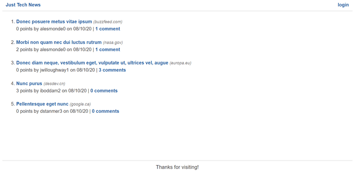
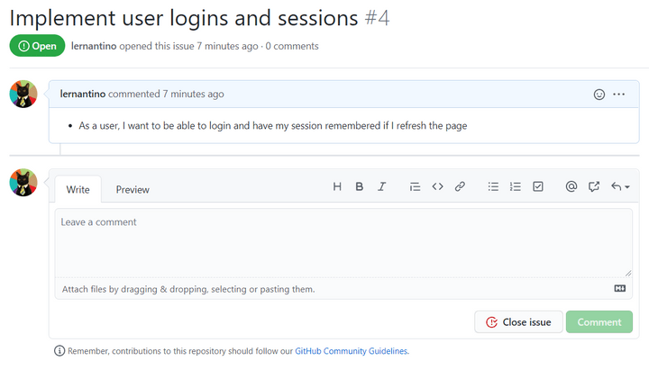

# Introduction

Congrats! You've finished the front end for the homepage and the single-post page. With the data in place, the homepage now looks like the following image:

`The homepage displays a list of posted news articles.`

However, users can't fully enjoy all the features of Just Tech News without signup and login processes in place, because only logged-in users can post new articles or comment on existing articles.

Fortunately, the next GitHub issue we'll address is to implement a login, as shown in the following image:

`GitHub issue #4 outlines the ability to log in and have a session remembered after refreshing the page.`

Fulfilling this issue will allow you to practice writing SQLAlchemy queries and creating more Flask routes.

At the same time, you'll learn how to do the following:

* Capture data in a Flask POST route.

* Implement sessions in a Flask app.

* Handle errors using `try...except` statements.

You used all these skills in JavaScript, so look for similarities as you learn the Python syntax for each task.

---
© 2022 edX Boot Camps LLC. Confidential and Proprietary. All Rights Reserved.
