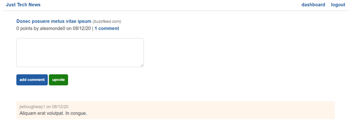

# Preview

The goal for this lesson is to create API routes for signing up, logging in, and logging out. A login should persist in a session so that refreshing the page doesn't require the user to log in again.

Once the user logs in, the single-post page should resemble the following image:

`The single-post page displays a comment form and a logout link.`

Note that the links in the upper right change to "dashboard" and "logout". The page also displays a form for posting a comment. We already set up the templates to conditionally render these elements, so we don't need to make any further front-end changes. We only need to build the missing API endpoints.

With that in mind, take a minute to review the following steps that we'll take in this lesson:

1. Create a signup API route.

2. Add error handling.

3. Add sessions to the app.

4. Create the logout and login routes.

Let's get started.

---
© 2022 edX Boot Camps LLC. Confidential and Proprietary. All Rights Reserved.
