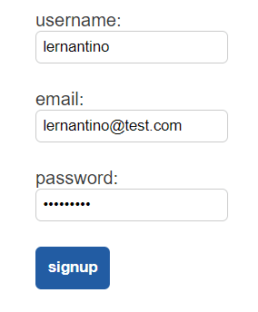

# Create a Signup API Route

It's time to add API endpoints to the Just Tech News app. The first one we need is a signup endpoint to create new users.

This step marks a new GitHub issue, so checkout a new branch called `feature/login`.

## Create an API Module

Next, create an `api.py` file in the `app/routes` directory. This is where we'll define all the API endpoints for the app.

In `api.py`, add the following code:

```python
from flask import Blueprint
from app.models import User
from app.db import get_db

bp = Blueprint('api', __name__, url_prefix='/api')
```

## Register the API Blueprint

Before going any further, let's use the Flask app to register this blueprint. Open the `routes/__init__.py` file, then add the following `import` statement:

```python
from .api import bp as api
```

In `app/__init__.py`, update the `app.routes` import to look like the following code:

```python
from app.routes import home, dashboard, api
```

In the `create_app()` function, add the following line to register the blueprint:

```python
app.register_blueprint(api)
```

Now any routes that we define in the `api.py` module will automatically become part of the Flask app and have a prefix of `/api`.

## Add a Route

Return to the `api.py` file and add the following code:

```python
@bp.route('/users', methods=['POST'])
def signup():

  return ''
```

We add a new route that will resolve to `/api/users`, and we specify the method to be of type POST. The purpose of a POST route is to receive data, but where can we find the mechanism to capture this data?

In Node.js and Express.js, you could capture posted data as shown in the following example:

```python
app.post('/users', (req, res) => {
  console.log(req.body);
});
```

Flask, of course, differs a bit. Remember, Flask creates a context for every request, and these contexts understand which values on the global `g` object are unique to them. Well, you can use another global contextual object that contains information about the `request` itself—the request object. Like the `g` object, you need to import it first.

In `api.py`, update the `flask` import as follows:

```python
from flask import Blueprint, request
```

Next, update the `signup()` route to use this object, as shown in the following example:

```python
@bp.route('/users', methods=['POST'])
def signup():
  data = request.get_json()
  print(data)

  return ''
```

## Test Your Signup Form in the Browser

Start the virtual environment, then start the Flask app. Navigate to http://127.0.0.1:5000/login in your browser and fill out the second form to simulate a signup.

You can input something like the example shown in the following image:



`The signup form has the username, email, and password fields filled out.`

```console
{'username': 'lernantino', 'email': 'lernantino@test.com', 'password': 'test12345'}
```

It seems that `request.get_json()` returned an object. If that's the case, we can pass these object properties to a new `User` model instance.

## Update the Signup Route to Pass Objects to the User

Update the `signup()` route to look like the following code:

```python
@bp.route('/users', methods=['POST'])
def signup():
  data = request.get_json()
  
  newUser = User(
    username = data.username,
    email = data.email,
    password = data.password
  )

  return ''
```

Restart the Flask app, navigate to the login page, and then fill out the signup form again. After clicking the signup button, look at the output in the command-line window. You'll see that the app threw an error, as shown in the following example:

```console
AttributeError: 'dict' object has no attribute 'username'
```

We verified that `data` had a `username` property, so why did the error occur? The answer is that `data` isn't an object in the traditional JavaScript sense. It's a Python dictionary, which is a different data type altogether. To access the properties of a dictionary, we must use bracket notation (for example, `data['property']`).

Note the following example of Python code:

```python
food = {
  'name': 'banana',
  'calories': 105
}
```

This syntax would create an object in JavaScript, but in Python, it creates a dictionary. Python creates objects only from classes, meaning that you need to use something like `food = Food('banana')`. However, it makes sense to create a `food` object only if it needs methods attached to it. Otherwise, the dictionary is the better data type to use.

For more information, refer to the [Python documentation on dictionaries](https://docs.python.org/3/tutorial/datastructures.html#dictionaries).

Let's switch to using bracket notation and bring in the database connection logic. Update the `signup()` route to look like the following code:

```python
@bp.route('/users', methods=['POST'])
def signup():
  data = request.get_json()
  db = get_db()

  # create a new user
  newUser = User(
    username = data['username'],
    email = data['email'],
    password = data['password']
  )

  # save in database
  db.add(newUser)
  db.commit()

  return ''
```

With these changes, we use the `db.add()` method to prep the `INSERT` statement and the `db.commit()` method to officially update the database.

But the front end wants a more meaningful response than an empty string. Let's send back JSON notation that includes the ID of the new user.

In `api.py`, update the `flask` import as follows:

```python
from flask import Blueprint, request, jsonify
```

Then, in the `signup()` route, change the `return` statement as follows:

```python
return jsonify(id = newUser.id)
```

## Test Your Work in the Browser

Restart the Flask app and test the signup form in the browser. After you submit a new user, the command line should print text similar to the following:

```console
2020-08-13 14:19:41,705 INFO sqlalchemy.engine.base.Engine INSERT INTO users (username, email, password) VALUES (%(username)s, %(email)s, %(password)s)
2020-08-13 14:19:41,706 INFO sqlalchemy.engine.base.Engine {'username': 'lernantino', 'email': 'lernantino@test.com', 'password': b'$2b$12$62qz9o1K.GwPP0eRlIIoSu1xPK9QpYLwCAZIM8DHRaD8nBn6UDb6S'}
```

You can also directly log in to the MySQL shell to verify that the new user made it into the `users` table.

If you try the signup process again using invalid data, the command line will print an error. For example, signing up with an email address that doesn't contain an at-sign character (`@`) throws an assertion error. Next, you'll add error handling to handle these cases.

---
© 2022 edX Boot Camps LLC. Confidential and Proprietary. All Rights Reserved.
