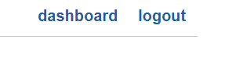

# Add Sessions to the App

Users can now create Just Tech News accounts, but after they sign up, the app immediately forgets their information on the front end. Instead, the app needs to remember that they're logged in as they navigate from page to page.

In previous projects, you used server-side sessions to keep track of a user's logged-in status. In Express.js, you can register the `express-session` npm package as middleware, which exposes a `req.session` property on every request. In Flask, sessions belong to a global object, similar to `g` and `request`.

## Add the Session Object

In the `api.py` file, update the `flask` import to include the `session` object, as shown in the following example:

```python
from flask import Blueprint, request, jsonify, session
```

## Add Session Object to Signup Route

In the `signup()` route, add the following code right before the `return jsonify()` statement at the end of the function:

```python
session.clear()
session['user_id'] = newUser.id
session['loggedIn'] = True
```

This clears any existing session data and creates two new session properties: a `user_id` to aid future database queries and a Boolean property that the templates will use to conditionally render elements.

>Rewind
>
> Remember, you can create sessions in Flask only if you've defined a secret key. Fortunately, the following code in `app/__init__.py` does just that:

```python
app.config.from_mapping(
  SECRET_KEY='super_secret_key'
)
```

In a production environment, you should change this key to something that's harder to guess.

## Add Session to Flask Import

Let's put this `session` object to use. Open the `home.py` file from the `routes` directory, and update the `flask` import to look like the following code:

```python
from flask import Blueprint, render_template, session, redirect
```

## Update the Index Route

In the `index() route`, update the `return` statement to pass the `loggedIn` session to the template, as shown in the following example:

```python
return render_template(
  'homepage.html',
  posts=posts,
  loggedIn=session.get('loggedIn')
)
```

Then update the `return` in the `single()` route to do the same, as shown in the following example:

```python
return render_template(
  'single-post.html',
  post=post,
  loggedIn=session.get('loggedIn')
)
```

## Test Your Session Functionality in the Browser

Restart the Flask app, then create a new account from the login page. The front end redirects you to the dashboard, which hasn't changed yet and doesn't reflect the session. Navigate to the homepage, however, and you'll see that the links in the upper-right corner have changed, as shown in the following image:



`The page displays a "dashboard" link and a "logout" link.`

You can refresh the page multiple times and the links won't revert, because the session on the back end is still active. Now click the comment count of one of the articles to route to the single-post page. It should look like the following image:


`The single-post page displays a comment form and a logout link.`

When the `loggedIn` session is `True`, the `single-post.html` template renders a comment form. The form doesn't work yet, because the other APIs aren't in place, but we're one step closer.

## Create a Login Redirect for Already Logged-In Users

Before we start working on the missing APIs, let's finish the `home.py` routes. One improvement we can make is to redirect users away from `/login` if they're already logged in.

Update the `login()` route to look like the following code:

```python
@bp.route('/login')
def login():
  # not logged in yet
  if session.get('loggedIn') is None:
    return render_template('login.html')

  return redirect('/dashboard')
```

Restart the Flask app and navigate to http://127.0.0.1:5000/login in the browser. You should immediately be redirected to `/dashboard` due to the `loggedIn` session not equalling `None`.

That wraps up everything we need to do with the `home.py` routes. Now we'll build the API routes to let users log in and out.

---
© 2022 edX Boot Camps LLC. Confidential and Proprietary. All Rights Reserved.
