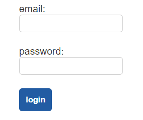

# Create the Logout and Login Routes

Passing the `loggedIn` session to the Jinja templates reveals a "logout" link on the front end, but the link doesn't work. The front end makes a request to a route that doesn't exist! Let's fix that now.

In the `api.py` file, add a new POST route that clears the session and returns a 204 status, like in the following example:

```python
@bp.route('/users/logout', methods=['POST'])
def logout():
  # remove session variables
  session.clear()
  return '', 204
```

Rewind
A status code of 204 indicates that there is no content. For a refresher, refer to the [Wikipedia page on HTTP status codes](https://en.wikipedia.org/wiki/List_of_HTTP_status_codes).

Restart the Flask app and test the "logout" link in the browser. Clicking the link should redirect you to the homepage; the upper-right corner displays only a "login" link again! That's perfect. Now let's allow users to log back in.

In the `api.py` file, create the following POST route:

```python
@bp.route('/users/login', methods=['POST'])
def login():
  data = request.get_json()
  db = get_db()
```

The first step is to check whether the user's posted email address exists in the database. SQLAlchemy will throw a `NoResultFound` error if the user doesn't exist, so you need to wrap the query in a `try...except` statement.

In the `login()` route, add the following code:

```python
try:
  user = db.query(User).filter(User.email == data['email']).one()
except:
  print(sys.exc_info()[0])

  return jsonify(message = 'Incorrect credentials'), 400
```

If the email exists, then we need to verify the password. The password in the database is hashed, though, so we can't do a one-to-one comparison. We need to decrypt it. Let's add a method to the `User` model that will do this for us.

Open the `models/User.py` file, then add the following method to the `User` class:

```python
def verify_password(self, password):
  return bcrypt.checkpw(
    password.encode('utf-8'),
    self.password.encode('utf-8')
  )
```

This uses the `checkpw()` method to compare the incoming `password` (that is, the password parameter) to the one saved on the `User` object (`self.password`).

Return to the `api.py` file, and add the following code to the end of the `login()` route function:

```python
if user.verify_password(data['password']) == False:
  return jsonify(message = 'Incorrect credentials'), 400
```

Note that `data['password']` becomes the second parameter in the `verify_password()` method of the class, because the first parameter is reserved for `self`.

The `login()` route will return a 400 status code if the posted email can't be found or if the posted password doesn't match. If neither happens, we can safely assume that the credentials are correct and thus create the session.

After the `if` statement, add the following code to create the session and send back a valid response:

## Test Your Login Form in the Browser

Restart the Flask app, then test the functionality in the browser. Remember to use the first form on the login page, which looks like the following image:



`The login form includes fields for an email and a password.`

Once you're satisfied, close the GitHub issue and merge the feature branch into `develop`.

---
© 2022 edX Boot Camps LLC. Confidential and Proprietary. All Rights Reserved.
