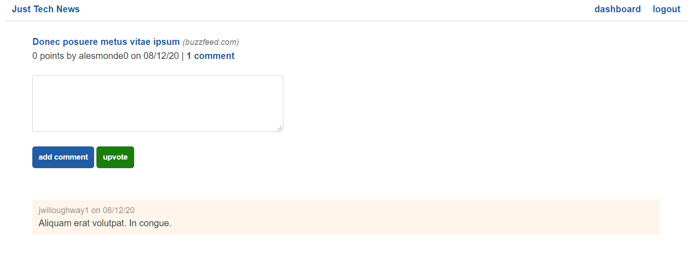
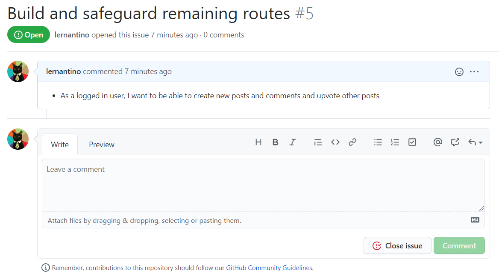

# Introduction

After your latest changes to the back end of Just Tech News, users can now sign up, log in, and log out. After a user logs in, the templates conditionally render new elements, as the following image shows:

`The single-post page displays the details of an article and a comment form.`

The single-post page displays a new comment form, but its buttons currently make requests to API routes that don't yet exist. The next GitHub issue addresses these missing features along with a few others, as detailed in the following image:

`The GitHub issue outlines the ability of a logged-in user to create posts, comments, and upvotes.`

Fulfilling the remaining CRUD operations will give you a chance to practice the following:

* Write `try...except` statements.

* Create data by using SQLAlchemy models.

Along the way, you'll learn how to do the following:

* Update and delete data using SQLAlchemy.

* Create custom decorator functions.

These custom decorators will help protect (sometimes referred to as **authguard**) the API routes from users who aren't logged in. Protecting the routes in this way will impede malicious users from intentionally breaking the app.

---
© 2022 edX Boot Camps LLC. Confidential and Proprietary. All Rights Reserved.
