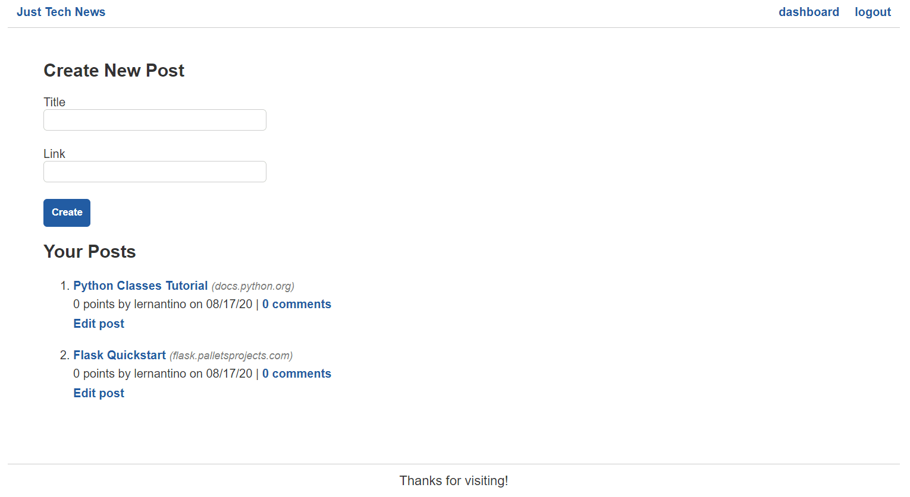
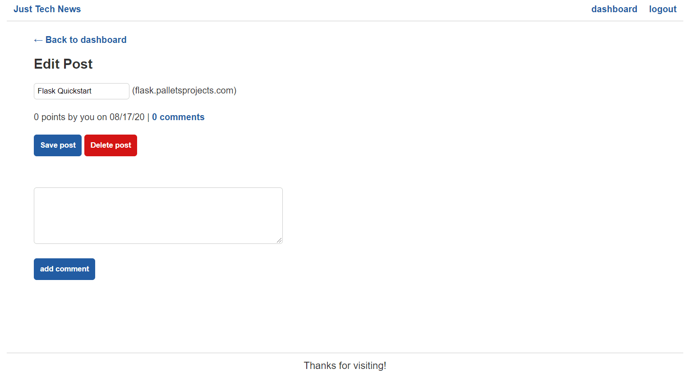

# Preview

The goal for this lesson is to build the missing API endpoints for the following functionalities:

* Creating, updating, and deleting posts

* Creating comments

* Creating upvotes

Building these routes will let us populate the dashboard pages. The following image displays the main dashboard page:

`The dashboard page displays a form for creating a new post followed by a list of the user's existing posts.`

The following image displays the dashboard page for editing a post:

`The edit post page displays a form for editing the title or leaving a comment.`

We'll also protect these routes so that users who aren't logged in can't make requests to them. Taking that into account, take a look at the following steps that we'll complete during this lesson:

1. Create APIs to upvote and comment on posts.

2. Create APIs to add, update, and delete posts.

3. Add data to dashboard templates.

4. Protect dashboard and API routes.

Note that we chose to build the comment and upvote routes first, because we can immediately test them before completing the dashboard template.

---
© 2022 edX Boot Camps LLC. Confidential and Proprietary. All Rights Reserved.
