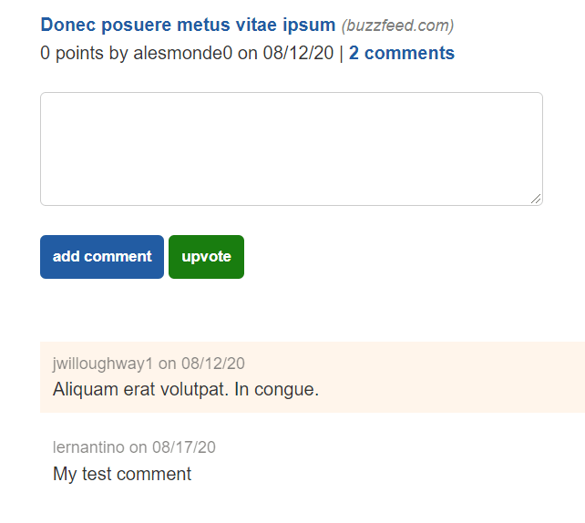

# Create APIs to Upvote and Comment on Posts

You need to add several more API routes to the `api.py` module, but the overall structure of each resembles that of the user endpoints. You can break down the workflow as follows:

1. Connect to the database.

2. Create a new model instance using the `request` data.

3. Try to save the instance using a t`ry...except` statement.

4. Return a status of 500 if it failed or the new ID if it succeeded.

Let's get started. First, checkout to a new Git branch called `feature/api-routes`.

## Import the User, Post, Comment, and Vote Models

In the `api.py` file, import the remaining models, as the following code shows:

```python
from app.models import User, Post, Comment, Vote
```

## Create a Comment Route

Next, create a new route for comments that looks like the following code:

```python
@bp.route('/comments', methods=['POST'])
def comment():
  data = request.get_json()
  db = get_db()
```

This takes care of the first step: connecting to the database. Because this is a POST route, we can capture the posted data by using the `get_json()` method and create a new comment by using the returned dictionary. Because the creation of a comment can fail, we want to wrap it in a `try...except` statement.

Add the following code to the `comment()` route:

```python
try:
  # create a new comment
  newComment = Comment(
    comment_text = data['comment_text'],
    post_id = data['post_id'],
    user_id = session.get('user_id')
  )

  db.add(newComment)
  db.commit()
except:
  print(sys.exc_info()[0])

  db.rollback()
  return jsonify(message = 'Comment failed'), 500
```

The `comment_text` and `post_id` values come from the front end, but the session stores the `user_id` value. Recall that `db.commit()` performs the `INSERT` against the database and that `db.rollback()` discards the pending commit if it fails.

If the `except` block doesn't run, we know that the comment creation succeeded, so we can return the newly created ID. Add the following `return` statement to the `comment()` function to complete the response:

```python
return jsonify(id = newComment.id)
```

## Test Your Work in the Browser

Let's test it. Start the virtual environment, then start the Flask app. Make sure that you log in or sign up on the front end. Otherwise, `session.get('user_id')` results in `None` and fails.

Navigate to the single-post page (for example, http://127.0.0.1:5000/post/1), then fill out the comment form. After you click the "add comment" button, the page should refresh, and the new comment should be displayed after the form.

The following image supplies an example of what you should see:



`The single-post page displays the comment form followed by a list of two comments.`

## Define the Upvote Action in a PUT Route

Now that comments are working, we can focus on the other feature of this page: upvoting the article. An upvote creates a new record in the `votes` table, but the `Post` model ultimately uses that information. We'll thus define this action as a `PUT` route for posts.

In `api.py`, add the following code to set up the `PUT` route:

```python
@bp.route('/posts/upvote', methods=['PUT'])
def upvote():
  data = request.get_json()
  db = get_db()

  try:
    # create a new vote with incoming id and session id
    newVote = Vote(
      post_id = data['post_id'],
      user_id = session.get('user_id')
    )

    db.add(newVote)
    db.commit()
  except:
    print(sys.exc_info()[0])

    db.rollback()
    return jsonify(message = 'Upvote failed'), 500

  return '', 204
```

## Test Your Work in the Browser

Restart the Flask app and test the "upvote" button on the single-post page. Every click should refresh the page and increase the point count by one.

The following image shows a post that's been upvoted five times:


`An article displays the text "5 points" after its name.`

That concludes all the APIs that the homepage routes need. In the next section, we'll move on to the APIs that are unique to the dashboard.

---
© 2022 edX Boot Camps LLC. Confidential and Proprietary. All Rights Reserved.
