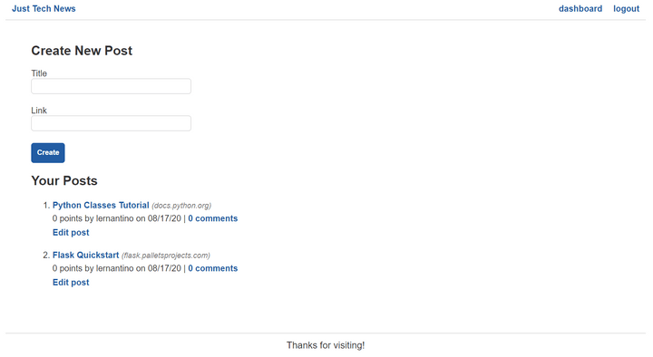
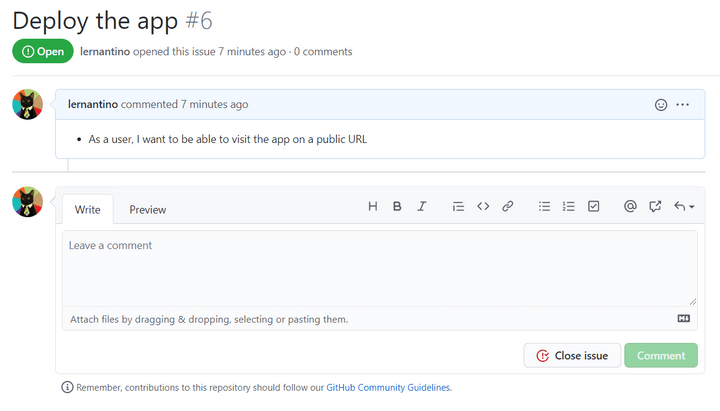

# Introduction

You have now successfully taken a Node.js project and rebuilt the server-side logic using a new programming language. The app is now fully functional, offering user authentication, homepage views, and dashboard views.

The following image shows the latest changes that you made to the dashboard:

`The dashboard page displays a form for creating posts followed by a list of the already-created posts.`

However, all this hard work doesn't count if it's not deployed. The final GitHub issue addresses that concern, as the following image shows:

`The GitHub issue outlines the ability to visit the app on a public URL.
`

This lesson will be lighter than usual but will still have key takeaways, including the following:

* Save the dependencies of a Python project.

* Configure Heroku to run a Flask app.

On the job, your company might not use Heroku for deployments, but some of the preparations and configurations you'll go through are fairly universal.

---
© 2022 edX Boot Camps LLC. Confidential and Proprietary. All Rights Reserved.
