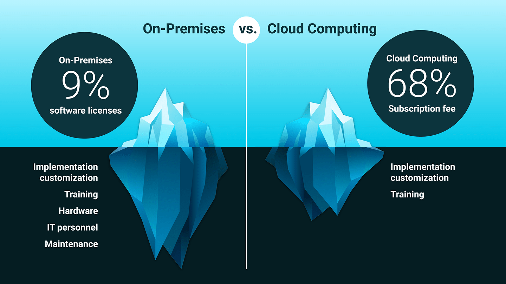

# Introduce Cloud Computing

In the previous step, we set up the project. In this step, we'll introduce cloud computing.

Before we start integrating web services into the Deep Thoughts application, we'll explore cloud computing a bit to better understand the context and terminology.

Before the cloud came into existence, companies hosted their web applications using **on-premises** servers. Depending on the amount of traffic that a company handles, this can be quite costly. Consider how many servers would be required to handle the amount of traffic that's occurring online these days, with companies like Facebook and Uber handling hundreds of thousands of requests per second. That's a lot of requests—and a lot of servers! So many, in fact, that some companies maintain server farms, called **data centers**, like the one that the following image shows:

`An illustration of a data center, which consists of several large buildings.`

Although most companies don't need this level of capacity, it can still be a challenge to design an IT system that can accommodate exactly the right server capacity. Hardware costs, rental space, and utilities have to be considered, as well as maintenance and data center operators to oversee both software and hardware. A static system like this also makes it difficult to scale up, and sunk costs can hinder scaling down when necessary. What's more, potential system crashes can add to all of these expenses. A crashed website can cost even average-sized companies roughly $100,000 per hour! As a result, on-premises solutions are cost-prohibitive for many small companies.

Fortunately, with advancements in internet speed, cloud computing has become a viable solution. **Cloud computing** is the on-demand availability of computer system resources through the internet, which enables companies to use remote data centers to serve applications on a pay-as-you-go basis.

**The cloud **refers to servers that are accessed through the internet. For example, when you back up images on your phone to the cloud, the photos aren't stored on-premises (in other words, on your phone) but in a remote server connected via the internet. Many email services use the cloud too, allowing you to send and receive hundreds or even thousands of messages at any time. In this way, cloud storage serves as a reliable backup that preserves data even if you lose or break your device.

**Deep Dive**

For more information, refer to the [AWS article about cloud computing](https://aws.amazon.com/what-is-cloud-computing/).

Cloud computing offers flexible capacity so that a remote data center's servers can be added or removed based on the demands of the application. This makes large-scale computing more affordable, even for small companies. The following image illustrates the advantages of cloud computing over on-premises solutions:

`An illustration compares on-premises and cloud computing regarding effort and costs.`

As the preceding image shows, on-premises computing requires 9 percent of the total costs up front, and these come from software licenses. By contrast, cloud computing requires 68 percent of the total costs up front, and these come from subscription fees. However, the hidden, ongoing costs of on-premises computing exceed those of cloud computing. Specifically, on-premises computing has costs for implementation customization, training, hardware, IT personnel, and maintenance. By contrast, cloud computing has hidden, ongoing costs only for implementation customization and training.

That is, with cloud computing, many costs that relate to purchasing and maintaining servers are deferred to a usage-based subscription fee. This approach relieves the initial cost burden and the time and energy that would be spent on planning a fixed-cost system that might not even be used.

With cloud computing, a company can instead focus on their core competencies and shift the administrative infrastructure and IT work onto a cloud provider. Managers don't have to worry about costly server failures anymore, because cloud providers replicate their code on redundant systems, guaranteeing to provide 99.999% uptime (Source: [AWS/Amazon)](https://aws.amazon.com/blogs/publicsector/achieving-five-nines-cloud-justice-public-safety/#:~:text=The%20accepted%20availability%20standard%20for,system%20must%20work%20seamlessly%20together.).

Another key advantage is that cloud computing leverages not just a single data center but a global infrastructure of data centers that can serve consumers at previously unthinkable speeds. Such a comprehensive network of data centers allows even a small company to serve performant applications globally.

## Deployment Models

If all of this seems too good to be true, you have a right to be skeptical. Cloud computing isn't the single right solution for every situation. In many cases, cloud computing isn't the best option, for several reasons.

For one thing, certain industries like healthcare, finance, and government require more rigorous security measures because of the sensitive nature of the information they store. A breach of this type of data can lead to national security concerns or other serious problems. Advancements in technology have helped reduce the extent of data breaches, but security should remain a major concern for all cloud users.

Adherence to security protocol is ultimately the best safeguard against data breaches, because most occur due to human error. That said, cloud computing offers different deployment models to accommodate varying security concerns, including private clouds, public clouds, and hybrid clouds:

* When security is a top concern, a **private cloud** provides more security than a public cloud, but less than an on-premises server. The private cloud has specific access points that only certain devices or IP addresses can enter.

* The **public cloud**, on the other hand, can be accessed from any device through any IP address.

* And as you might imagine, a **hybrid cloud** combines features of public and private clouds—which is useful for organizations like a government agency that needs both high security to store private data and a public-facing interface for the community.

**Deep Dive**

For more information, review the [Wikipedia page on cloud computing security](https://en.wikipedia.org/wiki/Cloud_computing_security).

Note that numerous cloud providers offer these deployment models for a subscription fee. Although we've chosen AWS, any one of them would meet the needs for the project that we're tackling.

## Service Models

Cloud providers offer many types of computer resources, because the needs of applications are wide-ranging. Cloud providers also offer many levels of service depending on how much time, energy, and control is available. Let's explore a few.

### Platform as a Service (PaaS)

Imagine that Company A does not have the extra personnel, time, or desire to configure their own cloud solution. They might have a very simple application that won't strain resources, so they would like a solution right out of the box. The best service model in this scenario would be a **Platform as a Service**, or **PaaS**.

Heroku is an example of a PaaS. When we want to deploy an app on Heroku, we don't need to specify computer system requirements; we simply connect the GitHub repo and optimize the build for deployment. PaaS models are built for developers that don't have an IT administrative background and just want to plug-and-play.

> Nerd Note

> Heroku is actually built on top of AWS and uses their public cloud.

### Software as a Service (SaaS)

**SaaS**, or **Software as a Service**, is another popular service model. The difference between PaaS and SaaS is that SaaS is for end users. In the PaaS model, the application is served to users through the cloud, which runs the application and stores the user's data, typically for a subscription fee. GitHub is an example of a SaaS, as many companies pay GitHub to secure their source code and use their tools. The repos are stored in the cloud, and the interface connects users to their accounts. Other popular SaaS companies include Zoom, Microsoft Office, Adobe, Salesforce, DoorDash, and Peloton. E-commerce sites are often not thought of as SaaS due to the difference in the business model and the exchange of hard goods.

The meteoric rise and success of companies that use the SaaS business model illustrates the extent to which cloud computing is a powerful economic vehicle that can scale globally to reach millions of consumers and handle this load efficiently. The amazing profit margins that a SaaS company can attain demonstrates the economic feasibility of using cloud computing to deliver software solutions in a consistent and reliable manner.

### Infrastructure as a Service (IaaS)

Although there are many more service models, the last one we'll cover is **Infrastructure-as-a Service**, or **IaaS**. This model is used mainly by IT administrators and developers who are savvy with computer systems. IaaS resembles PaaS but offers more control in choosing computer system requirements such as operating system, networking, middleware, and runtime environments. IaaS provides the lowest level of control of the computer resources available in the cloud. This enables resources to be more easily scaled to meet customer demands, and it allows greater cost control.

**Deep Dive**

To learn more, refer to the [Wikipedia page on aaS](https://en.wikipedia.org/wiki/As_a_service).

Now that we have more context in the role of cloud computing in web development, let's start setting up the web services for our app!

---
© 2022 edX Boot Camps LLC. Confidential and Proprietary. All Rights Reserved.