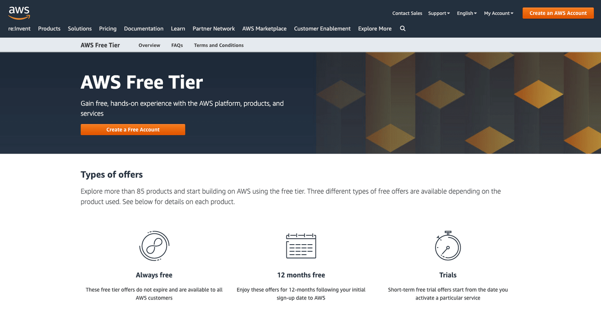
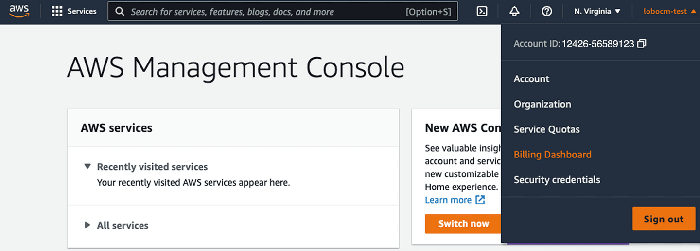
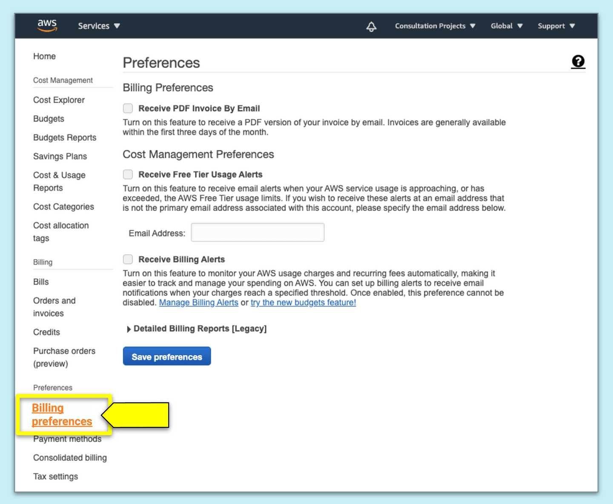
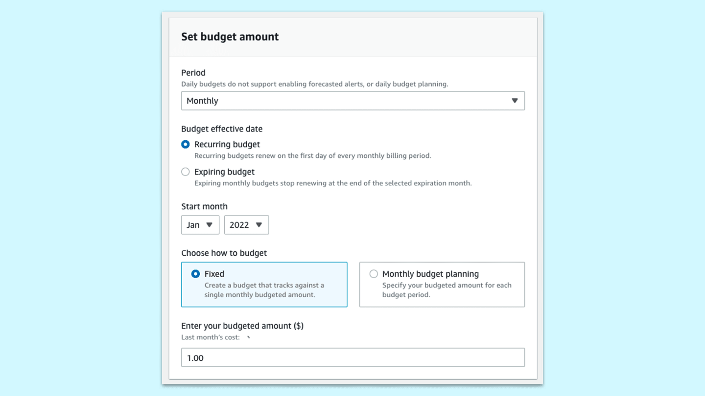
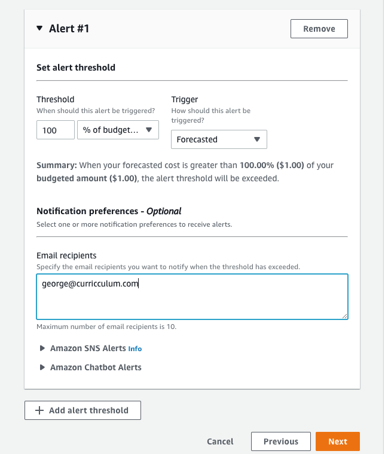

# Set Up an AWS Account

In the previous step, we introduced cloud computing. In this step, we'll set up an AWS account.

To begin, we must first create an AWS account by navigating to the [AWS sign-up page](https://aws.amazon.com/free/), shown in the following image:

`A screenshot depicts the AWS Free Tier page, which has a button named Create a Free Account.`

This brings us right to the AWS Free Tier page. Although we're using the free tier, we will still be prompted for a credit card. Don't worry—we will take measures to ensure that you're aware of your usage so that you can prevent any accidental charges to your credit card!

**Important**

> In order to ensure we are not charged for going over the Free Tier limits or for using an AWS service that is not covered by the Free Tier, we will set up billing and budget alerts, as well as terminate any AWS resources we used at the end of a module.

Follow these steps to set up your account:

1. Select Create a Free Account.

2. Fill in the form with the following information:

    * Email address

    * Password

    * Confirm password

    * AWS account name

3. Select Continue, which will take you to a new form.

4. For the account type, select Personal.

5. Fill out the form with your information.

6. Check the box to agree with the AWS Customer Agreement.

7. Select Create Account and Continue, which will take you to the Payment Information form.

8. Input your credit card information on the Payment Information form.

9. Choose whether you want the account verification sent to you by email or text. Once the verification code has been entered, you'll be redirected to the Support Plan.

10. Click Free to select the Basic Plan. You'll be directed to the Welcome to Amazon Web Services page. You've successfully created an AWS account!

11. Select the "Go to the AWS Management Console" button, which will redirect you to the sign-in page.

12. We'll sign in with the root user email, so choose that link (located under the Sign In button).

13. Verify that the root user has been selected, and enter the root user email address.

14. Select Next.

15. Enter the password.

16. Select Sign In.

If you've been redirected to the AWS Management Console, you've entered your account page! This is the main hub that can connect to all the AWS services as well as information on tutorials, documentation, and help.

**Important**

> Having problems signing in? Select the "Forget your Password" link to create a new password.

As you can see, the AWS ecosystem is very big. There are more than 175 web services to choose from, spanning many different categories. Before we go much further, let's create billing alerts to safeguard the account against unintended charges.

## Set Up Your Billing Preferences

From the AWS Management Console, go to the menu bar and select "Billing Dashboard" under your account name, as shown in the following image:

`A screenshot points out My Billing Dashboard from your account name drop-down menu.`

As shown in the preceding image, we'll be redirected to another page, where we can see the spend summary and expense reports.

Select "Billing preferences", located on the left side menu, as shown in the following image:

`A screenshot points out "Billing preferences" on the navigation menu.`

Select the following preferences:

* Receive PDF Invoice By Email

* Receive Free Tier Usage Alerts

* Receive Billing Alerts

Then save these preferences.

By selecting these preferences, you'll be alerted if you get charged for services beyond the Free Tier.

## Set Up Your Budget Alerts

While we are in the Billing & Cost Management dashboard, let's set up a budget alert so that we are notified **before** we incur any charges.

Select "Budgets", located on the left-side menu, and then select the "Create budget" button.

Follow these steps to set up the budget alert:

1. Select "Cost budget" and click "Next".

2. Under the "Set budget amount", set the "Period" dropdown to "Monthly".

3. For "Budget effective date", select "Recurring budget" and choose the current month as the "Start month".

4. Select "Fixed" under "Choose how to budget" and enter an amount for the "Budgeted amount". For example, if you want to be alerted when your estimated charges are over 1, enter `1.00` for "Enter your budgeted amount ($)", as shown in the following image:

`A screenshot depicts $1.00 in the "Budgeted amount" box on the "Set your budget" page.`

5. Under "Details", name the budget, such as "Monthly AWS budget" and click "Next".

6. You'll be taken to the "Configure alerts" page. From here click the "Add an alert threshold" button.

7. Set the alert threshold trigger to "Forecasted" and alert threshold at "100% of budgeted amount". This means that the threshold is set based on "Forecasted cost" when it is greater than 100% ($1.00).

8. Enter the email address where the budget notification will be sent. The alert threshold configurations should look like the following image:

`A screenshot depicts the final "Alert #1" page.`

9. Select "Next" to save your changes and select "Next" again.

10. Review the budget details and alert settings. If everything looks correct, select "Create budget".

**Important**

> As discussed previously, cloud computing delivers computing resources on a pay-as-you-go method. AWS has set up the Free Tier with a number of services that offer a sample of either time, memory, or requests. Once the initial free sample has been used, charges will begin to incur. To understand exactly how much time, storage, or requests are available, visit the [AWS Free Tier webpage](https://aws.amazon.com/free/?all-free-tier.sort-by=item.additionalFields.SortRank&all-free-tier.sort-order=asc). The free tier is only available for one year. After that, some of the services will begin to incur fees.

Excellent work. You've set up the project starter code, created an AWS account, and set up alerts to guard against charges.

The next step is to set up the permissions, so let's navigate back to the Management Console.

## Set Up AWS Security

We're almost finished setting up the AWS account, but we still have another important task to accomplish: creating the AWS IAM user. **IAM** stands for **Identity and Access Management**. This is the system that AWS has devised to set up permissions for their web services.

**Deep Dive**

For more information, refer to the [AWS documentation on IAM identities, users, groups, and roles](https://docs.aws.amazon.com/IAM/latest/UserGuide/id.html).

As discussed previously, having an effective security system in place is an integral part of using the cloud. AWS achieves this by having the IAM only allow access according to the services using IAM roles or grant permission to users with IAM users. An IAM group is a set of service permissions that an IAM user can be assigned to, for quick access.

### Activate Two-Step Authentication

First we need to follow best practices by creating an MFA authentication step for the root user account. To do that, follow these steps:

1. To begin, let's navigate to the IAM console by typing "IAM" in the services input field.

2. Select IAM to navigate to the IAM Dashoboard.

3. In the Security Alert section, we'll see a warning that requests an MFA to be enabled. Select "Add MFA".

4. You'll then be taken to the "Your Security Credentials" page. From here, click the "Activate MFA" button.

5. Select "Virtual MFA device", then click "Continue".

6. Add the Google Authenticator app to your phone.

7. Once the app has been downloaded, scan the QR code or enter the code given into Google Authenticator.

8. Insert two consecutive MFA codes into the input fields.

Once the MFA authentication has been accepted, we can rest assured that even if the email and password to the AWS account are compromised, this extra layer of security will prevent illicit access.

## Create an AWS IAM User

The next step is to create a new user. According to the AWS documentation, "Don't use your AWS account root user credentials to access AWS, and don't give your credentials to anyone else. Instead, create individual users for anyone who needs access to your AWS account."

**Deep Dive**

For more information, refer to the [AWS documentation on security best practices in IAM](https://docs.aws.amazon.com/IAM/latest/UserGuide/best-practices.html).

Follow these steps to create an IAM user:

1. In the IAM console Dashboard, select the Users option in the left-hand menu.

2. Select Add user.

3. Enter the User name in the input field. **Make sure to also copy down this information somewhere, as you do with other usernames and passwords**.

4. For Access type, select "Access key - Programmatic access" and "Password - AWS Management Console access".

5. Select "Custom Password" and create a password for this user. **Make sure to also copy down this information somewhere, as you do with other usernames and passwords**.

6. Uncheck "Require password reset" and click "Next: Permissions".

7. In the Set permission section, select "Create group".

8. In the Group name input field, type Admins.

9. Check the box for Administrator Access.

10. Select the "Create group" button to add this user to the Admins security group.

11. Select "Next: Tags".

12. Select "Next: Review".

13. Select "Create user".

### Safeguard the Access Key ID

Now that the admin user has been created, the AWS Access Key ID and the AWS Secret Access Key for your IAM user have been created. Safeguard this information and keep it in a secure, retrievable location.

**Important**

> You'll need this information later to configure the AWS CLI!

To send the access key ID to yourself, follow these steps:

1. Select the "Send email" link to send yourself the login instructions as well as the sign-in URL and IAM username.

2. Click on your username located in the menu bar on top.

3. In the drop-down menu copy the Account ID 12-digit number and save it as it will be used to login.

## Log In as the IAM User

Now that we've created a new user, we need to log out as the root user (admin) and log back in as the IAM user that we just created. The root user should not be used for daily operations, as it creates too much of a security risk.

Go ahead and log out, then log back in using the account ID, IAM username, and password for the user you just created.

Good work. Although that process might have seemed long and tedious, keeping a record of permissions, access keys, usernames, and passwords will keep your account safe.

**Important**

> IAM users are easy to remove and replace, but a root user isn't replaceable—so keep it safe!

---
© 2022 edX Boot Camps LLC. Confidential and Proprietary. All Rights Reserved.