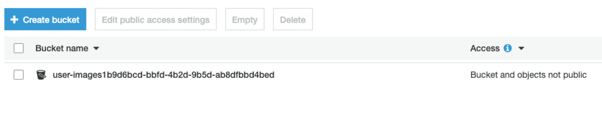
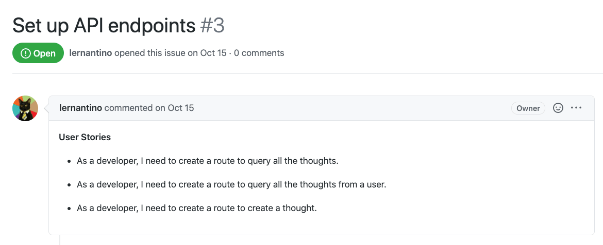

# Introduction

Now that you've learned the fundamentals of cloud computing, you probably have a good grasp on why the cloud has become a fixture of the internet. The cloud not only supplies backup storage for computing devices— but it also delivers a vast global infrastructure system that developers can use to deliver performant web solutions to people around the world.

In the previous lesson, we learned how companies can deliver web applications to consumers while shifting their infrastructure management to cloud providers. We also connected to AWS and created an S3 bucket in the Deep Thoughts application, as the following image shows:

`A screenshot depicts an S3 bucket, named user-images, that's listed in the S3 console.`

In this lesson, we'll learn how to use another AWS service that the free tier makes available—Amazon DynamoDB. This is a NoSQL database service that uses a key-value method for storing data. We'll replace the MongoDB database in the Deep Thoughts application with DynamoDB.

To find the extent of the free service that's available to us, go to the [AWS Free Tier](https://aws.amazon.com/free/free-tier/) page, and then review the DynamoDB card. Notice that on the free tier, we can receive 25 GB of storage and up to 200,000 requests per month. That's more than sufficient for the Deep Thoughts application, with ample room to create more.

**Deep Dive**

For more information, refer to the [Amazon DynamoDB pricing documentation](https://aws.amazon.com/dynamodb/pricing/).

We could have decided to use Atlas, the MongoDB web service that integrates with AWS. However, DynamoDB has special properties that apply to cloud computing on a large scale.

The overlying philosophy in AWS is to provide web services that can handle millions of requests every hour. With MongoDB and relational databases, like MySQL, the performance drops as the number of requests increase. By contrast, DynamoDB was designed with high performance under extreme load conditions in mind. If we use a large-scale-first mentality when designing web applications, we can get around the technical debt of database migration—by starting with a system that can handle a high-request load.

Typically, high-performance databases are expensive. But with the pay-as-you-go cost model of cloud computing, we need to pay DynamoDB only for read or write requests that occur beyond the limit of the free tier.

Let's review the GitHub issue that we'll complete in this lesson, as the following image shows:

`A screenshot depicts the GitHub issue for this lesson.`

In the preceding image, notice that GitHub Issue 3 is named "Set up API endpoints." And, it lists the following three user stories:

* As a developer, I need to create a route to query all the thoughts.

* As a developer, I need to create a route to query all the thoughts from a user.

* As a developer, I need to create a route to create a thought.

In this lesson, we'll create a data model for the application, create and populate a table by using DynamoDB, read and write data to the database, query a table in a NoSQL database, create API endpoints, and programmatically connect to AWS.

By integrating a database web service into an existing web application, we'll learn valuable skills. These include how to use web documentation to learn a new library, how to use a database web service to persist data, and how to integrate a database web service into API endpoints.

---
© 2022 edX Boot Camps LLC. Confidential and Proprietary. All Rights Reserved.