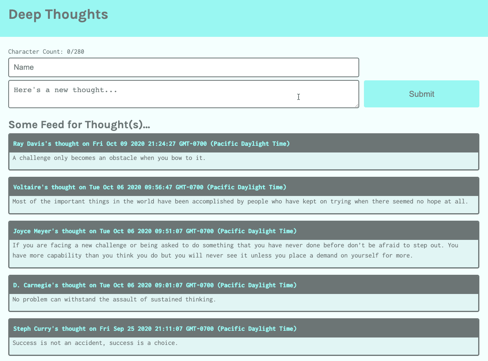

# Preview

The goal of this lesson is to integrate the DynamoDB web service into the Deep Thoughts application—to create a table and then to read and write data to that table. Specifically, we'll display a list of all the user thoughts on the homepage of the Deep Thoughts application.

The following image shows an example of what we'll build by the end of the lesson:

`A screenshot depicts the Deep Thoughts application in the browser.`

In the preceding image, notice that the Deep Thoughts application appears in the browser. It features an input form for submitting thoughts and a feed of already-submitted thoughts.

To get there, we’ll follow this game plan:

1. Create the data model.

2. Create and populate the table by using DynamoDB.

3. Create the API endpoints (for the GET and POST routes).

**Note**

> When following the preceding steps, we'll use the starter code, which supplies the front end of the Deep Thoughts application. We'll integrate the database web service to persist the user thoughts.

Let's get started!

---
© 2022 edX Boot Camps LLC. Confidential and Proprietary. All Rights Reserved.