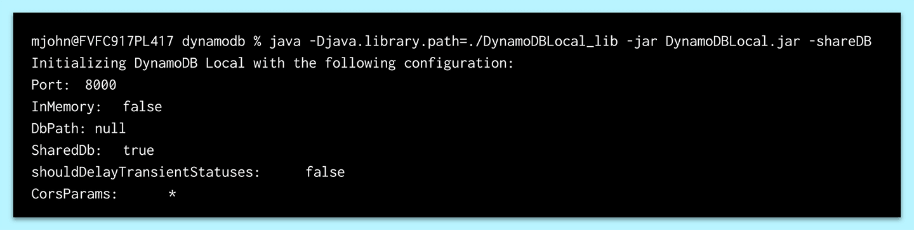
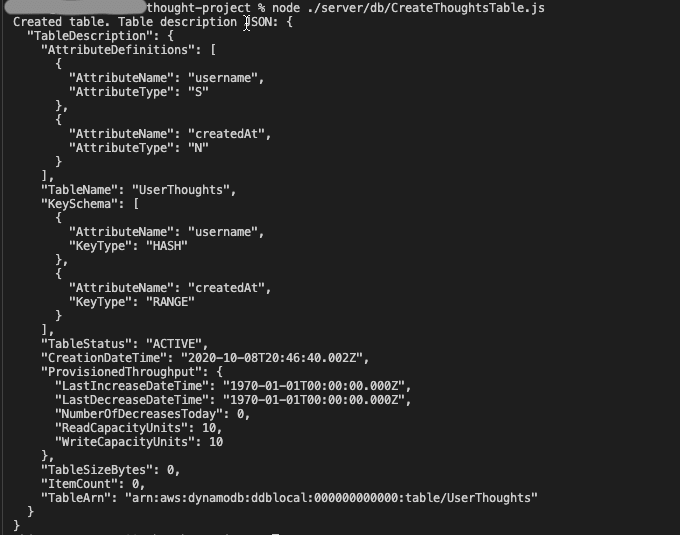
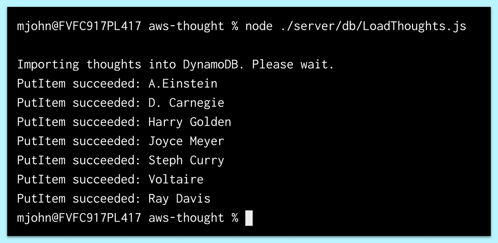

# Create and Populate the Table by Using Amazon DynamoDB

In the previous step, we created the data model. In this step, we'll create and populate the table by using DynamoDB.

First, we'll need to download the DynamoDB file and start a local instance of the database.

For both macOS and Windows users, complete the following steps:

1. Visit the [AWS DynamoDB download page](https://docs.aws.amazon.com/amazondynamodb/latest/developerguide/DynamoDBLocal.DownloadingAndRunning.html) and select the zip file in the US region.

2. Open the zip file to expand the folder.

3. Open the CLI, navigate to where this folder is located, and `cd` into this folder.

4. Run the following command:

```console
java -Djava.library.path=./DynamoDBLocal_lib -jar DynamoDBLocal.jar -sharedDb
```

If the above command results in a `java: command not found`, refer to the "Up and Running" page to ensure you have Java installed on your machine.

5. On execution, you should see a message like the one shown in the following image:



`A screenshot depicts a message in the CLI.`

In the preceding image, notice that the message shows the initialization and configuration of the DynamoDB local instance on the computer. In particular, notice that this instance is located on Port 8000.

Nice work! Having a local DynamoDB instance is great for development work because we won't be interrupted in case the internet connection is unstable or we need to pay for each read or write operation while in development.

## Define the Table in DynamoDB

Next, before we create the table, let's discuss the components of a DynamoDB table. The following are the basic DynamoDB components:

* **Tables**: Similar to other database systems, DynamoDB stores data in tables. A table is a collection of data.

* **Items**: Each table contains zero or more items. An item is a group of attributes that is uniquely identifiable among all of the other items. An item is similar to a row or record in SQL.

* **Attributes**: Each item is composed of one or more attributes. An attribute identifies the data element, such as a column in SQL.

# Learn About Implementing Partition Keys to Divide the Table

Just like primary keys in SQL, DynamoDB has partition keys. However, there is a key distinction between how they are used and how unique they must be.

In SQL, the primary key uniquely identifies each row. In DynamoDB, the recommendation is to use an attribute with a high degree of cardinality or uniqueness, but it isn't mandatory like it is in SQL. This is because a sort key can be used in combination with the partition key to create a composite key. The composite key will attribute uniqueness by using both attributes as identifiers.

**Deep Dive**

To learn more, refer to the [AWS documentation on partition keys for DynamoDB](https://aws.amazon.com/blogs/database/choosing-the-right-dynamodb-partition-key/).

## Create a Git Branch

Now we're ready to begin development. Make a new branch to isolate the work.

1. Navigate to the project root folder in the command line, or open the integrated CLI in VS Code at the project's root directory.

2. Checkout to the `develop` branch, then checkout to a new branch called `feature/userthoughts-table`.

Great, now we can safely start developing the `Thoughts` table.

# Create the Folder Structure

Next, let's create the folder structure for the back end of the Deep Thoughts application by following these steps:

1. Create a `db` folder in the `server`.

The current folder structure should look like the following example:

```
├─ client/
├─ server/
│  ├─ db
```

2. In the `db` folder, create a file called `CreateThoughtsTable.js`.

## Add JavaScript

Here we'll be programmatically creating a new table in the local DynamoDB instance.

1. At the top of the file, we'll be importing the `aws-sdk` package, as follows:

```js
const AWS = require('aws-sdk');
```

2. Then we'll modify the AWS config object that DynamoDB will use to connect to the local instance, as shown in the following example:

```js
AWS.config.update({
  region: 'us-east-2',
});
```

## Create the DynamoDB Service Object

Next, create the DynamoDB service object by adding the following expression:

```js
const dynamodb = new AWS.DynamoDB({ apiVersion: '2012-08-10' });
```

By specifying the API version in the preceding statement, we ensure that the API library we're using is compatible with the following commands. This is also the latest **long-term support** version, or **LTS**.

It is important to note that we're using the `DynamoDB` class to create a service interface object, `dynamodb`.

**Deep Dive**

For more information, read the [AWS documentation on the DynamoDB class](https://docs.aws.amazon.com/AWSJavaScriptSDK/latest/AWS/DynamoDB.html).

## Create the params Object

Next we'll create a `params` object that will hold the schema and metadata of the table, by adding the following code:

```js
const params = {
  TableName: 'Thoughts',
  KeySchema: [
    { AttributeName: 'username', KeyType: 'HASH' }, // Partition key
    { AttributeName: 'createdAt', KeyType: 'RANGE' }, // Sort key
  ],
  AttributeDefinitions: [
    { AttributeName: 'username', AttributeType: 'S' },
    { AttributeName: 'createdAt', AttributeType: 'N' },
  ],
  ProvisionedThroughput: {
    ReadCapacityUnits: 10,
    WriteCapacityUnits: 10,
  },
};
```

Because that was a lot of code, let's go through each line and interpret what is happening. Using an object-based key-pair definition, the keys indicate properties, and the values indicate the schema configurations.

In the first line, we designate the table name as `Thoughts`.

Next is the `KeySchema` property, which is where we define the partition key and the sort key. Here we see that the partition key is defined as the `KeyType: "HASH"` and the sort key is defined as the `"RANGE"`. We'll use these terms interchangeably throughout this module.

We defined the hash key as `username` and the range key as `createdAt` to create a unique composite key. One benefit of using `createdAt` as the sort key is that queries will automatically sort by this value, which conveniently orders thoughts by most recent entry.

**Important**

> Knowing the types of queries when creating the table schema can improve the performance of the database and save on development time.

Next we see the `AttributeDefinitions` property. This defines the attributes we've used for the hash and range keys. We must assign a data type to the attributes we've declared. We assigned a string to the `username` and a number to `createdAt`, indicated by `"S"` and `"N"` respectively.

**Deep Dive**

Because it's a NoSQL database, DynamoDB also has access to more complex attribute types like arrays (known here as lists, or `"L"`) and objects or dictionaries (known here as maps, or `"M"`).

For more information, review the [AWS documentation on attribute types](https://docs.aws.amazon.com/amazondynamodb/latest/APIReference/API_AttributeValue.html).

Next is the `ProvisionedThroughput` property. This setting reserves a maximum write and read capacity of the database, which is how AWS factors in pricing.

**Deep Dive**

For more information, refer to the [AWS documentation on the provisioned throughput](https://docs.aws.amazon.com/amazondynamodb/latest/APIReference/API_ProvisionedThroughput.html).

Notice that we only defined the keys for the `Thoughts` table. We didn't define any other attributes, such as the `thought` itself. Unlike in a relational database, the schema does not have to be predefined. Items in a DynamoDB table can have a different number of attributes, but they must have a partition key or composite key.

## Call the DynamoDB Instance to Create the Table

Now that the `params` object is configured, we can use it to make a call to the DynamoDB instance and create a table, by adding the following code:

```js
dynamodb.createTable(params, (err, data) => {
  if (err) {
    console.error(
      'Unable to create table. Error JSON:',
      JSON.stringify(err, null, 2),
    );
  } else {
    console.log(
      'Created table. Table description JSON:',
      JSON.stringify(data, null, 2),
    );
  }
});
```

In the preceding statement, we used the method, `createTable`, on the `dynamodb` service object. Next we pass in the `params` object and use a callback function to capture the error and response.

To run this file, run the following command from the root directory:

```console
node ./server/db/CreateThoughtsTable.js
```

If the table was created successfully, we should see a message that resembles the following image:



`A screenshot depicts a message that states "Created table" followed by a table description in JSON format.`

## Seed the Table with Data

Next, we'll load some data into the new table so that we can query the database, by following these steps:

1. Create a `seed` folder in the `server` directory.

2. Create the `seed` data file in seed named `users.json`.

3. Copy and paste the following object into a JSON file named `users.json`:

```js
[
  {
    "username": "A. Einstein",
    "createdAt": 1502293460904,
    "thought": "It’s not that I’m so smart, it’s just that I stay with problems longer."
  },
  {
    "username": "Steph Curry",
    "createdAt": 1601093467954,
    "thought": "Success is not an accident, success is a choice."
  },
  {
    "username": "Joyce Meyer",
    "createdAt": 1602003067054,
    "thought": "If you are facing a new challenge or being asked to do something that you have never done before don’t be afraid to step out. You have more capability than you think you do but you will never see it unless you place a demand on yourself for more."
  },
  {
    "username": "Voltaire",
    "createdAt": 1602003407954,
    "thought": "Most of the important things in the world have been accomplished by people who have kept on trying when there seemed no hope at all."
  },
  {
    "username": "D. Carnegie",
    "createdAt": 1602000067954,
    "thought": "No problem can withstand the assault of sustained thinking."
  },
  {
    "username": "Harry Golden",
    "createdAt": 1601003667954,
    "thought": " The only thing that overcomes hard luck is hard work."
  },
  {
    "username": "Ray Davis",
    "createdAt": 1602303867954,
    "thought": "A challenge only becomes an obstacle when you bow to it."
  }
]
```

Note that we're using an array of objects with three properties: `username`, `createdAt`, and `thought`.

4. Create another file in the `db` folder, called `LoadThoughts.js`, to load the seed data file.

5. Open the file and add the following statement:

```js
const AWS = require('aws-sdk');
const fs = require('fs');
```

6. Again we'll use the `aws-sdk` to create the interface with DynamoDB. We'll also be using the file system package to read the `users.json` file, as shown in the following example:

```js
AWS.config.update({
  region: 'us-east-2',
});
const dynamodb = new AWS.DynamoDB.DocumentClient({
  apiVersion: '2012-08-10',
});
```

This is similar to the `CreateThoughtsTable.js` configuration, with one key distinction. We'll use the `DocumentClient()` class this time to create the `dynamodb` service object. This class offers a level of abstraction that enables us to use JavaScript objects as arguments and return native JavaScript types. This constructor helps map objects, which reduces impedance mismatching and speeds up the development process. We'll be using this class for most of the database calls in this project.

**Deep Dive**

For more information, review the [AWS documentation on the document client](https://docs.aws.amazon.com/AWSJavaScriptSDK/latest/AWS/DynamoDB/DocumentClient.html).

7. In the next step, we'll use the `fs` package to read the `users.json` file and assign the object to the `allUsers` constant, as follows:

```js
console.log('Importing thoughts into DynamoDB. Please wait.');
const allUsers = JSON.parse(
  fs.readFileSync('./server/seed/users.json', 'utf8'),
);
```

**Important**

> The relative path for the `fs.readFileSync` function is relative to where the file is executed, not the path between files. In this case, the file path will work if this command is executed from the project's root directory.

1. Next we'll loop over the `allUsers` array and create the `params` object with the elements in the array, as follows:

```js
allUsers.forEach(user => {
  const params = {
    TableName: "Thoughts",
    Item: {
      "username": user.username,
      "createdAt": user.createdAt,
      "thought": user.thought
    }
  };
  ```

In the loop, we assigned the values from the array elements in the `Item` property.

9. While still in the loop, we make a call to the database with the service interface object, `dynamodb`, as shown in the following code:

```js
dynamodb.put(params, (err, data) => {
    if (err) {
      console.error("Unable to add thought", user.username, ". Error JSON:", JSON.stringify(err, null, 2));
    } else {
      console.log("PutItem succeeded:", user.username);
    }
  });
};
```

Add the preceding code to complete the creation of the `LoadThoughts.js` file. In the preceding statement, we used the same pattern that we used to create the table, but this time we used the PUT method.

10. Due to the `fs.readFileSync` function, we must navigate to the root directory of the project first. Otherwise, we'll receive an error that no file was found. Then we can execute the following command:

```console
node ./server/db/LoadThoughts.js
```

If the data loaded successfully into the `Thoughts` table, we should see a message resembling the following image:



`A screenshot depicts a message that lists various users,with each preceded by "PutItem succeeded."`

Great job! Before moving on, use the AWS CLI to verify that the table was created.

---
© 2022 edX Boot Camps LLC. Confidential and Proprietary. All Rights Reserved.