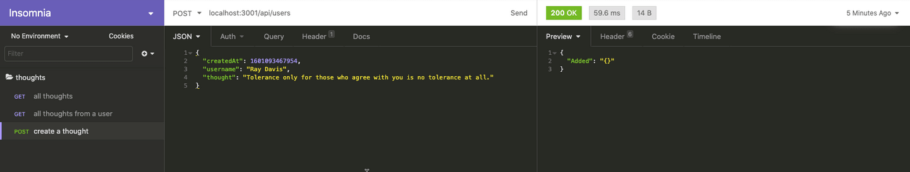

# Create the API Endpoints

In the previous step, we created and populated the table by using DynamoDB. In this step, we'll create the API endpoints.

In this section, we'll create the back end of the Deep Thoughts application. First we'll create the `package-json` file in the `server`. This will allow us to install `express` and help create the API routes.


1. Execute the following command inside the `server` directory:

```console
npm init --y
```

2. Next we'll install the `express` package, as follows:

```console
npm install express
```

3. Create the `server.js` file in the `server` directory.

4. We'll use a boilerplate or common server pattern to set up the back-end functionality, as shown in the following code block:

```js
const express = require('express');
const app = express();
const PORT = process.env.PORT || 3001;
const userRoutes = require('./routes/user-routes');

// express middleware, used to be bodyparser
app.use(express.json());
app.use(express.urlencoded({ extended: true }));

// Serve up static assets
if (process.env.NODE_ENV === 'production') {
  app.use(express.static('client/build'));
}

// app.use(require('./routes'));
app.use('/api/', userRoutes);

// Start the API server
app.listen(PORT, () =>
  console.log(`🌎  ==> API Server now listening on PORT ${PORT}!`),
);
```

Let's review a couple notable points of interest in the preceding code:

    * In order to make the above code functional, we need to create a `routes` directory in the `server` directory. And we need to create a `user-routes.js` file in the `routes` directory.

    * The API routes will use `/api/`.

5. Once `user-routes.js` has been created, open the file in the IDE. Now let's import `express` and use the `Router()` to create the routes, as follows:

```js
const express = require('express');
const router = express.Router();
```

Next, let's install the `aws-sdk` package, then import the `aws-sdk` and configure the service interface object, `dynamodb`.

1. In the command line, navigate to the `server` directory, then run the command `npm install aws-sdk.`

2. Configure the service interface object within the `user-routes.js` file as follows:

```js
const AWS = require('aws-sdk');
const awsConfig = {
  region: 'us-east-2',
};
AWS.config.update(awsConfig);
const dynamodb = new AWS.DynamoDB.DocumentClient();
const table = 'Thoughts';
```

In the preceding code, we're using some familiar configuration assignments to connect with the local DynamoDB instance. We use the `DocumentClient` class to use native JavaScript objects to interface with the `dynamodb` service object. We're also setting the `table` value to `"Thoughts"`.

**Pause**

> Why did we not lock the version number for the `DocumentClient` class like we did for the `DynamoDB` class?

> Answer
> While `DynamoDB` class had two versions, `DocumentClient` has only one, so there is no need to lock the version number for `DocumentClient`.

In the next step, we'll create the routes that will call on DynamoDB. But before we begin, let's figure out what type of data we need from the database and where we'll need it. Consider the following goals:

* Render all the users' thoughts on the homepage.

* List all of a user's thoughts on that user's profile page.

* Create a new user and thought on the thought form.

Based on that list, it looks like we'll need three routes to handle the application's requirements. Let's work on that next.

## Create the GET Route to Access All Thoughts

The first route needs the GET method at the `/api/users/` endpoint. We'll be retrieving all the users' thoughts from the `Thoughts` table. See the following code for an example:

```js
router.get('/users', (req, res) => {
  const params = {
    TableName: table,
  };
  // more to come . . .
});
```

In the preceding statement, we assign `"Thoughts"` to the `TableName` property in the `params` object.

Next, we'll pass the `params` object into the DynamoDB call, as follows:

```js
router.get('/users', (req, res) => {
  const params = {
    TableName: table,
  };
  // Scan return all items in the table
  dynamodb.scan(params, (err, data) => {
    if (err) {
      res.status(500).json(err); // an error occurred
    } else {
      res.json(data.Items);
    }
  });
});
```

In the preceding statement, we'll use the `scan` method to return all the items of the table. We also added a status code in case there was an internal error with retrieving the data from the table. Notice that the data in the table is actually in the `Items` property of the response, so `data.Items` was returned.

Next, we need to add the following expression to expose the endpoints:

```js
module.exports = router;
```

## Test the GET Route

Now let's test this route by starting the Express.js server and using Insomnia to inspect the responses. From the root directory, use the following command to run the `server.js` file:

```js
node ./server/server.js
```

**Note**

> Moving forward, we will be adding functionality to the Express.js server and then testing that new functionality. It's important to stop and then restart the server to ensure that the code you've added in each section is recognized by the server before you run any tests.

We should see the following message at the command prompt once the server is running:

```js
🌎  ==> API Server now listening on PORT 3001!
```

To test the GET route, open Insomnia and complete the following steps:

1. Create a new folder called `thoughts`.

2. Create a new request in the `thoughts` folder called `all thoughts`.

3. In the address bar, insert the route that you created: `localhost:3001/api/users`.

4. Select the GET method in the address bar from the drop-down menu.

5. Select Send.

If we get a response with data, we know that we created the route and seeded the data into the table correctly.

The following image verifies that the route is working properly:


`A screenshot depicts the Preview tab in Insomnia, which displays a response containing the data and the route.`

**Deep Dive**

One way to check is to use the following AWS CLI command, which will return the contents of the table in the command line:

```console
aws dynamodb scan --table-name Thoughts
```

To learn more, refer to the [AWS documentation on basic operations on DynamoDB tables](https://docs.aws.amazon.com/amazondynamodb/latest/developerguide/WorkingWithTables.Basics.html).

Now let's move on to the next endpoint, which will return all the thoughts from a user.

## Create the GET Route to Access All Thoughts from a User

We need to get all the thoughts for a specific user to populate the user's profile page. We'll get to the profile page by selecting the name of a user on the homepage.

Let's begin by creating the endpoint using the GET method. Place this route under the previously created route, but before the `module.exports` expression. Make sure that `module.exports` remains the last line of this file. See the following code for an example:

```js
// More to come
router.get('/users/:username', (req, res) => {
  console.log(`Querying for thought(s) from ${req.params.username}.`);
});
```

In the preceding route, we'll use query parameters to pass the `username` from the client to the server. We'll capture the query parameter with the `req.params` object.

Next we'll declare `params` to define the query call to DynamoDB. We'll use the `username` retrieved from `req.params` to provide a condition for the query, because we're only interested in one user. The goal is to find all the thoughts from this user. Begin by declaring `params`, as shown in the following expression:

```js
const params = {
  TableName: table,
  KeyConditionExpression: '#un = :user',
  ExpressionAttributeNames: {
    '#un': 'username',
    '#ca': 'createdAt',
    '#th': 'thought',
  },
  ExpressionAttributeValues: {
    ':user': req.params.username,
  },
  ProjectionExpression: '#th, #ca',
  ScanIndexForward: false,
};
```

Let's break down this expression and explain each of the four properties:

* The `KeyConditionExpression` property specifies the search criteria.

**Rewind**

Similar to the `WHERE` clause in SQL, the `KeyConditionExpression` property is used to filter the query with an expression.

As the name suggests, we can use expressions by using comparison operators such as `<`, `=`, `<=`, and `BETWEEN` to find a range of values.

**Deep Dive**

To learn more, refer to the [AWS documentation on working with queries in DynamoDB](https://docs.aws.amazon.com/amazondynamodb/latest/developerguide/Query.html).

We need to retrieve all the thoughts from a specific user, so we used the `=` operator to specify all items that pertain to a single username. The `#un` and `:user` symbols are actually aliases that represent the attribute name and value. The `#un` represents the attribute name `username`. This is defined in the `ExpressionAttributeNames` property. While attribute name aliases have the `#` prefix, the actual value of this key is up to us. DynamoDB suggests using aliases as a best practice to avoid a list of reserved words from DynamoDB that can't be used as attribute names in the `KeyConditionExpression`. Because words such as `time`, `date`, `user`, and `data` can't be used, abbreviations or aliases can be used in their place as long as the symbol `#` precedes it.

**Deep Dive**

For more information, refer to the [AWS documentation on reserved words in DynamoDB](https://docs.aws.amazon.com/amazondynamodb/latest/developerguide/ReservedWords.html).

* For the same reason, the attribute values can also have an alias, which is preceded by the `:` symbol. The attribute values also have a property that defines the alias relationship. In this case, the `ExpressionAttributeValues` property is assigned to `req.params.username`, which was received from the client. To reiterate, we're using the username selected by the user in the client to determine the condition of the search. This way, the user will decide which username to query.

* Next is the `ProjectExpression` property. This determines which attributes or columns will be returned. This is similar to the `SELECT` statement in SQL, which identifies which pieces of information is needed. In the preceding code statement, we specify that the `thoughts` and `createdAt` attributes should be returned. We didn't add the `username`, because this value is part of the condition criteria; therefore, this info is redundant and won't be rendered.

* Last is the `ScanIndexForward` property. This property takes a Boolean value. The default setting is true, which specifies the order for the sort key, which will be ascending. The sort key was assigned to the `createdAt` attribute when we first created the table. Because we want the most recent posts on top, we set the `ScanIndexForward` property to false so that the order is descending.

Now that the `params` object is set, we have all the information we need to make the database call to the `Thoughts` table. Let's use the service interface object, `dynamodb`, and the `query` method to retrieve the user's thoughts from the database, by running the following function call:

```js
dynamodb.query(params, (err, data) => {
    if (err) {
      console.error("Unable to query. Error:", JSON.stringify(err, null, 2));
      res.status(500).json(err); // an error occurred
    } else {
      console.log("Query succeeded.");
      res.json(data.Items)
    }
  });
}); // closes the route for router.get(users/:username)
```

Notice that the pattern is the same as before. We pass in the `params` object and a callback function to handle the response. The first conditional expression will return an internal request error with a status code of 500 if there's a problem with the query request to the database. All other responses will be considered a successful operation. Again we send the `data.Items` object back to the client. The response data from the database is located in the `Items` property of the response.

**Important**

> The last `});` is necessary to end the router statement. Double-check the syntax just to make sure the route will execute properly.

The route to get all the thoughts of a user should look like the following code block:

```js
// get thoughts from a user
router.get('/users/:username', (req, res) => {
  console.log(`Querying for thought(s) from ${req.params.username}.`);
  const params = {
    TableName: table,
    ProjectionExpression: '#th, #ca',
    KeyConditionExpression: '#un = :user',
    ExpressionAttributeNames: {
      '#un': 'username',
      '#ca': 'createdAt',
      '#th': 'thought',
    },
    ExpressionAttributeValues: {
      ':user': req.params.username,
    },
    ProjectionExpression: '#th, #ca',
    ScanIndexForward: false,
  };
  dynamodb.query(params, (err, data) => {
    if (err) {
      console.error('Unable to query. Error:', JSON.stringify(err, null, 2));
      res.status(500).json(err); // an error occurred
    } else {
      console.log('Query succeeded.');
      res.json(data.Items);
    }
  });
});
```

Nice work! Let's test the route now to see if the work for this route is finished.

Open Insomnia and create a new route called `all thoughts from a user`, which you can duplicate from the `all thoughts` route. Change the URL in the address bar to reflect the query parameters needed for this route. Your request should resemble the following example:

```console
localhost:3001/api/users/Ray%20Davis
```

Notice how we used the `%20` escape symbol to allow a space between the first and last names of the users.

Once we select Send, a successful response will look like the following image:


`A screenshot depicts the Preview tab in Insomnia, which displays a single thought with only the thought and createdAt properties.`

Notice that only the `thought` and `createdAt` attribute names were retrieved as expected due to the `ProjectExpressions` assignment in the `params` configuration. If we had not supplied this property in the `params` object, we would've received all the attributes of each item.

Now it's time to work on the final endpoint of this lesson: create a new user and their corresponding thought.

## Create the POST Route to Create a New Thought

As a reminder, we need this route when a user creates a new thought in the `ThoughtForm` component. We need the database call to occur once a user selects submit.

We're creating a new thought, so we'll use the POST method, which will occur at the endpoint `/api/users`. Set up the following route under the last route, but before the `module.exports = router;` expression:

```js
// Create new user at /api/users
router.post('/users', (req, res) => {
  const params = {
    TableName: table,
    Item: {
      username: req.body.username,
      createdAt: Date.now(),
      thought: req.body.thought,
    },
  };
  // database call
});
```

In the preceding route, notice that we set the `params` object to the form data of the `ThoughtForm`, which we can access with `req.body`. Also notice that we use the JavaScript native Date object to set the value of the `createdAt` property. This is so that we know when this thought from the user was posted. Remember that we used the `createdAt` property as the sort key, which will help us sort the thoughts chronologically when we want to render them in the profile page.

Now all that's left is the database call, which looks like the following example:

```js
dynamodb.put(params, (err, data) => {
    if (err) {
      console.error("Unable to add item. Error JSON:", JSON.stringify(err, null, 2));
      res.status(500).json(err); // an error occurred
    } else {
      console.log("Added item:", JSON.stringify(data, null, 2));
      res.json({"Added": JSON.stringify(data, null, 2)});
    }
  });
});  // ends the route for router.post('/users')
```

You might've noticed that this is the same pattern that we used before. However, a key distinction here is that we use the `put` method to add an item to the `Thoughts` tables.

The following completed endpoint shows how the route will look once we add both the `params` object and the corresponding database call:

```js
// Create new user
router.post('/users', (req, res) => {
  const params = {
    TableName: table,
    Item: {
      username: req.body.username,
      createdAt: Date.now(),
      thought: req.body.thought,
    },
  };
  dynamodb.put(params, (err, data) => {
    if (err) {
      console.error(
        'Unable to add item. Error JSON:',
        JSON.stringify(err, null, 2),
      );
      res.status(500).json(err); // an error occurred
    } else {
      console.log('Added item:', JSON.stringify(data, null, 2));
      res.json({ Added: JSON.stringify(data, null, 2) });
    }
  });
});
```

**Important**

> Notice that because we're using the `DocumentClient()` class to instantiate the service object, `dynamodb`, the request and response from the database are native JavaScript objects. This greatly simplifies the code and improves the developer experience by sidestepping any impedance mismatch.

### Test the POST Route

It's time to test the route!

1. Open Insomnia and create a POST request named `create thought` in the `thoughts` folder .

2. Duplicate the `all thoughts` route and change the method to a POST method.

3. Select Body in the menu bar and choose JSON. We'll simulate the form data by sending the route a JSON object.

4. Copy and paste the following JSON object, which will serve as a substitute for the form data:

```json
{
  "createdAt": 1601093467954,
  "username": "Ray Davis",
  "thought": "Tolerance only for those who agree with you is no tolerance at all."
}
```

5. Select Send to send the POST request with the sample form data.

If the route successfully created a thought, you'll see the following response from the database in Insomnia:



`A screenshot depicts the database response, which reveals an empty object with the "Added" success message.`

Let's do a quick check to verify that the new thought is in the `Thoughts` table by selecting the `all thoughts from a user` request we created previously. Select Send to see if the new thought from Ray Davis has been added to the `Thoughts` table. You should see something like the following image:


`A screenshot depicts the Preview tab in Insomnia, where two thoughts now appear.`

Hurray! We've successfully created the API endpoints needed by the Deep Thoughts application. Now that we've verified the data responses from DynamoDB, we can move on to connecting the API endpoints to the components on the client and rendering the data responses.

But before we forget, let's close the GitHub issue, add and commit the work, and then merge the `feature/userthoughts-table` branch into the `develop` branch.

---
© 2022 edX Boot Camps LLC. Confidential and Proprietary. All Rights Reserved.