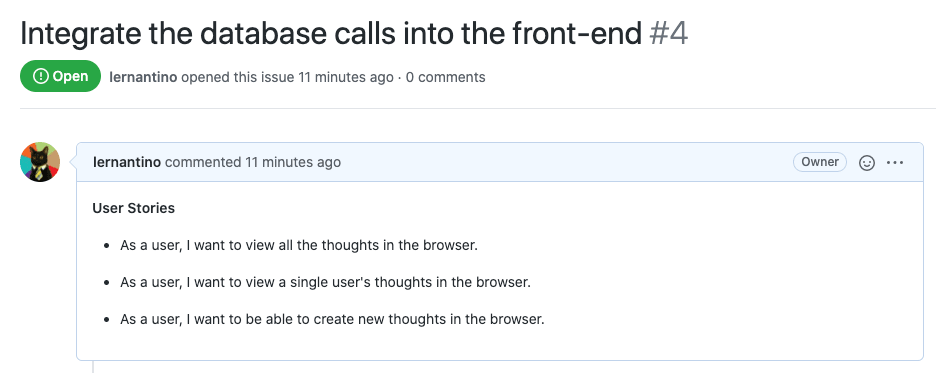

# Introduction

We've made lots of progress integrating the DynamoDB database service into the Deep Thoughts application!

In the previous lesson, we created the API endpoints that will supply the front end with the database operations, as the following image shows:

In this lesson, we'll integrate the routes that we built into the front end of the application. This is so that we can render the images and connect the form to the database.

Once we've accomplished this, we'll have an application that can share text. But, wouldn't it be nice to also share images? So, we'll add a bonus feature that will allow users to post images along with their thoughts. This will expand the usefulness of the application and demonstrate more capabilities of cloud computing.

The following image shows the first GitHub issue that we'll work on in this lesson:

`A screenshot depicts the Preview tab in Insomnia, which displays that the GET and POST routes return data.`

`A screenshot depicts the first GitHub issue for this lesson.`

In the preceding image, notice that GitHub Issue 4 is named "Integrate the database calls into the front-end." And, it lists the following three user stories:

* As a user, I want to view all the thoughts in the browser.

* As a user, I want to view a single user's thoughts in the browser.

* As a user, I want to be able to create new thoughts in the browser.

**Note**

> We'll review the second issue when we start that task.

In this lesson, we'll integrate database calls into the UI, create an image upload route for uploading an image to the S3 bucket, add an input element to capture the image file from the user, and integrate the image upload route into the UI component.

Once we successfully integrate the API endpoints into the front end of the application, we'll have an extra feature. This feature will allow users to save images to the cloud and share them in the application.

---
© 2022 edX Boot Camps LLC. Confidential and Proprietary. All Rights Reserved.