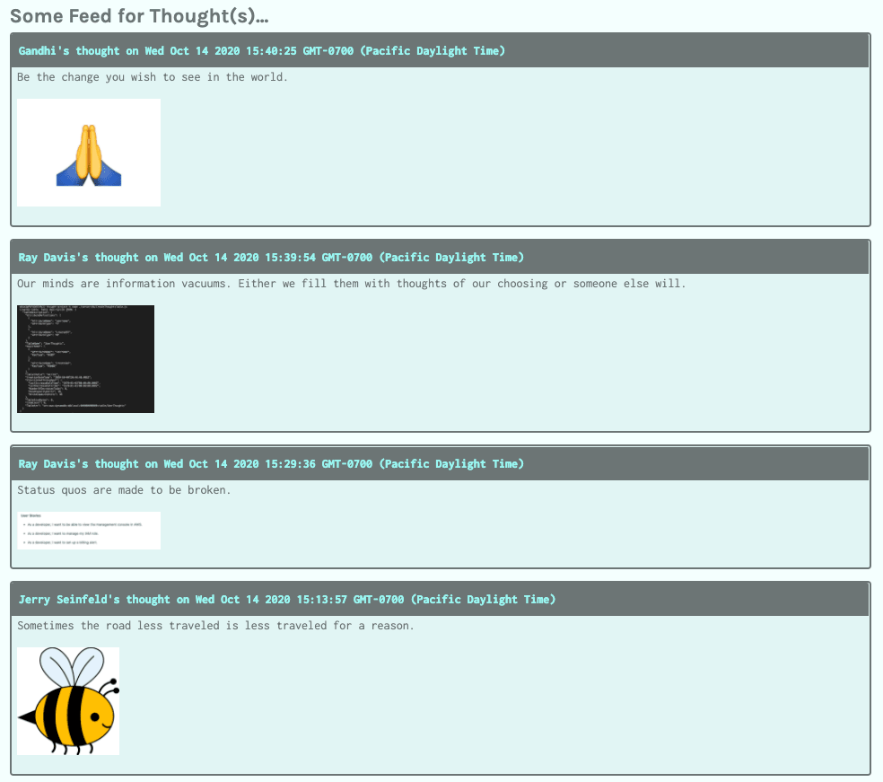

# Preview

The goals of this lesson are twofold. First, we'll complete the integration of DynamoDB into the Deep Thoughts application. Second, we'll add a bonus feature that expands the capabilities of the application.

The following image shows an example of what we'll build by the end of the lesson:

`A screenshot depicts the Deep Thoughts homepage, which displays users' images along with their thoughts.`

To get there, we’ll follow this game plan:

1. Integrate the API endpoints into the front end of the application.

2. Deploy DynamoDB to AWS.

3. Set up the image upload route.

4. Integrate the image upload feature into the UI.

**Note**

> Before you start, spend a few minutes reviewing the starter code that you previously downloaded. Familiarize yourself with the React application and its components. In this lesson, we'll work mostly with the `Home`, `ThoughtList`, `ThoughtForm`, and `Profile` components.

Let's get started!

---
© 2022 edX Boot Camps LLC. Confidential and Proprietary. All Rights Reserved.