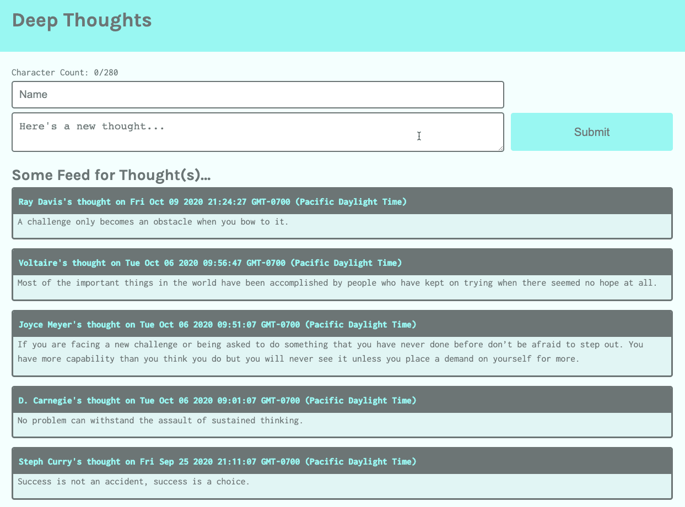
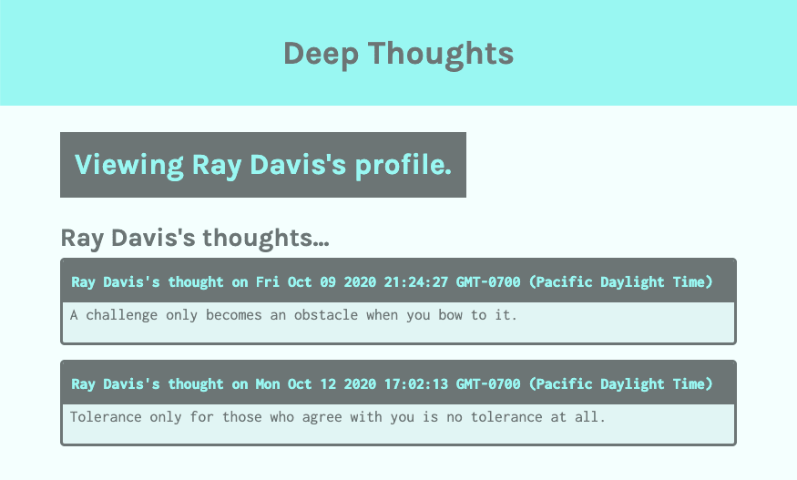
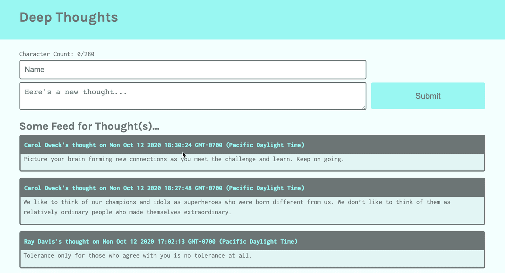

# Integrate the API Endpoints into the Front End of the application

We built three API endpoints in the previous lesson. Let's integrate these endpoints into the front end of the application so that users can render the data and create new data.

To get started, follow these steps if your client and server are not running:

1. Ensure that all the packages are installed by navigating to the root folder and running the `npm install` command at the command line.

2. Next, navigate to the `package.json` file within the `server` folder and add a new "watch" script under the "test" and "start" scripts so it looks like the following:

```json
"scripts": {
    "test": "echo \"Error: no test specified\" && exit 1",
    "start": "node server.js",
    "watch": "nodemon server.js --ignore client"
  },
  ```

3. Start the React application by navigating back up to the root of the project and running the `npm run start:dev` command. This will run the `watch` script in the server. Notice a few warnings in the console for variables that haven't been assigned yet. We'll take care of those in this lesson. We'll also make breaking changes to the server, but once we have entered the missing variables, the `nodemon` process will restart the server successfully.

4. Create the development feature branch by checking out from the `develop` branch and creating the `feature/integrate-api`.

## Read All Thoughts from All Users

The first route that we'll incorporate is the `/api/users` GET route, which retrieves all the thoughts in the application. We need this data on the homepage so that users can see what everyone has posted.

To accomplish this, follow these steps:

1. Go to the `Home` component in the `pages` directory, inside the `src`.

2. Open the `Home` component in the IDE.

3. Inside the `Home` function expression and under the `useState` constant declarations, add the following `useEffect` call, before the return statement:

```js
useEffect(() => {
  const fetchData = async () => {
    try {
      const res = await fetch('/api/users');
      const jsonData = await res.json();
      const _data = jsonData.sort((a, b) =>
        a.createdAt < b.createdAt ? 1 : -1,
      );
      setThoughts([..._data]);
      setIsLoaded(true);
    } catch (error) {
      console.log(error);
    }
  };
  fetchData();
}, []);
```

In the preceding statement, we used the `useEffect` hook to request all the users' thoughts to render on the component mount event. Notice that we used the default GET method to `fetch` the data from the database and store as a JSON into the data constant. Because the database call uses the `scan` method, we must sort the data ourselves, which we accomplish by using the `sort` method. We could also apply the sort operation in the server to offload processing to the cloud instead of the client.

Once the data is sorted, we store the data using the `useState` setter method, `setThoughts`. Notice that the dependency array is empty, so this fetch will only be invoked once when the component mounts.

It's a good idea to use a `try...catch` block in case the web service call doesn't work.

### Test the All-Thoughts-All-Users Database Call

Test the work by starting the Express server by running `npm run start` from the `client` directory in your command line, and navigating to the homepage, `https://localhost:3000` in your browser. If the component works as expected, you should see something like the following image:



`A screenshot depicts the Deep Thoughts homepage, with a form for submitting new thoughts and a feed of other users' thoughts.
`

If the application isn't rendering properly, make sure that both the Express.js server and the React server are running at ports 3000 and 3001. If you aren't receiving the test results you expect, restart the servers before troubleshooting to ensure that the latest changes are recognized by both servers.

Nice work! Next, we'll incorporate the route that will display the thoughts of a specific user in the `Profile` component.

## Get All Thoughts from a Specific User

Open the `Profile` component in the IDE. Use the `useEffect` hook again to fetch the data from the database.

Insert the following hook in the `Profile` function expression, under the `useState` constant declarations:

```js
useEffect(() => {
  const fetchData = async () => {
    try {
      const res = await fetch(`/api/users/${userParam}`);
      const data = await res.json();
      console.log(data);
      setThoughts([...data]);
      setIsLoaded(true);
    } catch (error) {
      console.log(error);
    }
  };
  fetchData();
}, [userParam]);
```

Adding this statement will reduce the warnings we observed earlier, since we're now using the variable we declared in the `useState` expressions. Notice a similar pattern here compared to the `useEffect` hook in the `Home` component. Namely, we do the following things:

* Use the `userParam` sourced from the React Router to retain the username from the `ThoughtList` component.

* Pass the `userParam` to the database in the URL.

* Set the state with the database response.

* Set the dependency array in the hook to reflect the dependency for the username with `userParam`.

### Test the All-Thoughts-Specific-User Database Call

Now let's test this database call by selecting a user on the homepage. The table row with the black background is actually a link. When you click that link, you should be directed to the profile page, as shown in the following image:



`A screenshot depicts a message that states "Viewing Ray Davis's profile," followed by Ray's thoughts.`

The preceding image displays the profile page for Ray Davis and his thoughts.

Next let's finish integrating the third route and let the user create a thought.

## Create a Thought

Next, we need a route that creates a new thought to connect with the form submission. Open the `index.js` file in the `ThoughtForm` folder from the IDE. We'll need to send the client request in `handleFormSubmit`.

Now we need to send the request to the API endpoint to create a new thought. In the `handleFormSubmit` function, under the `event.preventDefault`, add the following function:

```js
const postData = async () => {
  const res = await fetch('/api/users', {
    method: 'POST',
    headers: {
      Accept: 'application/json',
      'Content-Type': 'application/json',
    },
    body: JSON.stringify(formState),
  });
  const data = await res.json();
  console.log(data);
};
postData();
```

In the preceding function, we used the `fetch` function to send the form data to the endpoint in the body of the request.

### Test the Create-a-Thought Function

Test the code by creating a new thought. Because we set the list to render in chronological order, the newest thoughts are rendered first! The profile page should resemble the following image:



`A screenshot depicts the thoughts that users have posted. The timestamps indicate that the posts now display chronologically.`

**Note**

> If the page does not display as expected, you may need to refresh the browser.

Nice work. Now that the API endpoints have successfully integrated into the front end of the Deep Thoughts application, let's deploy the DynamoDB web service to AWS, making this capability available to all users.

---
© 2022 edX Boot Camps LLC. Confidential and Proprietary. All Rights Reserved.