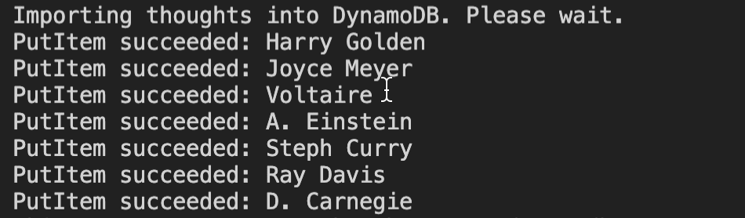
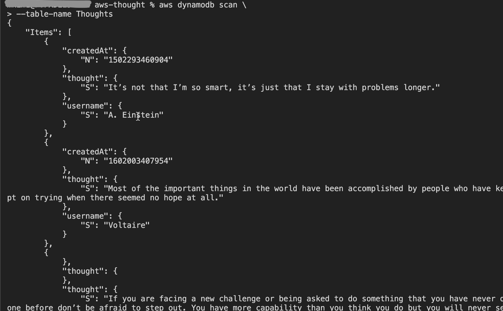
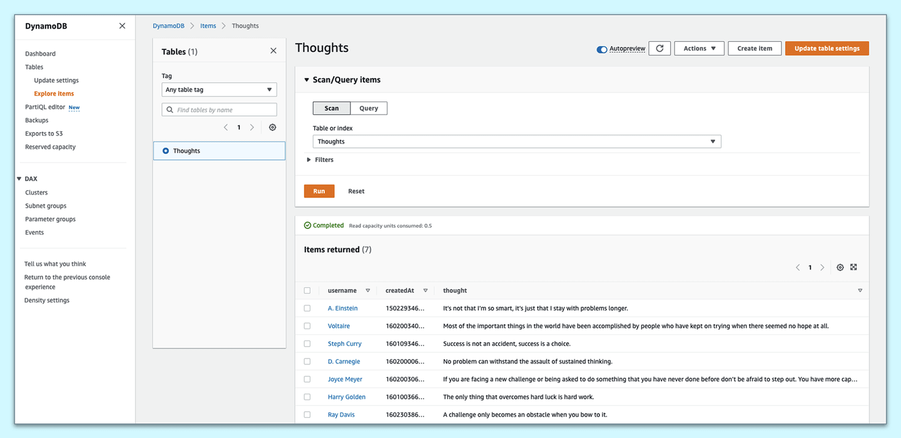

# Deploy Amazon DynamoDB to AWS

In this step, we'll deploy DynamoDB to AWS.

We used a local DynamoDB instance for the development phase of creating the database operations. Now that we've fully integrated DynamoDB into the application, let's use the web service and create a new `Thoughts` table in the cloud.

Now the `dynamodb` service object will point to the web service and not the local instance, because we previously configured the AWS CLI to connect to the S3 web service. Because we already assigned the access key and secret key, the service object can verify account authentication.

From the root directory, execute the following commands:

```console
node ./server/db/CreateThoughtsTable.js && node ./server/db/LoadThoughts.js
```

You should see messages that indicate the success of the `PutItem` operation, as shown in the following image:



`A screenshot depicts messages in the console that state "PutItem succeeded" for multiple users.`

We can also perform a table scan in the AWS CLI to check whether the data is from the old table or the new table, using the following command:

```console
aws dynamodb scan --table-name Thoughts
```

The response in the CLI displays the original data and doesn't contain any of the new thoughts we created previously, as shown in the following image:



`A screenshot depicts a command-line message that displays data without any new thoughts.`

If this is too hard to read, there's another way to verify that you created a table in AWS. Open the browser and log into your AWS account. Select the DynamoDB service under the Services option in the menu bar.

Select the Tables option in the left side menu. Select the `Thoughts` table, then select "Explore table items" next to the Actions menu item. We'll see the data in the `Thoughts` table, as shown in the following image:



`A screenshot depicts the Items tab of the DynamoDB console. A table displays user data along with thoughts that each user posted.`

Based on the preceding image, we can verify that the `Thoughts` table has been seeded successfully in the AWS cloud.

Now go to the browser and refresh the homepage to render the original data, without the new thoughts that we added.

Create a few thoughts of your own to make sure the web service is functioning properly. Visit the table in the DynamoDB console to verify that the database calls are working.

Now that we've finished integrating the routes into the client and deployed the database service to AWS, let's add and commit this work and then close the GitHub issue.

---
© 2022 edX Boot Camps LLC. Confidential and Proprietary. All Rights Reserved.