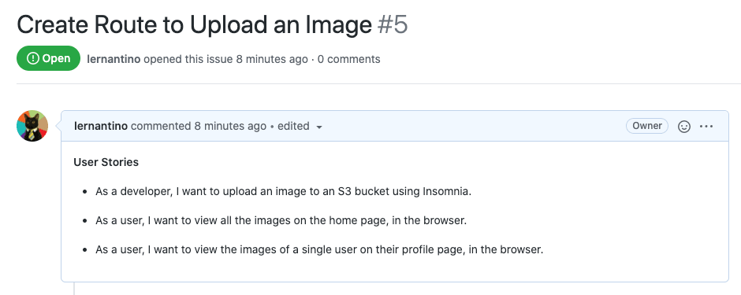
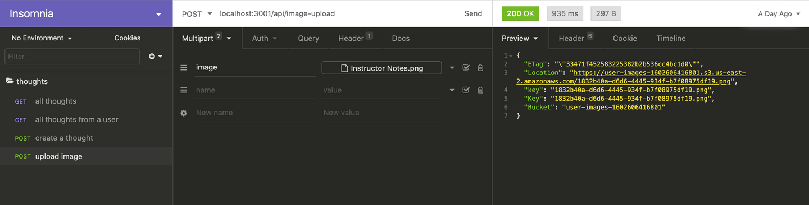

# Set Up the Image Upload Route

In the previous step, we deployed DynamoDB to AWS. In this step, we'll set up the image upload route.

Conceptually, we're starting the work on the new feature that allows users to share images along with their thoughts. So, review the second GitHub issue for this lesson, which the following image shows:



`A screenshot depicts the second GitHub issue for this lesson,`

In the preceding image, notice that GitHub Issue 5 is named "Create Route to Upload an Image." And, it lists the following three user stories:

* As a developer, I want to upload an image to an S2 bucket using Insomnia.

* As a user, I want to view all the images on the home page, in the browser.

* As a user, I want to view the images of a single user on their profile page, in the browser.

So, we'll capture a user image and then programmatically upload it to an S3 bucket. To do this, we'll create an API endpoint that can receive the image and then save it to the cloud.

But why use S3? Didn't we just set up a database in the last lesson? This is because there's a tradeoff for DynamoDB's superior high performance and speed: storage capacity. Allowing large files to be stored would greatly alter DynamoDB's read and write performance. DynamoDB limits each item or **record** at 400 kB—not very much, considering that images with average resolution can be half a megabyte, or 500 kB. High resolution images can easily top 3–4 megabytes each.

We'll use S3 to store the image files and store a reference to the file in DynamoDB. The reason why AWS has so many services is because each is responsible for a specific purpose. Having a high performance single-purpose service allows developers customize solutions to their applications by combining services.

In this case, we'll use the S3 bucket we created previously to store the image assets. The location URL of the image will then be saved in DynamoDB with the `username` and `thought`. This will allow the image to be retrieved with the accompanying thought and the username.

## Set Up the Route Dependencies

Much like we did previously, we'll first create the route that can upload the image to the S3 bucket. Navigate to the project in the IDE and go to the `server/server.js`

Let's create another route path by adding a route reference to the Express object, `app`.

Add the following route reference to the s`erver.js` file, under the current reference to the `userRoutes`:

```js
// app.use(require('./routes'));
app.use('/api/', userRoutes);
app.use('/api/', imageRoutes); // add this route for image upload
```

**Note**

> This addition will cause the server running on the back end to fail temporarily until we fix the error by adding the `imageRoutes` function, which we'll do in the following steps.

Next we'll need to include the preceding route file at the top of the `server.js` file, as follows:

```js
const userRoutes = require('./routes/user-routes');
const imageRoutes = require('./routes/image-upload'); // add this file import to the top of the file
```

Now let's create the route file, `image-upload.js`, in the `routes` folder.

To begin we'll need to create a route, process the image file, and upload to the S3 bucket. We'll include `express`, `multer`, and `aws-sdk` at the top of the `image-upload.js` file, as follows:

```js
const express = require('express');
const router = express.Router();
const multer = require('multer');
const AWS = require('aws-sdk');
```

We'll use the package `multer` to provide the middleware for handling `multipart/form-data`, primarily used for uploading files. The `multer` package will add a `file` property on the `req` object that contains the image file uploaded by the form, as we shall soon see.

To install `multer` from the terminal, navigate to the `server` folder and run the following command:

```console
npm install multer
```

**Deep Dive**

To learn more, review the [npm documentation on multer](https://www.npmjs.com/package/multer).

With `multer` we'll create a temporary storage container that will hold the image files until it is ready to be uploaded to the S3 bucket. Under the imported constants that we just created, add the following statement:

```js
const storage = multer.memoryStorage({
  destination: function (req, file, callback) {
    callback(null, '');
  },
});
```

Next we'll declare the upload `object`, which contains the storage destination and the key, `image`, using the following expression:

```js
// image is the key!
const upload = multer({ storage }).single('image');
```

We'll use the preceding function, `upload`, to store the image data from the form data received by the `POST` route. We'll use the `single` method to define that this upload function will receive only one image. We'll also define the `key` of the `image` object as image.

Next, we'll instantiate the service object, `s3`, to communicate with the S3 web service, which will allow us to upload the image to the S3 bucket. As a best practice, we normally keep the object declaration near the top of the file, with the other object declarations. See the following code for an example:

```js
const s3 = new AWS.S3({
  apiVersion: '2006-03-01',
});
```

We locked the version number as a precautionary measure in case the default S3 version changes. This way the code we write has a lower chance of breaking due to default version changes to the API.

## Create the Image Upload Route

With all the necessary dependencies set up now, create the route in the following statement:

```js
router.post('/image-upload', upload, (req, res) => {
  // set up params config
  // set up S3 service call
});
```

Note that the preceding endpoint will be located at `localhost:3000/api/image-upload`. We'll use a POST method to securely transfer the request body. We include the `upload` function as the second argument to define the key and storage destination. In the route's function block we need to configure `params`, so that the S3 will know the bucket name as well as the image's file name.

**Pause**

> How does S3 get the access keys to provide web service permission?

> Answer

> The `aws-sdk` package retrieves this information from the local folder, `~/.aws/credentials`, where we stored the access id key and private key information with the AWS CLI.

We'll need to do two things to complete this endpoint. We need to configure the `params` object, then make the web service call to S3 to upload the image.

Let's create a function that will return the `params` object in a separate file. This way we can keep the route uncluttered and more legible. We'll create this function in a file called `params-config.js`, which will be located in the `utils` folder in the `server` directory. So from the root directory, the relative path for the file will look like this: `./server/utils/params-config.js`.

Let's create the `utils` folder, then create the `params-config.js` file nested in that folder and open the file in the IDE.

This file has a singular purpose: to return a configured `params` object. We'll use a package called `uuid` that will generate a unique 36-character alphanumeric string, which we'll use as the image file names.

**Important**

> If a file name was duplicated, the original file would be overwritten by the new content.

Add the following expression to the top of the `params-config.js` file:

```js
const { v4: uuidv4 } = require('uuid');
```

Note how we specify version 4 in the preceding statement.

In order to use this package, navigate to the `server` in the terminal and execute the command `npm install uuid`.

**Deep Dive**

To learn more, look at the [npm documentation on uuid](https://www.npmjs.com/package/uuid).

Next we'll declare the `params` function, replacing the `<My_Bucket_Name>` with your own bucket name, that will configure the file as shown in the following statement:

```js
const params = (fileName) => {
  const myFile = fileName.originalname.split('.');
  const fileType = myFile[myFile.length - 1];

  const imageParams = {
    // Replace the <My_Bucket_Name> with the name of your own S3 bucket
    Bucket: '<My_Bucket_Name>',
    Key: `${uuidv4()}.${fileType}`,
    Body: fileName.buffer,
  };

  return imageParams;
};
```

In the preceding function expression, the `params` function receives a parameter called `fileName`, which this function will receive as an argument from the Express route.

Once we store the reference to the `fileType`, we'll declare `imageParams`.

We must define three properties of `imageParams`: the `Bucket`, `Key`, and `Body` properties to connect to S3.

We'll assign the `Bucket` with the name of the S3 bucket we created previously by replacing the `<My_Bucket_Name>` placeholder with the actual name of the S3 Bucket you created earlier in this lesson.

Next, assign the `Key` property, which is the name of this file. Use `uuidv4()` to ensure a unique file name. We'll also add the file extension from `fileType`. Then, assign the `buffer` property of the image to the `Body` property. This is the temporary storage container of the image file. `multer` removes this temporary storage space once this buffer has been used.

**Pause**

> How will we find the images if we assign them random string values as names?

> Answer

> Reference to the images will be stored in DynamoDB with a reference to their URL.

All that's left is to add the `module.exports` expression to expose the `imageParams`. Add the following statement at the bottom of the `params-config.js` file:

```js
module.exports = params;
```

Now that this function has been completed, let's navigate back to the `image-upload.js` file that contains the image upload route. We've finished the first part of the route, so let's ensure that the file we just created is available. Add the following import statement near the top of `image-upload.js`:

```js
const paramsConfig = require('../utils/params-config');
```

Now that the config object is imported, let's use it to make the web service call to upload the image to the S3 bucket. Go to the function block of the image upload route and declare a new constant named `params`, as follows:

```js
router.post('/image-upload', upload, (req, res) => {
  const params = paramsConfig(req.file);
  // set up S3 service call
});
```

In the preceding expression, we retrieved the image file object, `req.file,` from the route using `multer`. We assigned the returned object from the `paramsConfig` function to the `params` object.

Next, use the `s3` service interface object we instantiated previously with the `aws-sdk` package to call the `upload()` method—as shown in the following S3 service call:

```js
s3.upload(params, (err, data) => {
  if (err) {
    console.log(err);
    res.status(500).send(err);
  }
  res.json(data);
});
```

Similar to the pattern we used previously for the DynamoDB calls, we'll use the callback function to catch any internal errors with the web service and log error and success messages accordingly. In the last statement of this route, we send the `data` retrieved from S3 back to the client. The `data` will contain the image file's metadata, including the URL, bucket name, file name, and more. Now that the route is complete, it should look like the following statement:

```js
router.post('/image-upload', upload, (req, res) => {
  console.log("post('/api/image-upload'", req.file);
  const params = paramsConfig(req.file);
  s3.upload(params, (err, data) => {
    if (err) {
      console.log(err);
      res.status(500).send(err);
    }
    res.json(data);
  });
});

module.exports = router;
```

In the preceding statement, we configured the `params` object, then uploaded the image to S3. At the bottom of the file, include the `module.exports` statement so that this can be exposed. Let's test this route in Insomnia to see if it works.

Open Insomnia and create a POST route named `image upload` in the `thoughts` folder. Select the POST method in the address bar and use the following URL: `localhost:3001/api/image-upload`.

Now to test the route, we need to simulate the file upload process of the user, so a file is inserted into the form data. We can do this in Insomnia by changing the Body option in the menu bar. Select Multipart Form. In the name field, we must include the name of the key, `image`, that we designated previously when we configured the `upload` function. See the following code for an example:

```js
// image is the key!
const upload = multer({ storage }).single('image');
```

Use `image` as name of the file object. In the next field, select File from the drop-down. Then choose an image from your computer to upload to the S3 bucket. You should see something like the following image:



`A screenshot depicts testing the POST route for uploading images in Insomnia. The Preview tab shows the returned image data.`

As we can see in the preceding image from Insomnia, the request was successful and the image was uploaded to the S3 bucket. The data response from S3 includes the bucket name and the URL of the image, which is assigned to the `Location` key. This is the value we'll store in the DynamoDB as a reference to this image.

Not only can S3 store images in the cloud, but it also offers a URL that enables access to the image. This is an incredibly useful feature, making the image widely available and accessible once it is stored in the cloud. We'll soon see how we can incorporate this URL into the application to render the images.

Now that the image upload endpoint is functional, let's move on to the front end of the application, to incorporate the image into the UI.

---
© 2022 edX Boot Camps LLC. Confidential and Proprietary. All Rights Reserved.