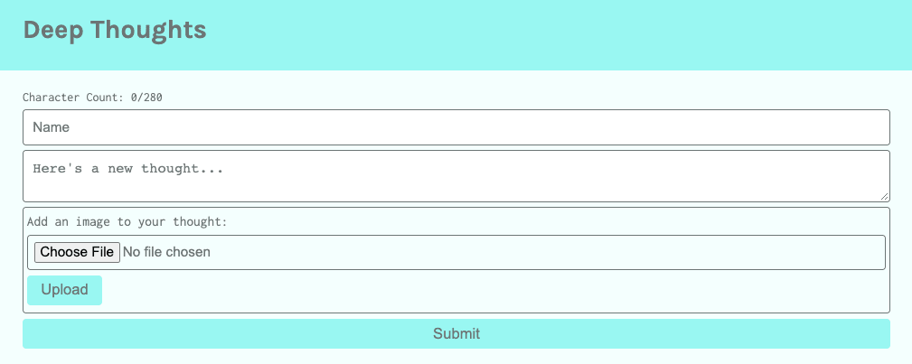
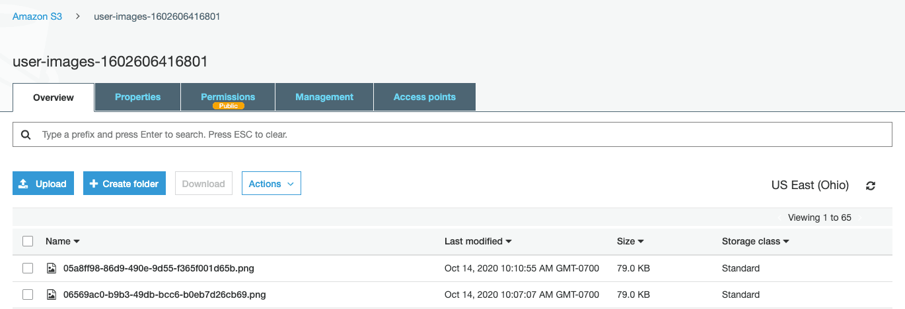

# Integrate the Image Upload Feature into the UI

In the previous step, we set up the image upload route. In this step, we'll integrate the image upload feature into the UI.

More specifically, we'll extend the UI in the following way: First, we'll allow a user to add an image to their thought. Second, we'll then render the image on both the homepage and the user's profile page.

## Add the Image Upload Option for the Users

To begin, we'll add the image upload input element in the `ThoughtForm`. This will allow users to add an image to each thought.

In the return statement of the `ThoughtForm` component, add the following HTML elements to the current `<form>` element:

```js
<label className="form-input col-12  p-1">
  Add an image to your thought:
  <input type="file" ref="{fileInput}" className="form-input p-2" />
  <button className="btn" onClick="{handleImageUpload}" type="submit">
    Upload
  </button>
</label>
```

We'll add the preceding elements after the `<textarea>` element, but before the `<button type="submit">` element within the `<form>` of the `ThoughtForm` component. Notice in the preceding statement that we've added the `<input>` and `<button>` wrapped in the `<label>`. A few key highlights of the preceding code include the following:

* The `<input>` type is `file`. With this designation, HTML can browse and add files from your computer.

* The `ref` attribute is assigned to the `fileInput`. We'll define this function using a React Hook name, `useRef`.

* We'll also need to define the `handleImageUpload` function. This function will send the image to the image upload endpoint we created.

With the `<input>` element in place, let's build the logic that will make this functionality work.

At the top of the `ThoughtForm`, we need to import the React Hook `useRef`. There is already a React import at the top of the file for `useState`. Replace that existing import statement with this single import statement that will combine the import for `useState` and `useRef` in one import statement:

```js
import React, { useState, useRef } from 'react';
```

The `useRef` Hook is useful, especially if there's a need to reference the DOM. We'll use the `useRef` Hook to retrieve the image file uploaded by the user, by accessing the `<input type="file">` element.

**Deep Dive**

To learn more, refer to the [React documentation on useRef](https://reactjs.org/docs/hooks-reference.html#useref).

Beneath the `useState` constant declarations in the `ThoughtForm` component, we'll declare another constant called `fileInput`, as shown in the following expression:

```js
const fileInput = useRef(null);
```

In the preceding statement, we set the initial value of `fileInput`—the reference to the DOM element, `<input type="file">`—to null. This ensures that the reference to the DOM element is current.

## Declare the Function and the Interface Object

In the next step, we declare the `handleImageLoad` function. We assigned this function to invoke when the user selects the `Upload` button for the `<input type="file">` element. We want this function to retrieve the image file uploaded by the user and send this data in a request to the image upload endpoint that we created previously.

Declare the `handleImageLoad` function, as shown in the following expression:

```js
const handleImageUpload = (event) => {
  event.preventDefault();
  const data = new FormData();
  data.append('image', fileInput.current.files[0]);
  // send image file to endpoint with the postImage function
  // ...
};
```

In the preceding expression, we've configured some of the parameters that are necessary to send the image file to the image upload endpoint. Note that without the `event.preventDefault()` statement, the thought will save before the image file is uploaded.

**Important**

> Because the image upload process to S3 is an asynchronous request that will take some time, it's possible to submit the form before the response from the image upload process is returned. This will submit a null as the value of the image URL. To prevent this, we can add a progress bar or disable the form submit button while the image is processing. However, because this is beyond the scope of this lesson, we will not attempt to add this feature.

Next, declare an interface object from `FormData`, called `data`. `FormData` makes it easy to construct a set of key-value pairs, mirroring the format of a form with the type set to `"multipart/form-data"`.


**Deep Dive**

For more information, refer to the [MDN Web Docs on FormData](https://developer.mozilla.org/en-US/docs/Web/API/FormData).

## Assign a Key-Value Pair

In the next statement, we assign a key-value pair to the `FormData` object with the name of the image file (`image`) and the payload (the image file). We assign the reference to the image file with `fileInput.current.files[0]`. If multiple files were uploaded at once, the `files` array would be sent.

The `postImage` function sends the configured `FormData` object, `data`, to the upload image endpoint. We'll declare the following function in the `handleImageLoad` function block, as indicated by the comment, `// send image file to endpoint with the postImage function`:

```js
const postImage = async () => {
  try {
    const res = await fetch('/api/image-upload', {
      mode: 'cors',
      method: 'POST',
      body: data,
    });
    if (!res.ok) throw new Error(res.statusText);
    const postResponse = await res.json();
    setFormState({ ...formState, image: postResponse.Location });

    return postResponse.Location;
  } catch (error) {
    console.log(error);
  }
};
postImage();
```

We used `async` and `await` to handle the Promises in the `fetch` request to the image upload endpoint, `/api/image-upload`. Notice that we used a POST method to send the image file as `data` in the body of the fetch request.

Once we receive a response from the image upload endpoint, we convert the response into a JSON object, so that we can add this new key-value to `formState`. This new key-value pair is `{ image: postResponse.Location }`, which is the public URL of the image. It was a good idea to place this request in a `try...catch` block to track any unsuccessful S3 calls.

Once the two sections are combined, `handleImageLoad` should look like the following function:

```js
const handleImageUpload = (event) => {
  event.preventDefault();
  const data = new FormData();
  data.append('image', fileInput.current.files[0]);

  const postImage = async () => {
    try {
      const res = await fetch('/api/image-upload', {
        mode: 'cors',
        method: 'POST',
        body: data,
      });
      if (!res.ok) throw new Error(res.statusText);
      const postResponse = await res.json();
      setFormState({ ...formState, image: postResponse.Location });
      console.log('postImage: ', postResponse.Location);
      return postResponse.Location;
    } catch (error) {
      console.log(error);
    }
  };
  postImage();
};
```

Let's check whether this functionality is working properly. The predicted behavior is to upload an image to the S3 bucket once the Upload button has been selected. Keep the console window open in the browser to see the response message.

Double-check that both servers at ports 3000 and 3001 are running properly without errors. Then go to the homepage of the application and upload a local image file. The browser with the new `<input>` element should look like the following image:



`A screenshot depicts the form for submitting thoughts. It now includes the option to choose a file to upload.`

In the preceding image, we used the Upload button to load the image file to S3. In a previous lesson, we set a click event on the Submit button, to handle the database call to create the thought in the table.

Great work! Examine the S3 console in AWS to verify that the image was uploaded correctly, as shown in the following image:



`A screenshot depicts the S3 console, which shows that the uploaded image file has been added to the S3 bucket.`

We can select a file from the S3 bucket and download it to verify that the image is the same one that was uploaded.

We've now successfully completed the GitHub issue and uploaded an image as a user to the S3 bucket. We can close this issue and then add, commit, push, and merge the feature branch, `feature/integrate-api`, into `develop`.

Now that we've finished the uploading feature for image files, we need to modify the endpoints to accept the image attribute in the database calls. Then we must receive the new image attribute and render the image to the `ThoughtsList`.

---
© 2022 edX Boot Camps LLC. Confidential and Proprietary. All Rights Reserved.