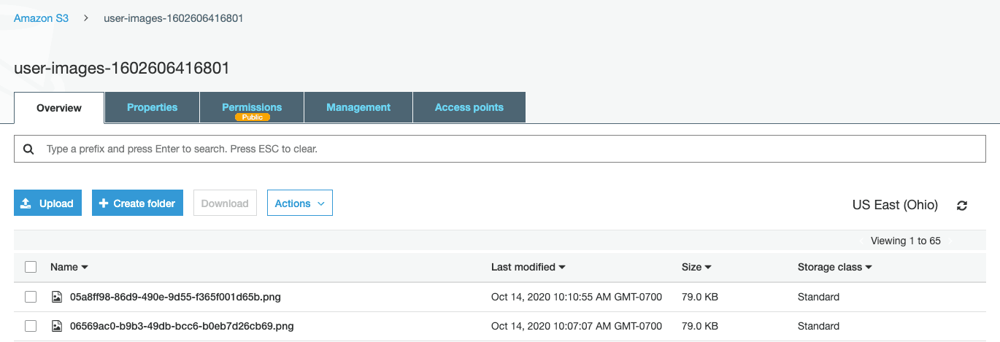

# Introduction

Nice work completing the first part of the image feature—which allows users to add images to the Deep Thoughts application! Users can now share funny memes and compelling pictures along with their thoughts.

We already completed the image upload route. We then modified the `ThoughtForm` component so that a user could choose an image file to upload to the S3 bucket. And, recall that when an image file successfully uploads to the S3 bucket, it displays in the S3 console, as the following image shows:

`A screenshot depicts the S3 console displaying the names and details of the image files that were uploaded to the S3 bucket.`

In this lesson, we'll complete the integration of the image feature so that users can display the images. We'll then deploy the app to the cloud. To do so, we'll deploy the app in an Amazon EC2 instance to host the app in AWS. This will make the Deep Thoughts application publicly available.

The following image shows the GitHub issue that we'll work on in this lesson:

`A screenshot depicts the GitHub issue for this lesson.`

In the preceding image, notice that GitHub Issue 5 is named "Create Route to Upload an Image." And, it lists the following three user stories:

* As a developer, I want to upload an image to an S3 bucket using Insomnia.

* As a user, I want to view all the images on the home page, in the browser.

* As a user, I want to view the images of a single user on their profile page, in the browser.

We already accomplished the first user story. And, we'll finish the last two user stories at the beginning of this lesson. We'll deploy the application to an EC2 instance.

In this lesson, we'll modify the database queries to include the image attribute, modify the UI components to render images, launch an EC2 instance, set up the EC2 environment, clone the application to the EC2 instance, and deploy the web application to AWS.

---
© 2022 edX Boot Camps LLC. Confidential and Proprietary. All Rights Reserved.