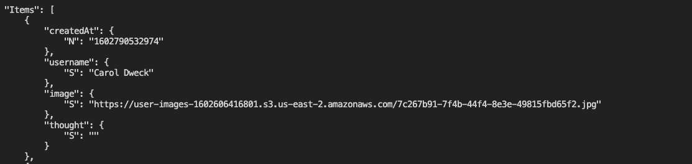

# Display the Images

Now that we've successfully integrated the image upload route into the front end, we'll render the images from the S3 bucket. We had to store the images in an S3 bucket because the DynamoDB table has restrictions on storage capacity. Now that the image is stored in the S3 bucket, how do we associate the image to the `Thoughts` table? Based on the following response message in Insomnia, there is information about the image and the S3 bucket:

`A screenshot depicts testing the POST route for uploading images in Insomnia. The Preview tab shows the returned image data.`

As shown in the preceding image, the response object contains a property that we need to render the image.

**Pause**

> Which property in the preceding database response will help us render this image?

> Answer

> The `Location` property has the URL address that we can assign to the `src` attribute in an `` element.

In the last lesson, we added the image and image location to `formState` in the `handleImageUpload` function in the `ThoughtForm` component. Once the Submit button is selected, the `handleFormSubmit` function will send the form data to the API endpoint for the create thought operation.

In this section, we'll modify the `/api/users` POST route so that the image attribute will be added to the item when created in DynamoDB. Open the `user-routes.js` file in the `server` of the Deep Thoughts application.

Go to the POST route and add the `image` attribute to the `params` object, as shown in the following expression:

```js
// Create new user
router.post('/users', (req, res) => {
  const params = {
    TableName: table,
    Item: {
      username: req.body.username,
      createdAt: Date.now(),
      thought: req.body.thought,
      image: req.body.image  // add new image attribute
    }
  };
  // ... database call
```

**Rewind**

> Note that because we're dealing with a NoSQL database, we don't have to adjust the table schema or perform a migration like we would for a relational database.

With this modification, the DynamoDB table will store the image URL in the `Thoughts` table with the `username` and `thought` text.

Let's confirm that the image URL is correctly stored by querying the `Thoughts` table with the scan operation in the command line. Navigate to the `server` directory and run the following command to run the scan:

```console
aws dynamodb scan --table-name Thoughts
```

The subsequent response from the web service will appear in the command line:



`A screenshot depicts that the scan operation of the Thoughts table reveals the URL of the image file from S3.`

The preceding image shows that the image attribute holds the URL of the image which we can use to render the image.

In the following step, let's check the rest of the GET routes to ensure that the responses are returning the `image` attribute correctly. Because the route to get all thoughts uses the scan operation, all the items in the `Thoughts` table will be returned as the response. However in the route to get thoughts from a user, or the `/api/users/:username` route, we see that the `ProjectionExpression` property in the `params` object doesn't have the `image` attribute.

**Rewind**

> The `ProjectionExpression` property is like the `SELECT` statement in SQL, which identifies which attributes or columns to return in the database query.

Let's add the `image` attribute to the `ExpressionAttributeNames` property to add the `#img` alias. Then we can add the `image` attribute to the `ProjectionExpression` property, as shown in the following modification to the `params` object:

```js
// get thoughts from a user
router.get('/users/:username', (req, res) => {
  console.log(`Querying for thought(s) from ${req.params.username}.`);
  const params = {
    TableName: table,
    KeyConditionExpression: "#un = :user",
    ExpressionAttributeNames: {
      "#un": "username",
      "#ca": "createdAt",
      "#th": "thought",
      "#img": "image"    // add the image attribute alias
    },
    ExpressionAttributeValues: {
      ":user": req.params.username
    },
    ProjectionExpression: "#un, #th, #ca, #img", // add the image to the database response
    ScanIndexForward: false  // false makes the order descending(true is default)
  };
  // database call ..
```

Now that we've modified the database calls, we need to adjust the UI components to render the images, which will take place in the `ThoughtList` component.

Open this component so that we can add the `` element that will render the image.

---
© 2022 edX Boot Camps LLC. Confidential and Proprietary. All Rights Reserved.