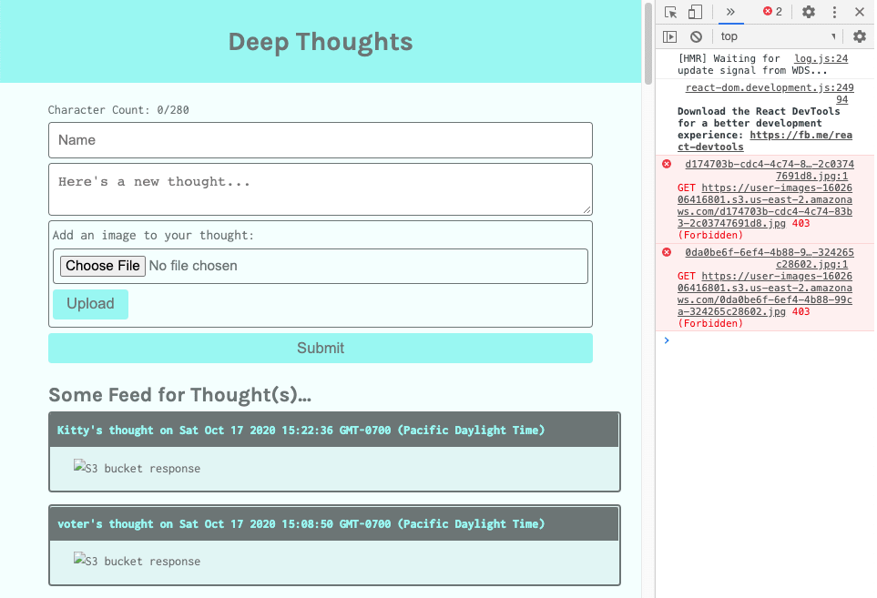
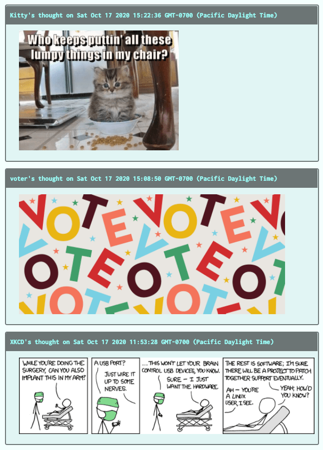

# Modify the UI Components to Render the Images

In the previous step, we displayed the images. In this step, we'll modify the UI components to render the images.

Now let's integrate the image feature into the homepage. Look at the `Home` component, where the query to get all the users' thoughts originated.

Once the database response is received, it's assigned to the `thoughts` state and then passed down to the `ThoughtList` component as a prop.

Open the `ThoughtList` component in the IDE. This is the component that renders the user's thoughts, so it is here that we'll render the user's images as well. In the return statement of the component in the `<div>` element, following the `<p>` element, add the following JSX expression to add the user's image:

```js
<div key={thought.createdAt} className="card mb-3">
  <p className="card-header">
    <Link
      to={`/profile/${thought.username}`}
      style={{ fontWeight: 700 }}
      className="text-light"
    >
      {thought.username}'s thought on{' '}
      {new Date(parseInt(thought.createdAt)).toString()}
    </Link>{' '}
  </p>

  {/* add thought text */}
  {thought.thought && <p className="px-2 mt-2">{thought.thought}</p>}
  {/* add thought image */}
  {thought.image && (
    <p className="px-2">
      
    </p>
  )}
</div>
```

Notice that we used a conditional render expression, to only show the thought or image if a user added them.

Let's make sure the application is running so that we can check in the browser to see if the images we added are showing. We should see something like the following image:



`A screenshot depicts an error message in the console that denies access to images.`

Up until now we've had access to the S3 bucket through the access keys located in `.aws/credentials` locally stored on the computer. These credentials were accessed by the `aws-sdk` package and provided authentication to the S3 and DynamoDB services. The access keys recognized us as the S3 bucket owner, which grants us access privileges to write, list, and read items in the S3 bucket.

## Grant Access Permissions

To access the images in the bucket from a public URL, we'll need to grant access privileges to the S3 bucket. AWS can grant privileges in a few different ways in an S3 bucket. We can grant access to each file in the bucket or grant access to the bucket, for all the files or objects stored in the bucket.

To do this programmatically, we can assign an **ACL** (or **access-control list**) permission on each image file. Let's add this permission property to the `imageParams` object, which we configured in the `params-config.js` file in the `server/utils` folder. Open this file in the IDE and make the following adjustment:

```js
const imageParams = {
  Bucket: config.bucket,
  Key: `${uuidv4()}.${fileType}`,
  Body: fileName.buffer,
  ACL: 'public-read', // allow read access to this file
};
```

In this example, we add the `ACL` property to the `imageParams` object to grant read access to this object.

Next, we also need to change the permissions in the bucket in the S3 console. This type of permission can be granted programmatically as well, when the bucket is first created.

**Deep Dive**

To learn more, see the [AWS documentation on access control lists](https://docs.aws.amazon.com/AmazonS3/latest/dev/acl-overview.html#CannedACL).

To enable anyone with the URL address to view the images files, we must allow public read access. First navigate in the browser to the S3 console, then select the bucket name.

Select the Permissions tab, then scroll down to Bucket Policy. Select Edit.

We'll add a bucket policy that will grant read access for anonymous users so that anyone can see the images in their browsers.

Enter the following JSON code with your own `user-images` Amazon Resource Names (ARNs) into the text editor and select Save. You can find your ARN under the Properties tab within your bucket.

```json
{
  "Version": "2012-10-17",
  "Statement": [
    {
      "Sid": "PublicReadGetObject",
      "Effect": "Allow",
      "Principal": "*",
      "Action": "s3:GetObject",
      "Resource": [
        // Replace <arn:aws:s3:::user-images-16026064168/*> and <arn:aws:s3:::user-images-16026064168> with your own ARNs. Do not include the angled brackets. You will be posting the same ARN twice here but one will have a `/*` after it.
        "<arn:aws:s3:::user-images-16026064168/*>",
        "<arn:aws:s3:::user-images-16026064168>"
      ]
    }
  ]
}
```

Make sure to add `/*` to the end of one of the ARNs. To understand most security policies, you should consider who gets access and what type of access will they receive. In the preceding bucket policy the "who" is the `Principal`, which is set to everyone. The type of `Action` or what this policy allows, is `GetObject`, which also means the read object, which is the image file in this case. In the `Resource` property, you designate the S3 bucket name and all its contents.

**Important**

> As a general rule, it's also best to grant the least amount of permission possible to constrain accessibility. This will increase security and decrease vulnerabilities of your applications.

Due to the change in permission, we can see the Public flag under Permissions and Bucket Policy.

Now let's go back to the application in the browser to see if we can view any of the images in the application. If the bucket policy was granted successfully, we should be able to see something like the following image in the browser:



`A screenshot depicts the Deep Thoughts application in the browser with rendered user images.`

Nice work! As shown in the preceding image, the application can now retrieve the URL from the DynamoDB table and render the results in the browser. Let's also check the profile page to confirm that the application is functioning properly. Because we modified the route previously, the profile page is also working correctly.

Now that we've verified that the images are persisting in the S3 bucket and rendering to the browser, we've fulfilled the requirements for the GitHub issue. Close this issue and add, commit, push, and merge the work into the `develop` branch. Because we're finished with this feature's development, merge the work into the `main` branch for deployment.

Now all that's left is to deploy the application to AWS to allow public access to the application.

---
© 2022 edX Boot Camps LLC. Confidential and Proprietary. All Rights Reserved.