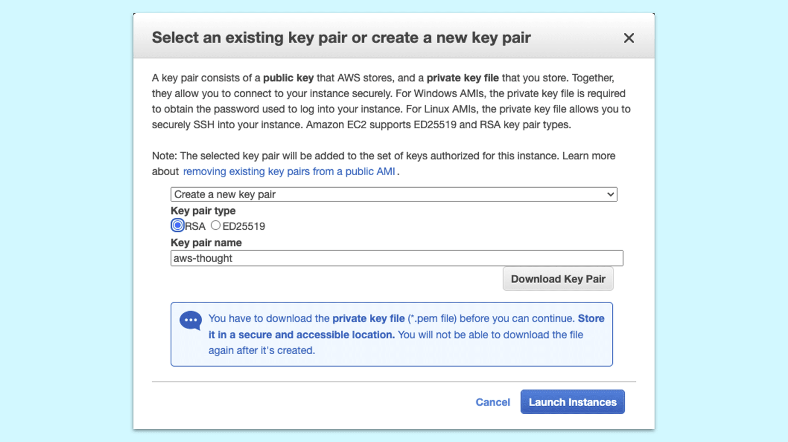
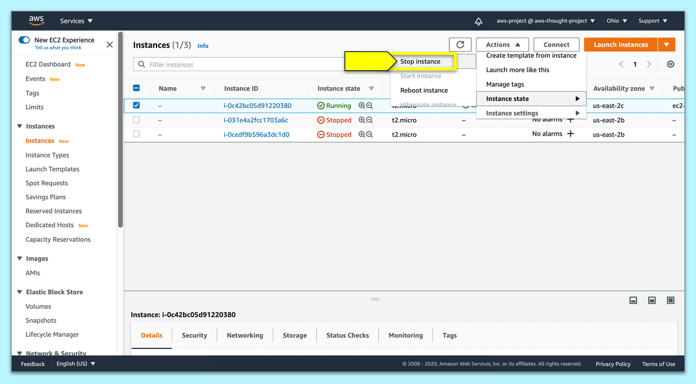

# Create an Amazon EC2 Instance

In the previous step, we learned about AWS VMs. In this step, we'll create an EC2 instance.

To create our EC2 instance, navigate to the [EC2 console](https://console.aws.amazon.com/ec2) and select "Launch instance".

**Important**

> The AWS Management Console UI changes frequently. Some of these steps may be slightly different from what you see on the screen. In future modules, we use the AWS CLI, which allows us to avoid navigating an interface that might change every time you begin a new project. This module serves as an introduction to AWS, so it's important to begin working in the console. Note that some of these instructions may have some slight variations from what you see in the console.

## Choose an Amazon Machine Image (AMI)

An Amazon Machine Image (AMI) is a preconfigured template of software. This step is to select the operating system and application server so that the EC2 instance has the correct software configuration needed by your application.

From the list of available AMIs, select the "Ubuntu Server 20.04 LTS (HVM), SSD Volume Type, 64-bit (x86)", which is on the free tier. If this is not available, you can choose a different AMI on the free tier.

**Deep Dive**

Scrolling down the list of options will reveal many different types of AMI for many operating systems and application servers. There are even a few preconfigured application templates used for computation for machine learning. In short, we're renting a VM or a computer in an AWS data center that's capable of handling heavy computational processes.

For more information, read the [AWS Docs on Amazon Machine Images](https://docs.aws.amazon.com/AWSEC2/latest/UserGuide/AMIs.html).

## Choose an Instance Type

EC2 provides a wide selection of instance types optimized to fit different use cases. An instance type will have different configurations of CPU, memory, storage, and networking capacity.

Select `t2.micro` from the list of instance types—it's free-tier eligible and capable of fulfilling the requirements of the Deep Thoughts application. Select "Next: Configure Instance Details" to continue.

## Configure the Instance Details

In this step, we will configure our instance to use a new IAM role with a new set of permissions. We don't want to use our current IAM role since it has admin privileges. Ideally, limiting the IAM permissions on an EC2 instance is preferred to limit vulnerability to the AWS account.

**Deep Dive**

Because we're placing IAM user credentials in the cloud, we should make sure that this user has the smallest possible amount of permissions. To learn more, see the [AWS documentation on IAM users](https://docs.aws.amazon.com/IAM/latest/UserGuide/id_users.html).

Select "Create new IAM role" next to the "IAM role" dropdown menu to be taken to the IAM console in another browser tab. Select "Create role" and follow these steps:

1. Select "AWS service" as the type of trusted entity.

2. Under "Choose a use case", select EC2.

3. Select "Next: Permissions".

4. Select "Create policy"; it will open a new browser tab.

5. Select the JSON tab and replace its content with the following policy:

```js
{
  "Version": "2012-10-17",
  "Statement": [
    {
      "Sid": "DescribeQueryScanBooksTable",
      "Effect": "Allow",
      "Action": "dynamodb:*",
      "Resource": "*"
    },
    {
      "Effect": "Allow",
      "Action": "s3:*",
      "Resource": "*"
    }
  ]
}
```

    * With this policy, we'll be able to access S3 and DynamoDB from the EC2 instance.

6. Select "Next: Tags".

7. We will not add any tags, so select "Next: Review".

8. Enter `S3-DynamoDB` as the name of this policy so that we can remember which services this policy is giving access to.

9. Select "Create policy". We should see confirmation that the `S3-DynamoDB` policy has been created. We can close this browser tab.

10. Back in the "Create role" page, refresh the list of policies to view our `S3-DynamoDB` policy. Select our policy and then the "Next: Tags" button.

11. We will not add any tags, so select "Next: Review".

12. Enter `S3-DynamoDB` as the Role name and select "Create role". We should see our new `S3-DynamoDB` IAM role listed in the list of IAM roles. We can close this browser tab.

13. Back in the "Configure Instance Details" page, refresh the IAM roles dropdown menu and select `S3-DynamoDB` as our IAM role.

**Rewind**

> IAM roles assign permissions to a service or entity. For example, we'll assign the EC2 instance access to S3 and DynamoDB with an IAM role. An IAM user assigns permission to a person to access AWS services or maintain the amount of access to a service.

Select "Next: Add Storage" to continue to the next step.

## Add Storage

Here we can expand the application's storage needs if applicable. We can attach an Amazon EBS as a primary storage device for data that requires frequent updates. This is often used for storage when running a database on an instance.

We'll accept the default configuration and select "Next: Add Tags" because the default storage capacity is sufficient for this application's storage needs.

**Deep Dive**

To learn more, review the [AWS documentation on EC2 storage](https://docs.aws.amazon.com/AWSEC2/latest/UserGuide/Storage.html).

## Add Tags

This step allows you to add more information to your EC2 instance for instance organization purposes. Because we only have one instance we'll skip this step. Select "Next: Configure Security Group".

## Configure a Security Group

A **security group** is a set of firewall rules that control the traffic on your EC2 instance. On this page, you can add rules to allow specific traffic to reach your instance with inbound rules as well as manage the outbound traffic.

Select "Create a new security group" and follow these steps:

1. Keep the Security group name as `launch-wizard-1` and leave the Description with the default value.

2. Keep the default SSH values.

3. Select "Add Rule" to create a new rule.

4. Select "HTTPS" from the dropdown menu for Type.

5. Keep the default values for "Port Range" and "Source".

    * `0.0.0.0/0, ::/0` allows any IP address to connect to the EC2 instance using HTTPS.

6. Select "Add Rule" to create another rule.

7. Select "HTTP" this time and keep the default values for "Port Range" and "Source".

That's it! Select "Review and Launch" to review the details of our instance.

## Review and Launch the Instance

Review the AMI details, Instance Type, and Security Group. We can change the Security Group, Tags, and Instance Details, but the AMI template can't be changed.

Select "Launch" to start the EC2 instance and provision the server.

We're directed to either select an existing key pair or create a new key pair. We can use this key for multiple EC2 instances. For now, choose "Create a new key pair" from the first dropdown menu, select RSA under Key pair type, and name the key pair `aws-thought`, as shown in the following image:



`A screenshot depicts a dialog box with "Create a new key pair" selected and the key pair name of aws-thought entered.`

Once downloaded, save this file in the `~/.ssh/` folder. If this folder doesn't exist, we can create the `.ssh` folder at `~/` by running the following command:

```console
mkdir ~/.ssh
```

This is how we'll receive authentication for the EC2 instance when we try to connect to the instance with `ssh`.

Select "Launch Instances" to see a launch status message in the browser. AWS will need a few minutes to generate the AMI, then provision the EC2 instance. If more EC2 instances are needed to scale up, this configuration can be copied as an AMI image that can be replicated quickly on up to 20 different instances at once.

**Important**

> If the instance is running, then AWS is counting this time towards the free time given in the free tier. Even though the EC2 instance is currently idle and not actively processing anything, because this VM is provisioned, the rental time begins when the state of the instance is running.

> To turn the instance state off, select the checkbox for the instance and select the Actions button. This will display a dropdown menu of options, including the instance state. By choosing that option, we can stop the instance, as shown in the following image:



`A screenshot depicts selecting "Instance state" on the Actions drop-down menu and then selecting "Stop instance."`

> As we can see in the preceding image, we can have several EC2 instances in different states, but remember, only a running instance will accrue time against the free tier time allotment. As a general rule, if only one instance is running at any given time, then the free tier will not be exceeded.

---
© 2022 edX Boot Camps LLC. Confidential and Proprietary. All Rights Reserved.