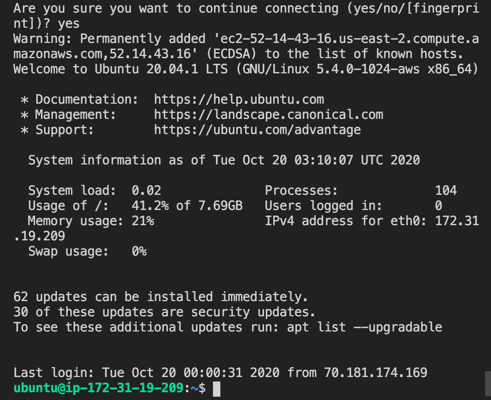

# Set Up the Amazon EC2 Environment

In the previous step, we created an EC2 instance. In this step, we'll set up the EC2 environment. By setting up the EC2 environment, we'll enable the Deep Thoughts application to run on the EC2 instance.

To do this, we must first connect to the EC2 instance from the command line. In the security group configuration, we left a default setting for inbound traffic to allow an SSH IP connection on port 22.

In the command line, navigate to the `.ssh` folder. Then in our browser, navigate to the [EC2 console](https://console.aws.amazon.com/ec2) and select Instances to see which EC2 instances are running or stopped.

Now select the Instance ID to expand the details of the EC2 instance we just launched. We see a summary of our EC2 instance that includes information like the instance ID, instance type, VPC ID, and Public IPv4 address. We also see tabs below the instance summary that includes details on security, networking, storage, status checks, monitoring, and tags.

Let's make sure that the instance is still running and select the Connect button. Select the "SSH client" tab to view the details of the SSH client. We'll use the SSH client to connect to the EC2 instance from the command line.

Following the directions on this page, run the following commands in the `~/.ssh` directory if you're using Mac OS:

```console
chmod 400 aws-thought.pem
```

If you're using Windows OS, run the following commands:

```console
icacls.exe aws-thought.pem /reset
icacls.exe aws-thought.pem /grant:r "$($env:username):(r)"
icacls.exe aws-thought.pem /inheritance:r
```

**Important**

> If later you decide you want to delete this `.pem` file, you'll need to first reset the permissions on the file by using the following:

```console
icacls.exe aws-thought.pem /reset
```

> This command ensures that the key isn't publicly viewable.

Next, run the following command to connect to the instance, using the public DNS of your instance:

```console
ssh -i "aws-thought.pem" ubuntu@<public DNS of your instance>
```

Note that this command will only work in the `~/.ssh` directory because the path to the key is relative.

With the key file, we also have the username, `ubuntu`, and its Public DNS address, similar to `ec2-3-140-217-171.us-east-2.compute.amazonaws.com`.

If successful, we'll be prompted to confirm connection. Affirm with yes, to see the following message in the command line:



`A screenshot depicts a message that includes "Welcome to Ubuntu."`

Great! We're now in a VM in a data center located in the Midwest. We need to set up the environment of this machine to run the Deep Thoughts application. We'll talk through this process from start to finish.

**Important**

> Previously Heroku handled this part of the deployment process for us. As a PaaS, Heroku makes the process of deployment very simple, making all the decisions on the types of resources and security. However, if any special ports or storage resources are needed, modifications to meet the application's needs can't be served. The ability to allocate security and resources offers a lot of flexibility in choosing the right fit for the application.

---
© 2022 edX Boot Camps LLC. Confidential and Proprietary. All Rights Reserved.