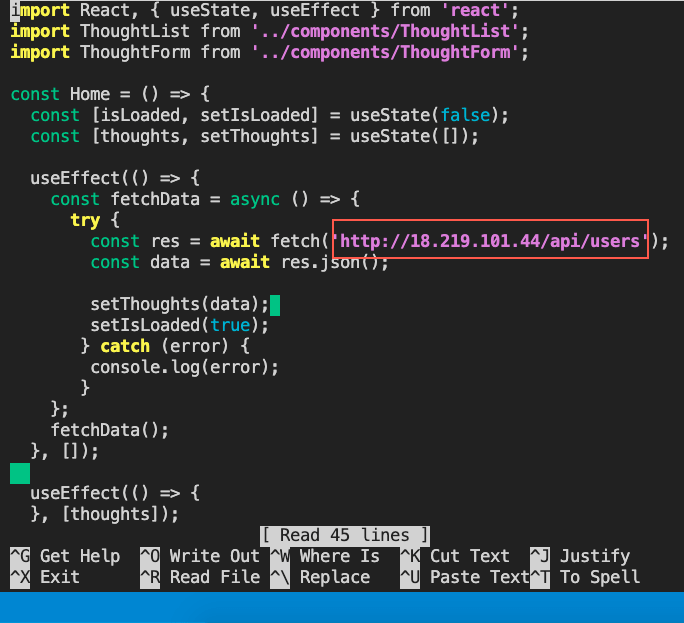
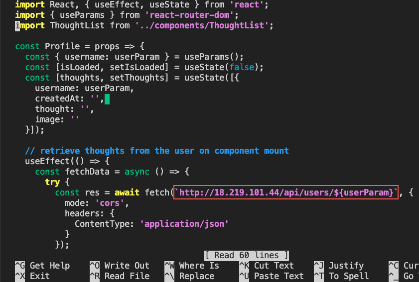

# Modify the API Calls

In the previous step, we configured the NGINX server on our instance. In this step, we will modify the API calls.

To modify these calls, we'll use the text editor `nano` to modify the fetch requests in the UI components to target the correct path.

Currently, we know of the following three access points that connect the client to the database service. The three API `fetch` calls occur in the `Home` component, to fetch all the users' thoughts; in the `ThoughtForm` component, to create a new thought; and in the `Profile` component, to retrieve a single user's thoughts.

Run the following command to modify the `Home` component in the Ubuntu CLI:

```console
nano /opt/aws-thought/client/src/pages/Home.js
```

We'll replace the path in the `fetch` call to update the URI, which is shown in the following image:



`A screenshot points out the URI in the fetch argument, which matches the public IPv4 address in the EC2 instance.`

Save and exit the changes. We replaced the URI to point to the public IPv4 address of the EC2 instance, the correct location of the resource. We can retrieve the public IPv4 address from the EC2 console by selecting the instance id.

We'll perform a similar service for the `Profile` component by typing the following command:

```console
nano /opt/aws-thought/client/src/pages/Profile.js
```

We'll change the URI as we did in the `Home` component, yet keep the same resource path for the API endpoints. The following image reflects the change we'll make:



`A screenshot points out the URI in the fetch argument, which highlights the context change in the EC2 instance.`

In the preceding image, we can see that the URL domain has changed, but the path resource has remained the same.

Next we'll modify the `ThoughtForm` component for the thought creation operation by typing the following command:

```console
nano /opt/aws-thought/client/src/components/ThoughtForm/index.js
```

Also note that this HTTP request (as with the other requests) will connect to port 80, which we've configured in the `nginx` server config file to connect to the proxies in the Deep Thoughts application.

**Important**

> If the EC2 instance is stopped, note that the public IP4 address will change when restarted. This means that the URI resource paths will need to be updated. For this reason, it might be best to have a config file that can change all domains from a single location.

Now that the source code modifications are complete, navigate to the `aws-thought` folder to install the application's dependencies, by typing the following commands:

```console
cd /opt/aws-thought
npm install
```

---
© 2022 edX Boot Camps LLC. Confidential and Proprietary. All Rights Reserved.