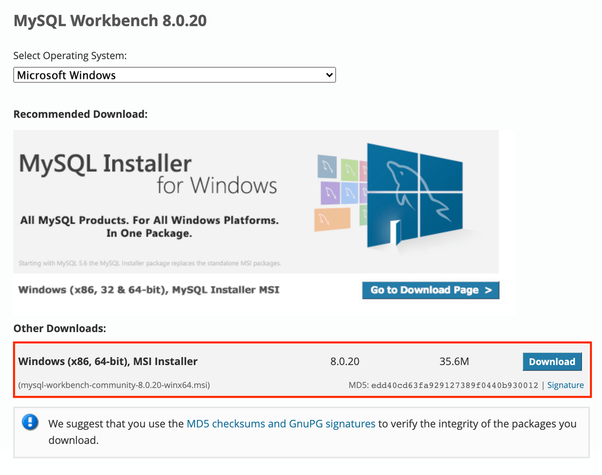
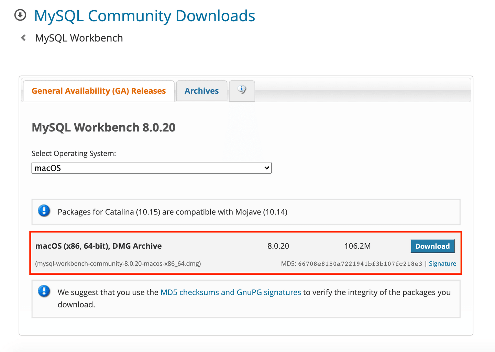

# Up and Running

## Getting Ready

This section contains a list of the tools you’ll use in this module. If you didn’t install MySQL Workbench during your boot camp, refer to the instructions later in this section to install it on your computer. For any other new tools, you don’t need to install them before you begin—you’ll do that during the lessons.

You’ll use the following tools in this module:

* The [Java Development Kit (JDK)](https://www.oracle.com/technetwork/java/javase/downloads/jdk8-downloads-2133151.html) is a development environment for building applications using Java. It also includes useful tools for developing and testing programs and allows you to install Java on your computer.

* [IntelliJ IDEA](https://www.jetbrains.com/idea/) is an integrated development environment (IDE) written in Java. You’ll use the IntelliJ IDEA to write the code for your Java application.

* [Spring](https://spring.io/) is an open-source application framework for the Java platform. [Spring Boot](https://spring.io/projects/spring-boot) is Spring's solution for creating standalone, production-grade Spring-based applications that require minimal configuration to get up and running. You’ll use [Spring Initializr](https://start.spring.io/) to create a Spring Boot Java microservice project. Its user interface allows you to select the project configuration variables and dependencies necessary for the project.

You’ll add the following dependencies when setting up Spring Initializr:

* The [Spring Web dependency](https://mvnrepository.com/artifact/org.springframework/spring-web) allows developers to build RESTful web applications using Spring MVC.

* [Spring Data JPA](https://spring.io/projects/spring-data-jpa) is an implementation of the Jakarta Persistence API, which is the Object Relational Mapper standard for storing, accessing, and managing Java objects in a relational database. For this course, you’ll use the [Spring Data JPA dependency](https://mvnrepository.com/artifact/org.springframework.data/spring-data-jpa).

* [MySQL Driver](https://mvnrepository.com/artifact/net.sourceforge.javydreamercsw/MySQL-Driver) is the dependency that will connect your Java application to a MySQL database.

* [Spring Session](https://spring.io/projects/spring-session) provides an API and implementations for managing a user’s session information. For this course, you’ll use the [Spring Session dependency](https://mvnrepository.com/artifact/org.springframework.session/spring-session).

* [Thymeleaf](https://www.thymeleaf.org/) is a Java template engine used to serve HTML at the View layer of MVC-based web applications. For this course, you’ll use the [Thymeleaf dependency](https://mvnrepository.com/artifact/org.thymeleaf/thymeleaf) to integrate it as part of your Spring application.

* [MVN (Maven) Repository](https://mvnrepository.com/) is a dependency repository that you’ll use to find additional dependencies for your project, including the following:

* [Spring Security](https://spring.io/projects/spring-security) is a framework that focuses on providing both authentication and authorization to Java applications. For this course, you’ll use the [Spring Security Core dependency](https://mvnrepository.com/artifact/org.springframework.security/spring-security-core)

* [Thymeleaf Layout Dialect](https://ultraq.github.io/thymeleaf-layout-dialect/) is a dialect for Thymeleaf that lets you build layouts and reusable templates in order to improve code reuse. For this course, you’ll use the [Thymeleaf Layout Dialect dependency](https://mvnrepository.com/artifact/nz.net.ultraq.thymeleaf/thymeleaf-layout-dialect)

* [Spring Session JDBC](https://spring.io/projects/spring-session-jdbc) provides SessionRepository implementation backed by a relational database and configuration support. For this course, you’ll use the [Spring Session JDBC dependency](https://mvnrepository.com/artifact/org.springframework.session/spring-session-jdbc).

* [MySQL Workbench](https://www.mysql.com/products/workbench/) is a unified visual tool that provides a user interface so that developers can visually design, model, generate, and manage MySQL databases.

* [Insomnia Core](https://insomnia.rest/) is a powerful REST API client that allows us to test APIs and make client-side server requests without having to use a browser.

**NOTE**

> You'll use Insomnia Core to test your APIs—NOT Insomnia Designer.

## Install MySQL Workbench

If you didn’t install MySQL Workbench during your boot camp, follow these steps to install it now:

Navigate to the MySQL Community Downloads page for [MySQL Workbench](https://dev.mysql.com/downloads/workbench).

If you’re using Windows, follow these steps (if not, skip to step 3):

* From the Operating System dropdown menu, select “Microsoft Windows”.

* In Other Downloads, find “Windows (x86, 64-bit), MSI Installer” and select Download, as shown in the following screenshot:

`MySQL Workbench Win`

If you’re using macOS, follow these steps (if not, skip to step 4):

* From the Operating System dropdown menu, select macOS.

* Find “macOS (x86, 64-bit), DMG Archive” and select Download, as shown in the following screenshot:

`MySQL Workbench Mac`

When prompted to sign up for a free Oracle Web Account, select “No thanks, just start my download.”

After the installer has downloaded, open it to begin the installation process.

---
© 2022 edX Boot Camps LLC. Confidential and Proprietary. All Rights Reserved.